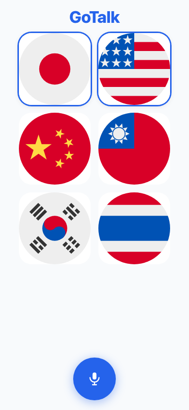
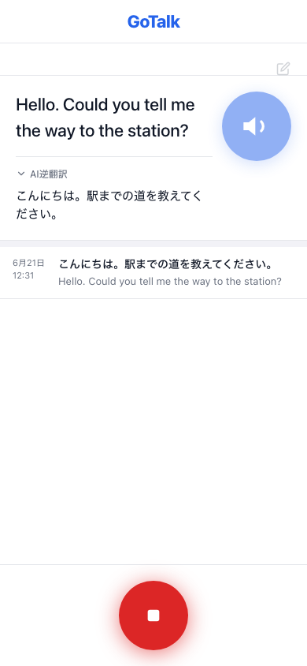
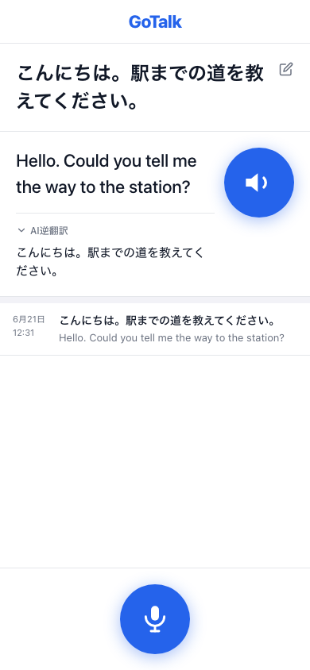
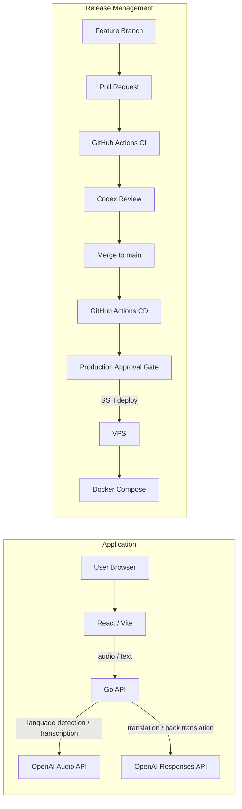

# GoTalk

## GoTalkとは

GoTalk は、異なる言語を話す 2 人がブラウザ上で会話するための音声通訳 Web アプリケーションです。話者が 2 つの言語を選択し、マイクで話した内容を文字起こし、翻訳、読み上げまで行います。

翻訳文に加えてバックトランスレーションも表示することで、「相手にどう伝わるか」を確認しながら会話できる体験を目指しています。

このプロジェクトは、AI を使ったユーザー体験を実装するだけでなく、テスト、レビュー、デプロイ、承認付き本番反映、VPS 運用まで含めて 1 つのサービスとして成立させることを目的にしています。実際に使える音声通訳アプリを題材に、機能実装と運用品質の両方を設計・構築できることを示すためのポートフォリオです。

## 主な機能

- 2 言語を選択して音声通訳を開始
- マイク入力による音声録音
- OpenAI Audio API による言語判定と文字起こし
- OpenAI Responses API による翻訳とバックトランスレーション
- 認識テキストの編集と再翻訳
- Web Speech API による翻訳文の読み上げ
- 画面内の会話履歴表示

## 技術スタック

- Frontend: React, TypeScript, Vite
- Backend: Go, net/http
- AI: OpenAI Audio API, OpenAI Responses API
- Infrastructure: Docker Compose, VPS, HTTPS
- CI/CD: GitHub Actions
- Monitoring: Uptime Kuma, Discord Webhook
- Quality: Unit Test, Coverage, Codex Review

## スクリーンショット

### 言語選択



### 通訳画面（録音中）



### 翻訳結果表示



## システム構成



詳細な設計は [docs/architecture.md](docs/architecture.md) にまとめています。

## 品質保証

- GitHub Actions CI による lint、test、coverage、build の自動検証
- Backend Unit Test による handler、OpenAI 連携まわりのエラーハンドリング、補助ロジックの検証
- Backend Unit Test Coverage 92.2%（`translateHandler`: 100%、`interpretHandler`: 97.1%）
- Frontend Unit Test による主要画面、ユーザー操作、UI ロジックの検証
- Codex Review による差分レビューと品質リスクの確認

テスト方針と現在の coverage は [docs/testing.md](docs/testing.md) を参照してください。CI/CD の詳細は [docs/ci-cd.md](docs/ci-cd.md) にまとめています。

### Codex Review ラベル運用

`.github/workflows/codex-review-request.yml` が PR コメントを監視し、ラベルで状態を自動管理します。

| ラベル | 意味 |
| --- | --- |
| `review-pending` | レビュー依頼済み / レビュー待ち |
| `merge-ready` | Codex レビューが問題なしと判定した状態 |
| `merge-blocked` | Codex レビューに修正が必要な指摘がある状態 |

**トリガーと動作:**

| 条件 | 動作 |
| --- | --- |
| PR コメントに `@codex review` を含む（投稿者不問） | `review-pending` 付与、`merge-ready` / `merge-blocked` 削除、確認コメント投稿 |
| Bot コメントに OK キーワードを含む | `merge-ready` 付与、`review-pending` / `merge-blocked` 削除 |
| Bot コメントに NG キーワードを含む（OK より優先） | `merge-blocked` 付与、`review-pending` / `merge-ready` 削除 |
| PR に新しいコミットが push された場合 | `merge-ready` 削除、`review-pending` 付与（`merge-blocked` は残す） |

**キーワード一覧:**

| 種別 | キーワード |
| --- | --- |
| OK（merge-ready） | `LGTM` / `No issues found` / `looks good` / `問題ありません` / `指摘事項はありません` |
| NG（merge-blocked） | `review suggestions` / `automated review suggestions` / `issues found`\* / `blocking issue` / `must fix` / `修正が必要` / `問題があります` / `指摘事項`\* |

\* `issues found` は `No issues found` を含まない場合のみ NG。`指摘事項` は `指摘事項はありません` を含まない場合のみ NG。NG / OK 両方マッチする場合は NG が優先。

**Bot 判定:** `github.event.comment.user.type == 'Bot'` を確認します。GitHub App（Copilot / Codex 等）は Bot として分類されます。ラベル 3 種は workflow 内で未存在の場合に自動作成されます。

**merge-ready の制限:** Codex がコメントで OK 文言を返した場合は workflow が `merge-ready` を自動付与します。Codex が 👍 リアクションのみで完了した場合は、現時点では workflow で自動検知しません。その場合は内容を確認のうえ `merge-ready` ラベルを手動付与してください。

## リリース管理

- Pull Request Workflow による main 取り込み前の確認
- Branch Protection による main ブランチ保護
- GitHub Actions CD による main push 起点のデプロイ workflow
- `production` Environment の Required reviewers による Production Approval Gate
- 承認後、GitHub Actions から SSH で VPS に接続し、Docker Compose で更新

CD は CI 成功後に無条件で本番反映される構成ではなく、GitHub の `production` Environment 承認を通過してからデプロイされます。

## インフラ / 運用

- Docker Compose による frontend/backend の実行
- VPS 上でのアプリケーション運用
- HTTPS での公開
- Uptime Kuma による公開環境の監視
- Discord Webhook による障害通知

インフラ構成の詳細は [docs/infrastructure.md](docs/infrastructure.md) を参照してください。

## Monitoring

GoTalk では、公開環境の死活監視と障害通知のために Uptime Kuma を導入しています。

監視対象:

- HTTPS エンドポイント: `https://gotalk.chiemaru.com`
- SSH ポート: `49.212.204.161:22`
- SSL 証明書有効期限

通知:

- Uptime Kuma から Discord Webhook に通知
- 障害発生時と復旧時に Discord の `gotalk-alerts` チャンネルへ通知

検知できる主な異常:

- VPS 停止
- nginx 停止
- frontend 停止
- ドメイン到達不可
- SSL 証明書期限切れ
- SSH 接続不可

## ドキュメント

- [アーキテクチャ](docs/architecture.md)
- [ローカル開発](docs/development.md)
- [テスト](docs/testing.md)
- [CI/CD](docs/ci-cd.md)
- [インフラ構成](docs/infrastructure.md)

## ローカル起動

`.env.example` をコピーして `.env` を作成し、OpenAI API キーを設定します。

```bash
cp .env.example .env
```

```env
OPENAI_API_KEY=sk-...
OPENAI_MODEL=gpt-4o-mini
```

Docker Compose で frontend/backend を起動します。

```bash
docker compose up -d --build
```

| URL | 用途 |
| --- | --- |
| http://localhost:5173 | Frontend |
| http://localhost:8080 | Backend API |

詳しい開発手順は [docs/development.md](docs/development.md) を参照してください。
