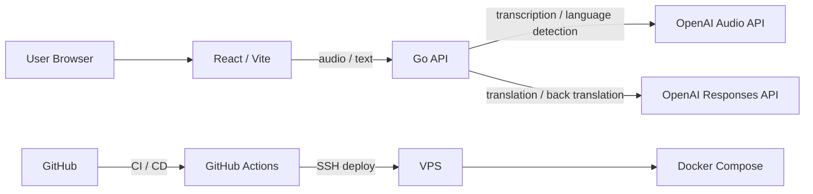

# GoTalk

## GoTalkとは

GoTalk は、異なる言語を話す 2 人がブラウザ上で会話するための音声通訳 Web アプリケーションです。話者が 2 つの言語を選択し、マイクで話した内容を文字起こし、翻訳、読み上げまで行います。

このプロジェクトはアプリケーション実装だけでなく、CI/CD、Docker、VPS 運用まで含めたポートフォリオです。実装、テスト、自動デプロイ、運用環境を 1 つのプロダクトとして成立させることを重視しています。

## 解決する課題

海外旅行、接客、日常会話など、相手の言語を十分に話せない場面では、翻訳結果が正しいか確認しづらいことがあります。

GoTalk は翻訳文に加えてバックトランスレーションも表示することで、「相手にどう伝わるか」を確認しながら会話できる体験を目指しています。

## このプロジェクトで示すこと

- React / TypeScript による音声入力を含むフロントエンド実装
- Go によるシンプルな API サーバー設計
- OpenAI API を用途別に使い分ける AI 連携設計
- Docker Compose によるローカル開発環境と VPS 実行環境の統一
- GitHub Actions による lint、test、build、deploy の自動化
- main push を契機にした VPS への自動デプロイ
- Claude Code を実装担当、Codex をレビュー担当とする AI 活用開発フロー

## 主な機能

- 2 言語を選択して音声通訳を開始
- マイク入力による音声録音
- 音声の言語判定と文字起こし
- 相手側言語への翻訳
- 翻訳結果のバックトランスレーション表示
- 認識テキストの編集と再翻訳
- 翻訳文の読み上げ
- 会話履歴の表示

## システム構成図

## 技術スタック

| 領域 | 技術 |
| --- | --- |
| Frontend | React, TypeScript, Vite |
| Backend | Go, net/http |
| AI | OpenAI Responses API, OpenAI Audio API |
| Test | Vitest, Testing Library, Go test |
| Runtime | Docker, Docker Compose |
| CI/CD | GitHub Actions |
| Infrastructure | VPS, SSH deploy |

## ドキュメント一覧

- [アーキテクチャ](docs/architecture.md)
- [ローカル開発](docs/development.md)
- [テスト](docs/testing.md)
- [CI/CD](docs/ci-cd.md)
- [インフラ構成](docs/infrastructure.md)
