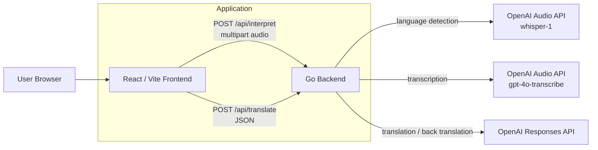

# Architecture

## 概要

GoTalk は、React / Vite のフロントエンドと Go のバックエンドで構成された音声通訳アプリケーションです。フロントエンドで録音した音声をバックエンドへ送信し、OpenAI API を使って言語判定、文字起こし、翻訳、バックトランスレーションを行います。

## アプリケーション実行構成図



## コンポーネント

| コンポーネント | 役割 |
| --- | --- |
| Frontend | 言語選択、録音、翻訳結果表示、読み上げ、履歴表示 |
| Backend | API 受付、OpenAI API 呼び出し、レスポンス整形 |
| OpenAI Audio API | 音声の言語判定と文字起こし |
| OpenAI Responses API | 翻訳とバックトランスレーション |

## API

| Method | Path | 内容 |
| --- | --- | --- |
| `GET` | `/health` | ヘルスチェック |
| `POST` | `/api/interpret` | 音声ファイルを受け取り、言語判定、文字起こし、翻訳、バックトランスレーションを行う |
| `POST` | `/api/translate` | 編集済みテキストを再翻訳する |

## 音声処理設計

GoTalk では、音声入力から翻訳結果を返すまでの処理を 3 つの責務に分けています。

| 処理 | 使用モデル / API | 役割 |
| --- | --- | --- |
| 言語判定 | `whisper-1` | 録音音声が、ユーザーが選択した 2 言語のどちらに該当するかを判定する |
| 文字起こし | `gpt-4o-transcribe` | 言語判定を通過した音声をテキスト化する |
| 翻訳 | Responses API | 文字起こし結果を相手側の言語へ翻訳し、バックトランスレーションも生成する |

### `whisper-1` を言語判定専用にする理由

`whisper-1` は `verbose_json` のレスポンスで検出言語を取得できるため、音声が選択済みの言語ペアに含まれるかを判定する用途に向いています。

GoTalk は 2 人の会話を支援するアプリケーションです。選択外の言語を無理に翻訳すると、相手に誤った内容が伝わるリスクがあります。そのため、最初に `whisper-1` で言語判定を行い、選択した 2 言語に一致しない場合は `language_mismatch` として処理を止めます。

### `gpt-4o-transcribe` を文字起こし専用にする理由

`gpt-4o-transcribe` は、言語判定を通過した音声をテキスト化する責務に限定しています。言語判定と文字起こしを分離することで、判定失敗時には不要な文字起こし処理を避けられます。

また、バックエンドの処理フロー上も「判定」「文字起こし」「翻訳」を段階化できるため、エラー原因を切り分けやすくなります。

### Responses API を翻訳専用にする理由

Responses API は、文字起こし済みのテキストを入力として、翻訳文とバックトランスレーションを JSON 形式で返す用途に使っています。

翻訳専用にすることで、音声処理の不確実性と翻訳処理の不確実性を分離できます。プロンプトでは、入力言語、出力言語、返却 JSON 形式を明示し、フロントエンドが扱いやすいレスポンスへ整形しています。

## 処理フロー

1. ユーザーが 2 言語を選択する
2. ブラウザで音声を録音する
3. フロントエンドが `/api/interpret` へ音声を送信する
4. バックエンドが `whisper-1` で言語判定を行う
5. 選択外の言語だった場合は `language_mismatch` を返す
6. 言語が一致した場合、`gpt-4o-transcribe` で音声を文字起こしする
7. Responses API で翻訳とバックトランスレーションを行う
8. フロントエンドに認識テキスト、翻訳文、バックトランスレーションを表示する

## 関連ディレクトリ構成

```text
.
├── backend/              # Go API server
│   ├── main.go           # /health, /api/interpret, /api/translate
│   ├── main_test.go      # backend unit tests
│   └── Dockerfile
├── frontend/             # React / Vite app
│   ├── src/              # React application
│   ├── vite.config.ts    # /api proxy configuration
│   ├── package.json
│   └── Dockerfile
├── docker-compose.yml
├── .env.example
├── docs/
└── README.md
```

## 主な設計判断

- フロントエンドとバックエンドを分離し、AI API のキーはバックエンド側だけで扱う
- 音声の言語判定を先に行い、選択した 2 言語以外の入力を明示的に拒否する
- 言語判定、文字起こし、翻訳を分離し、各 API を得意な責務に限定する
- 翻訳結果だけでなくバックトランスレーションを返し、利用者が意味のズレを確認できるようにする
