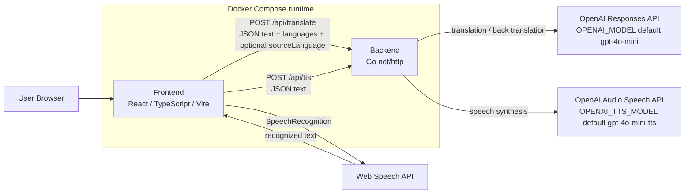
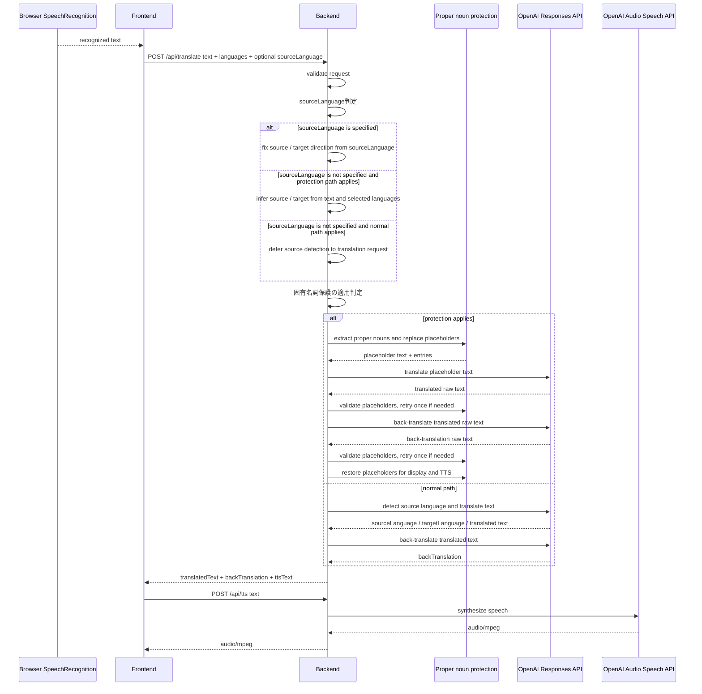
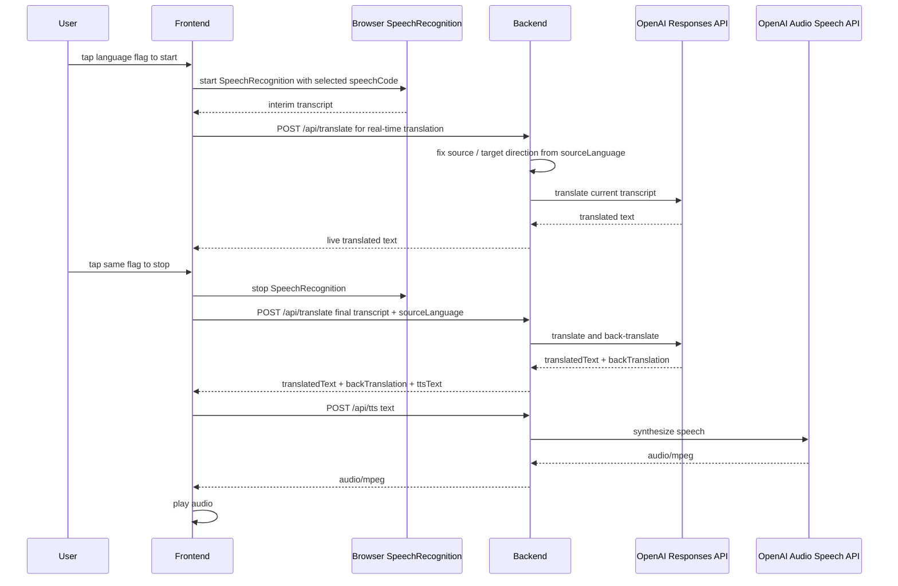

# Architecture

## 1. システム概要

GoTalk は、異なる言語を話す 2 人がブラウザ上で会話するための音声通訳 Web アプリケーションです。

現在の GoTalk は、ブラウザの `SpeechRecognition` で音声をテキスト化し、そのテキストを Backend の `/api/translate` に送って翻訳とバックトランスレーションを行います。翻訳文は Frontend に表示され、必要に応じて `/api/tts` で音声合成して再生します。

Frontend は React / TypeScript / Vite で実装され、言語選択、`SpeechRecognition`、リアルタイム翻訳、翻訳結果表示、バックトランスレーション表示、TTS 再生、会話履歴表示を担当します。Backend は Go の `net/http` で実装され、OpenAI API キーをサーバー側で扱い、翻訳、バックトランスレーション、固有名詞保護、TTS を実行します。

この文書は GoTalk のシステム設計の入口です。翻訳処理、音声処理、固有名詞保護、API 詳細は個別ドキュメントにまとめています。ここでは現在の実装に基づく全体像を整理します。

## 2. 全体構成

主な実装単位:

| 領域 | 主なファイル | 役割 |
| --- | --- | --- |
| Frontend | `frontend/src/App.tsx` | 言語選択画面と通訳画面の切り替え |
| Frontend | `frontend/src/pages/LanguageSelectPage.tsx` | 2 言語の選択 |
| Frontend | `frontend/src/pages/InterpreterPage.tsx` | `SpeechRecognition`、翻訳 API 呼び出し、TTS 再生、履歴表示 |
| Frontend | `frontend/src/languages.ts` | 対応言語と `SpeechRecognition` 用 locale |
| Backend | `backend/main.go` | API handler、OpenAI API 呼び出し、翻訳・TTS の制御 |
| Backend | `backend/propnoun.go` | 固有名詞抽出、プレースホルダ保護、復元、検証、リトライ |
| Runtime | `docker-compose.yml` | frontend / backend / backend-dev の Compose 定義 |
| CI/CD | `.github/workflows/*.yml` | CI、CD、Codex review ラベル運用 |

## 3. Frontend の責務

Frontend はブラウザ上の会話 UI と、Backend API へのリクエスト生成を担当します。

- 2 つの利用言語を選択する
- 選択した言語ごとの国旗ボタンで音声入力を開始・停止する
- `SpeechRecognition` / `webkitSpeechRecognition` で音声をテキスト化する
- 音声入力中の認識テキストを使って `/api/translate` へリアルタイム翻訳を投げる
- 音声入力中と音声入力終了時の `/api/translate` リクエストに、話している国旗の言語 ID を `sourceLanguage` として指定する
- 音声入力終了時に認識済みテキストを `/api/translate` へ送り、確定翻訳とバックトランスレーションを取得する
- 認識テキスト、翻訳文、バックトランスレーションを表示する
- 認識テキストの編集後、`/api/translate` で再翻訳する
- `/api/tts` から返る `audio/mpeg` を `Audio` で再生する
- 画面内に会話履歴を保持して表示する

Vite の開発サーバーでは `frontend/vite.config.ts` の proxy により、`/api` リクエストを `VITE_BACKEND_URL` または `http://localhost:8080` へ転送します。

## 4. Backend の責務

Backend は Go の単一 HTTP サーバーとして動作し、OpenAI API キーをサーバー側だけで扱います。

- CORS middleware と API routing を提供する
- `/health` でヘルスチェックを返す
- `/api/translate` でテキスト翻訳とバックトランスレーションを実行する
- `/api/tts` で翻訳文の音声合成を実行する
- OpenAI Responses API と Audio Speech API を呼び出す
- 必要な場合に固有名詞保護を適用し、OpenAI への入力ではプレースホルダを保持させる
- `sourceLanguage` が指定された場合、選択済み 2 言語のうち指定された言語を翻訳元、もう一方を翻訳先として翻訳方向を固定する
- `sourceLanguage` が未指定の場合、固有名詞保護を適用する経路では入力文字種や名前表現と選択言語から翻訳方向を決め、通常経路では OpenAI Responses API で 2 言語候補から翻訳元を判定する
- `language_mismatch`、`translation failed`、`tts failed` などのエラーを JSON で返す

Backend の HTTP client timeout は `main()` で 120 秒に設定されています。

## 5. OpenAI API の利用箇所

| 用途 | API / endpoint | モデル指定 | 実装箇所 |
| --- | --- | --- | --- |
| 翻訳 | Responses API `/v1/responses` | `OPENAI_MODEL`、未設定時 `gpt-4o-mini` | `callOpenAI` |
| バックトランスレーション | Responses API `/v1/responses` | `OPENAI_MODEL`、未設定時 `gpt-4o-mini` | `callOpenAI` |
| 音声合成 | Audio Speech API `/v1/audio/speech` | `OPENAI_TTS_MODEL`、未設定時 `gpt-4o-mini-tts` | `callOpenAITTS` / `/api/tts` |

`OPENAI_TTS_VOICE` は未設定時 `marin` です。

## 6. Docker 構成

`docker-compose.yml` は 3 つの service を定義しています。

| Service | Container | Build context | Port | 主な用途 |
| --- | --- | --- | --- | --- |
| `frontend` | `gotalk-frontend` | `./frontend` | `5173:5173` | Vite dev server |
| `backend` | `gotalk-backend` | `./backend` | `8080:8080` | Go API server |
| `backend-dev` | なし | `./backend` + `Dockerfile.dev` | なし | backend 開発用コンテナ |

`frontend` は `VITE_BACKEND_URL=http://backend:8080` を持ち、Vite proxy 経由で backend service へ接続します。`backend` には `OPENAI_API_KEY`、`OPENAI_MODEL`、`DEBUG_TRANSLATION=true` が渡されます。`backend-dev` には `OPENAI_API_KEY` と `OPENAI_MODEL` が渡されます。

Dockerfile の概要:

- `frontend/Dockerfile`: `node:22-alpine` を使い、`npm install` 後に `npm run dev -- --host` を実行する
- `backend/Dockerfile`: `golang:1.24-alpine` で build し、`alpine:3.22` に binary をコピーして `./server` を実行する
- `backend/Dockerfile.dev`: `golang:1.24-alpine` に Go の PATH 設定を追加する

## 7. 翻訳処理フロー

`/api/translate` は `sourceLanguage` が指定された場合、指定言語を翻訳元として翻訳方向を固定します。未指定の場合、固有名詞保護を適用する経路では入力文字種や名前表現と選択言語から翻訳方向を決め、通常経路では OpenAI Responses API に 2 言語候補から翻訳元を判定させます。通常経路で候補外または判定不能の場合は `language_mismatch` を返します。

## 8. 音声処理フロー

音声入力開始時は `getUserMedia({ audio: true })` でマイク権限を確認し、`AudioContext` / `AnalyserNode` で入力中の波紋表示を制御します。音声の文字起こしはブラウザの `SpeechRecognition` が担当し、Backend には認識済みテキストだけを送ります。

## 9. 固有名詞保護の概要

固有名詞保護は `backend/propnoun.go` に実装されています。目的は、翻訳時に人名・地名・組織名などが意味的に翻訳されたり、存在しない固有名詞へ補正されたりするリスクを下げることです。

概要:

- 日本語の固有名詞や、条件に合う英語の名前表現を検出する
- 検出した固有名詞をプレースホルダに置き換えて OpenAI に渡す
- 翻訳後にプレースホルダを表示用・TTS 用のテキストへ復元する
- 保護を適用できない場合は通常の翻訳処理へフォールバックする

プレースホルダの形式、検証、リトライ、復元ルールの詳細は [proper-noun-protection.md](proper-noun-protection.md) にまとめています。

## 10. バックトランスレーションの概要

GoTalk は翻訳文だけでなく、翻訳文を元の言語へ戻したバックトランスレーションも返します。Frontend はこれを翻訳カード内に表示し、利用者が「相手にどう伝わるか」を確認できるようにしています。

Backend では翻訳後に別 prompt でバックトランスレーションを実行します。固有名詞保護が有効な場合は、保護された表現を復元したうえでレスポンスに含めます。

## 11. API 構成

| Method | Path | 概要 |
| --- | --- | --- |
| `GET` | `/health` | Backend のヘルスチェック |
| `POST` | `/api/translate` | テキストと 2 言語、任意の `sourceLanguage` を受け取り、翻訳とバックトランスレーションを返す |
| `POST` | `/api/tts` | テキストを受け取り、読み上げ音声 `audio/mpeg` を返す |

各 API の request / response / error の詳細は [api.md](api.md) を参照してください。

## 12. CI / GitHub Actions の概要

GitHub Actions は以下の workflow で構成されています。

| Workflow | Trigger | 概要 |
| --- | --- | --- |
| `.github/workflows/ci.yml` | `push` to `main`, `pull_request` | Frontend lint / test / coverage / build、Backend vet / test / build |
| `.github/workflows/cd.yml` | `push` to `main` | `production` Environment 承認後、SSH で VPS に入り `git pull --ff-only` と `docker compose up -d --build` を実行 |
| `.github/workflows/codex-review-request.yml` | PR comment, PR synchronize | `@codex review` コメントと Bot 結果コメントをもとに `review-pending` / `merge-ready` / `merge-blocked` ラベルを管理 |

CI の実装では Frontend は Node.js 22、Backend は GitHub Actions 上で Go 1.22 をセットアップしています。Docker build では Backend Dockerfile が `golang:1.24-alpine` を使用します。

CI/CD の詳細は [CI/CD](ci-cd.md) を参照してください。

## 13. 関連ドキュメントへのリンク

- [README](../README.md)
- [ローカル開発](development.md)
- [テスト](testing.md)
- [CI/CD](ci-cd.md)
- [インフラ構成](infrastructure.md)
- [バックアップ](backup.md)
- [音声処理フロー](speech-flow.md)
- [翻訳処理フロー](translation-flow.md)
- [固有名詞保護](proper-noun-protection.md)
- [Backend API](api.md)
- [Docker 構成](docker.md)
