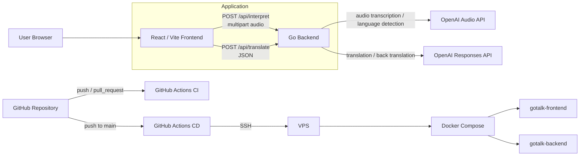

# Architecture

## 概要

GoTalk は、React / Vite のフロントエンドと Go のバックエンドで構成された音声通訳アプリケーションです。フロントエンドで録音した音声をバックエンドへ送信し、OpenAI API を使って言語判定、文字起こし、翻訳、バックトランスレーションを行います。

## システム構成図



## コンポーネント

| コンポーネント | 役割 |
| --- | --- |
| Frontend | 言語選択、録音、翻訳結果表示、読み上げ、履歴表示 |
| Backend | API 受付、OpenAI API 呼び出し、レスポンス整形 |
| OpenAI Audio API | 音声の言語判定と文字起こし |
| OpenAI Responses API | 翻訳とバックトランスレーション |
| GitHub Actions CI | lint、test、coverage、build の自動検証 |
| GitHub Actions CD | main push を契機に VPS へ自動デプロイ |
| VPS | Docker Compose によるアプリケーション実行環境 |

## API

| Method | Path | 内容 |
| --- | --- | --- |
| `GET` | `/health` | ヘルスチェック |
| `POST` | `/api/interpret` | 音声ファイルを受け取り、言語判定、文字起こし、翻訳、バックトランスレーションを行う |
| `POST` | `/api/translate` | 編集済みテキストを再翻訳する |

## 処理フロー

1. ユーザーが 2 言語を選択する
2. ブラウザで音声を録音する
3. フロントエンドが `/api/interpret` へ音声を送信する
4. バックエンドが OpenAI Audio API で言語判定を行う
5. 選択外の言語だった場合は `language_mismatch` を返す
6. 言語が一致した場合、音声を文字起こしする
7. OpenAI Responses API で翻訳とバックトランスレーションを行う
8. フロントエンドに認識テキスト、翻訳文、バックトランスレーションを表示する

## ディレクトリ構成

```text
.
├── backend/              # Go API server
│   ├── main.go           # /health, /api/interpret, /api/translate
│   ├── main_test.go      # backend unit tests
│   └── Dockerfile
├── frontend/             # React / Vite app
│   ├── src/
│   ├── package.json
│   └── Dockerfile
├── .github/workflows/
│   ├── ci.yml            # lint / test / coverage / build
│   └── cd.yml            # main push deployment to VPS
├── docker-compose.yml
├── .env.example
└── README.md
```

## 主な設計判断

- フロントエンドとバックエンドを分離し、AI API のキーはバックエンド側だけで扱う
- 音声の言語判定を先に行い、選択した 2 言語以外の入力を明示的に拒否する
- 翻訳結果だけでなくバックトランスレーションを返し、利用者が意味のズレを確認できるようにする
- Docker Compose を開発環境と VPS デプロイの共通実行単位にする
