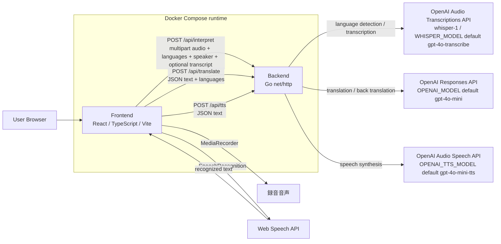
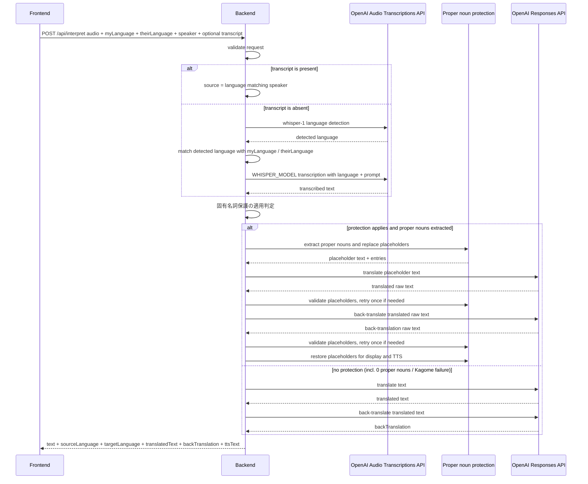
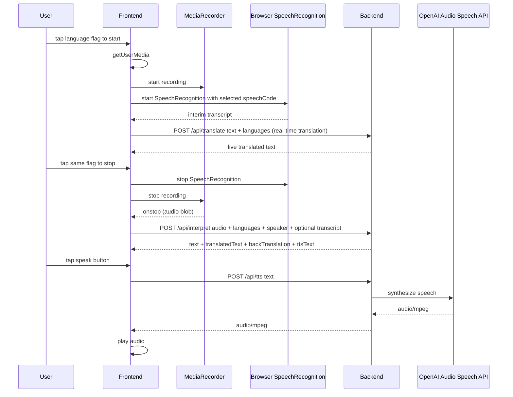

# Architecture

## 1. システム概要

GoTalk は、異なる言語を話す 2 人がブラウザ上で会話するための音声通訳 Web アプリケーションです。

現在の GoTalk は、国旗ボタンで開始した発話を `MediaRecorder` で録音し、録音終了時に音声を Backend の `/api/interpret` に送って確定翻訳とバックトランスレーションを取得します。録音と並行してブラウザの `SpeechRecognition` も動かし、認識テキストが得られた場合はそのテキストを `transcript` として同じリクエストに添えます。Backend は `transcript` があればそれを翻訳し、なければ OpenAI の音声文字起こし API で言語判定と文字起こしを行ってから翻訳します。翻訳文は Frontend に表示され、必要に応じて `/api/tts` で音声合成して再生します。

録音中は `SpeechRecognition` の認識テキストを `/api/translate` に送ってリアルタイム翻訳を表示します。原文を編集した後の再翻訳も `/api/translate` で行います。

Frontend は React / TypeScript / Vite で実装され、言語選択、録音、`SpeechRecognition`、リアルタイム翻訳、翻訳結果表示、バックトランスレーション表示、TTS 再生、会話履歴表示を担当します。Backend は Go の `net/http` で実装され、OpenAI API キーをサーバー側で扱い、文字起こし、翻訳、バックトランスレーション、固有名詞保護、TTS を実行します。

この文書は GoTalk のシステム設計の入口です。翻訳処理、音声処理、固有名詞保護、API 詳細は個別ドキュメントにまとめています。ここでは現在の実装に基づく全体像を整理します。

## 2. 全体構成

```mermaid
flowchart LR
  User[User Browser] --> Frontend[Frontend<br/>React / TypeScript / Vite]
  Frontend -->|MediaRecorder| Recorder[録音音声]
  Frontend -->|SpeechRecognition| BrowserSpeech[Web Speech API]

  BrowserSpeech -->|recognized text| Frontend
  Frontend -->|POST /api/interpret<br/>multipart audio + languages + speaker + optional transcript| Backend[Backend<br/>Go net/http]
  Frontend -->|POST /api/translate<br/>JSON text + languages| Backend
  Frontend -->|POST /api/tts<br/>JSON text| Backend

  Backend -->|language detection / transcription| Transcriptions[OpenAI Audio Transcriptions API<br/>whisper-1 / WHISPER_MODEL default gpt-4o-transcribe]
  Backend -->|translation / back translation| Responses[OpenAI Responses API<br/>OPENAI_MODEL default gpt-4o-mini]
  Backend -->|speech synthesis| TTS[OpenAI Audio Speech API<br/>OPENAI_TTS_MODEL default gpt-4o-mini-tts]

  subgraph Runtime[Docker Compose runtime]
    Frontend
    Backend
  end
```

主な実装単位:

| 領域 | 主なファイル | 役割 |
| --- | --- | --- |
| Frontend | `frontend/src/App.tsx` | 言語選択画面と通訳画面の切り替え |
| Frontend | `frontend/src/pages/LanguageSelectPage.tsx` | 2 言語の選択 |
| Frontend | `frontend/src/pages/InterpreterPage.tsx` | 録音、`SpeechRecognition`、翻訳 API 呼び出し、TTS 再生、履歴表示 |
| Frontend | `frontend/src/languages.ts` | 対応言語と `SpeechRecognition` 用 locale |
| Backend | `backend/main.go` | API handler、OpenAI API 呼び出し、文字起こし・翻訳・TTS の制御 |
| Backend | `backend/propnoun.go` | 固有名詞抽出、プレースホルダ保護、復元、検証、リトライ |
| Runtime | `docker-compose.yml` | frontend / backend / backend-dev の Compose 定義 |
| CI/CD | `.github/workflows/*.yml` | CI、CD、Codex review ラベル運用 |

## 3. Frontend の責務

Frontend はブラウザ上の会話 UI と、Backend API へのリクエスト生成を担当します。

- 2 つの利用言語を選択する
- 選択した言語ごとの国旗ボタンで録音を開始・停止する
- `getUserMedia` で取得した音声を `MediaRecorder` で録音する
- 録音と並行して `SpeechRecognition` / `webkitSpeechRecognition` を動かし、認識テキストを表示する
- 録音中の認識テキストを使って `/api/translate` へリアルタイム翻訳を投げる
- 録音終了時に音声を `/api/interpret` へ送り、確定翻訳とバックトランスレーションを取得する。タップされた国旗の言語を `myLanguage` と `speaker`、もう一方を `theirLanguage` として送り、認識テキストがあれば `transcript` として添える
- 原文、翻訳文、バックトランスレーションを表示する
- 原文の編集後、`/api/translate` で再翻訳する
- `/api/tts` から返る `audio/mpeg` を `Audio` で再生する
- 画面内に会話履歴を保持して表示する

Vite の開発サーバーでは `frontend/vite.config.ts` の proxy により、`/api` リクエストを `VITE_BACKEND_URL` または `http://localhost:8080` へ転送します。

## 4. Backend の責務

Backend は Go の単一 HTTP サーバーとして動作し、OpenAI API キーをサーバー側だけで扱います。

- CORS middleware と API routing を提供する
- `/health` でヘルスチェックを返す
- `/api/interpret` で録音音声を受け取り、確定翻訳とバックトランスレーションを実行する
- `/api/translate` でテキスト翻訳とバックトランスレーションを実行する
- `/api/tts` で翻訳文の音声合成を実行する
- OpenAI Audio Transcriptions API、Responses API、Audio Speech API を呼び出す
- 必要な場合に固有名詞保護を適用し、OpenAI への入力ではプレースホルダを保持させる
- `/api/interpret` では、`transcript` がある場合は `speaker` に一致する言語を翻訳元にする。`transcript` がない場合は `whisper-1` で判定した言語を選択言語と照合して翻訳元を決め、`WHISPER_MODEL` で文字起こしする
- `/api/translate` では、固有名詞保護を適用する経路（保護経路）では入力文字種や名前表現と選択言語から翻訳方向を決め、固有名詞保護を使わない経路（保護なし経路）では OpenAI Responses API で 2 言語候補から翻訳元を判定する
- `language_mismatch`、`translation failed`、`tts failed` などのエラーを JSON で返す

Backend の HTTP client timeout は `main()` で 120 秒に設定されています。

## 5. OpenAI API の利用箇所

| 用途 | API / endpoint | モデル指定 | 実装箇所 |
| --- | --- | --- | --- |
| 言語判定 | Audio Transcriptions API `/v1/audio/transcriptions` | `whisper-1` 固定（`langDetectionModel`） | `callWhisper` / `/api/interpret` |
| 文字起こし | Audio Transcriptions API `/v1/audio/transcriptions` | `WHISPER_MODEL`、未設定時 `gpt-4o-transcribe` | `callWhisper` / `/api/interpret` |
| 翻訳 | Responses API `/v1/responses` | `OPENAI_MODEL`、未設定時 `gpt-4o-mini` | `callOpenAI` |
| バックトランスレーション | Responses API `/v1/responses` | `OPENAI_MODEL`、未設定時 `gpt-4o-mini` | `callOpenAI` |
| 音声合成 | Audio Speech API `/v1/audio/speech` | `OPENAI_TTS_MODEL`、未設定時 `gpt-4o-mini-tts` | `callOpenAITTS` / `/api/tts` |

言語判定と文字起こしは、`/api/interpret` に `transcript` がない場合だけ実行します。`OPENAI_TTS_VOICE` は未設定時 `marin` です。

## 6. Docker 構成

`docker-compose.yml` は 3 つの service を定義しています。

| Service | Container | Build context | Port | 主な用途 |
| --- | --- | --- | --- | --- |
| `frontend` | `gotalk-frontend` | `./frontend` | `5173:5173` | Vite dev server |
| `backend` | `gotalk-backend` | `./backend` | `8080:8080` | Go API server |
| `backend-dev` | なし | `./backend` + `Dockerfile.dev` | なし | backend 開発用コンテナ（`profiles: ["dev"]`） |

`frontend` は `VITE_BACKEND_URL=http://backend:8080` を持ち、Vite proxy 経由で backend service へ接続します。`backend` には `OPENAI_API_KEY`、`OPENAI_MODEL`、`DEBUG_TRANSLATION=true` が渡されます。`backend-dev` には `OPENAI_API_KEY` と `OPENAI_MODEL` が渡されます。`backend-dev` は `profiles: ["dev"]` に属しているため、サービス名を指定しない `docker compose up` では起動せず、`docker compose run --rm backend-dev ...` で使います。

Dockerfile の概要:

- `frontend/Dockerfile`: `node:22-alpine` を使い、`npm install` 後に `npm run dev -- --host` を実行する
- `backend/Dockerfile`: `golang:1.24-alpine` で build し、`alpine:3.22` に binary をコピーして `./server` を実行する
- `backend/Dockerfile.dev`: `golang:1.24-alpine` に Go の PATH 設定を追加する

## 7. 翻訳処理フロー

```mermaid
sequenceDiagram
  participant FE as Frontend
  participant BE as Backend
  participant WH as OpenAI Audio Transcriptions API
  participant PN as Proper noun protection
  participant OA as OpenAI Responses API

  FE->>BE: POST /api/interpret audio + myLanguage + theirLanguage + speaker + optional transcript
  BE->>BE: validate request
  alt transcript is present
    BE->>BE: source = language matching speaker
  else transcript is absent
    BE->>WH: whisper-1 language detection
    WH-->>BE: detected language
    BE->>BE: match detected language with myLanguage / theirLanguage
    BE->>WH: WHISPER_MODEL transcription with language + prompt
    WH-->>BE: transcribed text
  end
  BE->>BE: 固有名詞保護の適用判定
  alt protection applies and proper nouns extracted
    BE->>PN: extract proper nouns and replace placeholders
    PN-->>BE: placeholder text + entries
    BE->>OA: translate placeholder text
    OA-->>BE: translated raw text
    BE->>PN: validate placeholders, retry once if needed
    BE->>OA: back-translate translated raw text
    OA-->>BE: back-translation raw text
    BE->>PN: validate placeholders, retry once if needed
    BE->>PN: restore placeholders for display and TTS
  else no protection (incl. 0 proper nouns / Kagome failure)
    BE->>OA: translate text
    OA-->>BE: translated text
    BE->>OA: back-translate translated text
    OA-->>BE: backTranslation
  end
  BE-->>FE: text + sourceLanguage + targetLanguage + translatedText + backTranslation + ttsText
```

`/api/interpret` は、`transcript` がある場合は `speaker` に一致する言語を翻訳元、もう一方を翻訳先にします。`transcript` がない場合は `whisper-1` の判定言語が `myLanguage`、`theirLanguage` のどちらに一致するかで翻訳方向を決め、どちらにも一致しない場合は `language_mismatch` を返します。

`/api/translate` は、録音中のリアルタイム翻訳と原文編集後の再翻訳で使います。保護経路では入力文字種や名前表現と選択言語から翻訳方向を決め、保護なし経路では OpenAI Responses API に 2 言語候補から翻訳元を判定させます。保護なし経路で候補外または判定不能の場合は `language_mismatch` を返します。`/api/interpret` の保護なし経路は決めた翻訳方向のまま翻訳するため、`/api/interpret` が `language_mismatch` を返すのは Whisper 経路の言語照合で一致しなかった場合だけです。翻訳方向の詳細は [api.md](api.md) を参照してください。

## 8. 音声処理フロー

```mermaid
sequenceDiagram
  participant User as User
  participant FE as Frontend
  participant MR as MediaRecorder
  participant Browser as Browser SpeechRecognition
  participant BE as Backend
  participant TTS as OpenAI Audio Speech API

  User->>FE: tap language flag to start
  FE->>FE: getUserMedia
  FE->>MR: start recording
  FE->>Browser: start SpeechRecognition with selected speechCode
  Browser-->>FE: interim transcript
  FE->>BE: POST /api/translate text + languages (real-time translation)
  BE-->>FE: live translated text

  User->>FE: tap same flag to stop
  FE->>Browser: stop SpeechRecognition
  FE->>MR: stop recording
  MR-->>FE: onstop (audio blob)
  FE->>BE: POST /api/interpret audio + languages + speaker + optional transcript
  BE-->>FE: text + translatedText + backTranslation + ttsText
  User->>FE: tap speak button
  FE->>BE: POST /api/tts text
  BE->>TTS: synthesize speech
  TTS-->>BE: audio/mpeg
  BE-->>FE: audio/mpeg
  FE->>FE: play audio
```

録音開始時は `getUserMedia({ audio: true })` でマイク入力を取得し、`MediaRecorder` で録音します。`AudioContext` / `AnalyserNode` で入力中の波紋表示を制御します。録音と並行してブラウザの `SpeechRecognition` を動かし、認識テキストを表示とリアルタイム翻訳に使います。録音終了時は、`SpeechRecognition` の認識テキストの有無にかかわらず録音音声を `/api/interpret` に送ります。認識テキストがある場合は `transcript` として添え、ない場合は Backend が音声から文字起こしします。

## 9. 固有名詞保護の概要

固有名詞保護は `backend/propnoun.go` に実装されています。目的は、翻訳時に人名・地名・組織名などが意味的に翻訳されたり、存在しない固有名詞へ補正されたりするリスクを下げることです。

概要:

- 日本語の固有名詞や、条件に合う英語の名前表現を検出する
- 検出した固有名詞をプレースホルダに置き換えて OpenAI に渡す
- 翻訳後にプレースホルダを表示用・TTS 用のテキストへ復元する
- 固有名詞が抽出されない場合や Kagome を使えない場合は、固有名詞保護を使わない翻訳（保護なし経路）へフォールバックする

保護を適用する条件は `/api/interpret` と `/api/translate` で異なります。プレースホルダの形式、適用条件、検証、リトライ、復元ルールの詳細は [proper-noun-protection.md](proper-noun-protection.md) にまとめています。

## 10. バックトランスレーションの概要

GoTalk は翻訳文だけでなく、翻訳文を元の言語へ戻したバックトランスレーションも返します。Frontend はこれを翻訳カード内に表示し、利用者が「相手にどう伝わるか」を確認できるようにしています。

Backend では翻訳後に別 prompt でバックトランスレーションを実行します。固有名詞保護が有効な場合は、保護された表現を復元したうえでレスポンスに含めます。

## 11. API 構成

| Method | Path | 概要 |
| --- | --- | --- |
| `GET` | `/health` | Backend のヘルスチェック |
| `POST` | `/api/tts` | テキストを受け取り、読み上げ音声 `audio/mpeg` を返す |
| `POST` | `/api/interpret` | 録音音声、2 言語、話者、任意の認識テキストを受け取り、原文、翻訳、バックトランスレーションを返す |
| `POST` | `/api/translate` | テキストと 2 言語を受け取り、翻訳とバックトランスレーションを返す |

各 API の request / response / error の詳細は [api.md](api.md) を参照してください。

## 12. CI / GitHub Actions の概要

GitHub Actions は以下の workflow で構成されています。

| Workflow | Trigger | 概要 |
| --- | --- | --- |
| `.github/workflows/ci.yml` | `push` to `main`, `pull_request` | Frontend lint / test / coverage / build、Backend gofmt / vet / test / build |
| `.github/workflows/cd.yml` | `workflow_run`（`CI` の完了、`main`）、`workflow_dispatch` | `push` to `main` の CI が成功した場合だけ、SSH で VPS に入り、CI が検証したコミットへ fast-forward してから `docker compose build --pull` と `docker compose up -d` を実行（`frontend` と `backend` を pull・build・起動）。`production` Environment を指定しており、Required reviewers が設定されている場合は承認後に実行 |
| `.github/workflows/codex-review-request.yml` | PR comment, PR synchronize | `@codex review` コメントと Bot 結果コメントをもとに `review-pending` / `merge-ready` / `merge-blocked` ラベルを管理 |

CI の実装では Frontend は Node.js 22 をセットアップしています。Backend は `setup-go` の `go-version: "1.24"` と `check-latest: true` で、1.24 系の最新パッチをセットアップします。`backend/go.mod` の `go 1.24.0` は必要な最低バージョンです。Backend job は `go vet` の前に `gofmt -l .` で整形されていないファイルがないことを確認します。CD は `main` への push で起動した CI が成功した場合だけ起動し、その CI が検証したコミットを deploy します。CD の run は `concurrency` で直列化され、手動での再 deploy には Re-run と `workflow_dispatch` を使えます。Docker build では Backend Dockerfile が `golang:1.24-alpine` を使用します。CD は `docker compose build --pull` で base image を pull してから build するため、本番の Go は deploy の時点で `golang:1.24-alpine` が指しているパッチになります（[ci-cd.md](ci-cd.md) を参照）。

CI/CD の詳細は [CI/CD](ci-cd.md) を参照してください。

## 13. 関連ドキュメントへのリンク

- [README](../README.md)
- [ローカル開発](development.md)
- [テスト](testing.md)
- [CI/CD](ci-cd.md)
- [インフラ構成](infrastructure.md)
- [バックアップ](backup.md)
- [音声処理フロー](speech-flow.md)
- [翻訳処理フロー](translation-flow.md)
- [固有名詞保護](proper-noun-protection.md)
- [Backend API](api.md)
- [Docker 構成](docker.md)
