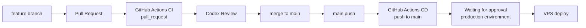

# CI/CD

## 開発フロー

GoTalk は、Pull Request で CI とレビューを行い、main へ merge された変更を main push として CD に流す運用です。

CD workflow は `push` to `main` をトリガーに起動しますが、`production` Environment の承認ゲートを通過してから VPS へデプロイします。



承認者（Required reviewers）は GitHub リポジトリの Settings → Environments → production で管理します。

## 役割分担

| 役割 | 担当 | 内容 |
| --- | --- | --- |
| 実装 | Claude Code | コード変更、修正、テスト追加 |
| 自動検証 | GitHub Actions CI | lint、test、coverage、build |
| レビュー | Codex | 差分確認、品質リスクの指摘、改善提案 |
| デプロイ | GitHub Actions CD | main push を契機に VPS へ SSH デプロイ |

## CI 構成

CI は `.github/workflows/ci.yml` で定義しています。

トリガー:

- `push` to `main`
- `pull_request`

### Frontend job

working directory: `frontend`

- Node.js 22 をセットアップ
- npm cache を有効化
- `npm ci`
- `npm run lint`
- `npm run test`
- `npm run test:coverage`
- `npm run build`

### Backend job

working directory: `backend`

- Go 1.22 をセットアップ
- Go module cache を有効化
- `go vet ./...`
- `go test ./...`
- `go build -o /tmp/gotalk-backend .`

## CI で検証する内容

- PR 時点で静的解析、単体テスト、カバレッジ計測、ビルドを自動検証する
- main へ取り込む前にフロントエンドとバックエンドの基本品質を確認する
- レビュー担当の Codex が、CI 結果と差分を合わせて確認する

## CD 構成

CD は `.github/workflows/cd.yml` で定義しています。

トリガー:

- `push` to `main`

deploy job に `environment: production` を設定しており、GitHub の production Environment に設定された Required reviewers が承認するまでデプロイは保留されます。承認後、GitHub Actions から VPS へ SSH 接続し、VPS 上で Docker Compose を使ってアプリケーションを更新します。

## デプロイ手順

CD workflow では `appleboy/ssh-action@v1.2.2` を使い、VPS 上で以下を実行します。

```bash
set -e
cd ~/gotalk
git pull --ff-only
docker compose up -d --build
docker compose ps
```

## GitHub Secrets

| Secret | 用途 |
| --- | --- |
| `VPS_HOST` | VPS のホスト名または IP アドレス |
| `VPS_USER` | SSH ユーザー |
| `VPS_SSH_KEY` | SSH 秘密鍵 |

## GitHub Environment 設定

production Environment は以下の設定で運用します。

| 項目 | 設定 |
| --- | --- |
| Environment | `production` |
| Required reviewers | `shin-arita` |
| Protection rules | 有効 |

## 運用上の注意

- main push で CD が起動し、production Environment の承認待ちになる
- 承認者が GitHub Actions の画面から approve するとデプロイが実行される
- VPS 側の `~/gotalk` は GitHub の main と `git pull --ff-only` で同期できる
- VPS 側の `.env` に `OPENAI_API_KEY` を設定している
