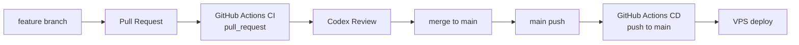

# CI/CD

## 開発フロー

GoTalk は、Pull Request を中心に CI とレビューを行い、main へ merge された変更を main push として CD に流す運用です。現在の CD workflow は CI 完了イベントではなく、`main` ブランチへの push をトリガーに起動します。



この図は「PR で CI を確認してから main に merge する」運用を表しています。workflow として CD が CI の成功を直接待つ構成ではありません。

### 役割分担

| 役割 | 担当 | 内容 |
| --- | --- | --- |
| 実装 | Claude Code | 機能追加、修正、テスト追加 |
| 自動検証 | GitHub Actions CI | lint、test、coverage、build |
| レビュー | Codex | 差分確認、品質リスクの指摘、改善提案 |
| デプロイ | GitHub Actions CD | main push を契機に VPS へ SSH デプロイ |

## CI 構成

CI は `.github/workflows/ci.yml` で定義しています。

トリガー:

- `push` to `main`
- `pull_request`

### Frontend job

- Node.js 22 をセットアップ
- npm cache を有効化
- `npm ci`
- `npm run lint`
- `npm run test`
- `npm run test:coverage`
- `npm run build`

### Backend job

- Go 1.22 をセットアップ
- Go module cache を有効化
- `go vet ./...`
- `go test ./...`
- `go build -o /tmp/gotalk-backend .`

## CI の目的

- PR 時点で静的解析、単体テスト、ビルドを自動検証する
- main へ取り込む前にフロントエンドとバックエンドの基本品質を担保する
- レビュー担当の Codex が、CI 結果と差分を合わせて確認できる状態にする

## CD 構成

CD は `.github/workflows/cd.yml` で定義しています。

トリガー:

- `push` to `main`

main に push されると、GitHub Actions から VPS へ SSH 接続し、VPS 上で Docker Compose を使ってアプリケーションを更新します。現状の workflow は `workflow_run` ではなく `push` to `main` で起動します。

## デプロイ手順

CD workflow では以下を実行します。

```bash
cd ~/gotalk
git pull --ff-only
docker compose up -d --build
docker compose ps
```

## GitHub Secrets

| Secret | 用途 |
| --- | --- |
| `VPS_HOST` | VPS のホスト名または IP アドレス |
| `VPS_USER` | SSH ユーザー |
| `VPS_SSH_KEY` | SSH 秘密鍵 |

## 運用上の注意

- main push で自動デプロイされるため、main へ入れる前に PR で CI を通す
- VPS 側の `~/gotalk` は GitHub の main と同期できる状態にしておく
- VPS 側の `.env` に `OPENAI_API_KEY` を設定しておく
- デプロイ後のヘルスチェック自動化は今後の改善項目
