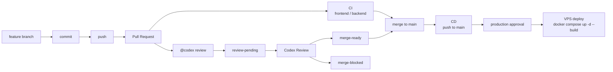

# CI/CD

## 1. 概要

GoTalk は GitHub Actions で CI、CD、Codex Review ラベル運用を行います。

現在存在する workflow は次の 3 つです。

- `.github/workflows/ci.yml`
- `.github/workflows/cd.yml`
- `.github/workflows/codex-review-request.yml`

Pull Request では CI とレビューを行い、`main` へ merge された変更は `push` to `main` として CD workflow に流れます。CD は GitHub Environment `production` の承認を通過してから VPS へ SSH 接続し、Docker Compose で更新します。



## 2. CI

CI は `.github/workflows/ci.yml` で定義されています。

Trigger:

- `push` to `main`
- `pull_request`

### Frontend

Frontend job は `frontend` directory で実行されます。

| 項目 | 内容 |
| --- | --- |
| runner | `ubuntu-latest` |
| Node.js | `22` |
| cache | `npm`、`frontend/package-lock.json` |
| install | `npm ci` |
| lint | `npm run lint` |
| test | `npm run test` |
| coverage | `npm run test:coverage` |
| build | `npm run build` |

### Backend

Backend job は `backend` directory で実行されます。

| 項目 | 内容 |
| --- | --- |
| runner | `ubuntu-latest` |
| Go | `1.22` |
| cache | `backend/go.sum` |
| vet | `go vet ./...` |
| test | `go test ./...` |
| build | `go build -o /tmp/gotalk-backend .` |

## 3. CD

CD は `.github/workflows/cd.yml` で定義されています。

| 項目 | 内容 |
| --- | --- |
| Trigger | `push` to `main` |
| job | `deploy` |
| runner | `ubuntu-latest` |
| environment | `production` |
| deploy target | VPS |
| deploy method | SSH 経由で VPS 上の repository を更新し、Docker Compose を起動 |

`deploy` job は `environment: production` を指定しています。GitHub Environment 側で Required reviewers が設定されている場合、承認されるまで VPS への deploy は実行されません。

VPS への SSH 接続には `appleboy/ssh-action@v1.2.2` を使います。参照する GitHub Secrets は次のとおりです。

| Secret | 用途 |
| --- | --- |
| `VPS_HOST` | VPS host |
| `VPS_USER` | SSH user |
| `VPS_SSH_KEY` | SSH private key |

VPS 上で実行する deploy script:

```bash
set -e
cd ~/gotalk
git pull --ff-only
docker compose up -d --build
docker compose ps
```

## 4. GitHub Actions

現在存在する workflow は次のとおりです。

| ファイル名 | Trigger | 役割 |
| --- | --- | --- |
| `.github/workflows/ci.yml` | `push` to `main`、`pull_request` | Frontend と Backend の lint / test / coverage / build |
| `.github/workflows/cd.yml` | `push` to `main` | `production` Environment 承認後、VPS に SSH 接続して Docker Compose で deploy |
| `.github/workflows/codex-review-request.yml` | `issue_comment` created、`pull_request` synchronize | `@codex review` request と Codex bot result に応じて PR label を更新 |

`codex-review-request.yml` は次の label を扱います。

| Label | 用途 |
| --- | --- |
| `review-pending` | Codex review 待ち |
| `merge-ready` | review 結果が merge 可能 |
| `merge-blocked` | review 結果が merge block |

`@codex review` を含む人間の PR comment では `review-pending` を追加し、`merge-ready` と `merge-blocked` を外します。Bot comment では本文の keyword から ready / blocked を判定し、`merge-ready` または `merge-blocked` を適用します。PR synchronize では `merge-ready` を外して `review-pending` を追加します。`merge-blocked` は synchronize では外しません。

## 5. 開発フロー

現在の運用フローは次のとおりです。

1. feature branch を作成する
2. Claude Code で実装、修正、テスト、ドキュメント更新を行う
3. commit する
4. branch を push する
5. Pull Request を作成する
6. GitHub Actions CI で Frontend / Backend の検証を行う
7. PR comment で `@codex review` を依頼する
8. Codex Review の結果に応じて `merge-ready` または `merge-blocked` label が付く
9. CI と review 結果を確認して merge する
10. `main` への push を trigger に CD が起動する
11. `production` Environment の承認後、VPS に deploy する

## 6. 品質保証

品質保証は CI、テスト、build、Codex Review を組み合わせます。

Frontend:

- ESLint: `npm run lint`
- Vitest: `npm run test`
- coverage: `npm run test:coverage`
- TypeScript / Vite build: `npm run build`

Backend:

- Go vet: `go vet ./...`
- Go test: `go test ./...`
- Go build: `go build -o /tmp/gotalk-backend .`

Codex Review:

- PR 差分に対する review request を `@codex review` comment で開始する
- review request 中は `review-pending` を使う
- review 結果 comment に応じて `merge-ready` または `merge-blocked` を付ける
- PR 更新時は `merge-ready` を外し、再 review 待ちとして `review-pending` を付ける

## 7. デプロイ後確認

CD workflow は deploy script の最後で `docker compose ps` を実行します。

デプロイ後は VPS 上の Docker Compose service 状態と、Backend の health check を確認します。Backend health check は `/health` で `{"status":"ok"}` を返します。

## 8. 関連ドキュメント

- [development.md](development.md)
- [testing.md](testing.md)
- [architecture.md](architecture.md)
