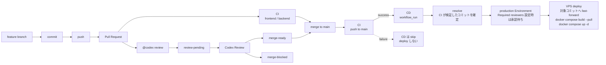

# CI/CD

## 1. 概要

GoTalk は GitHub Actions で CI、CD、Codex Review ラベル運用を行います。

現在存在する workflow は次の 3 つです。

- `.github/workflows/ci.yml`
- `.github/workflows/cd.yml`
- `.github/workflows/codex-review-request.yml`

Pull Request では CI とレビューを行います。`main` へ merge されると `push` to `main` で CI が起動し、その CI が完了すると `workflow_run` で CD workflow が起動します。CD は、`main` への push で起動した CI が成功した場合だけ deploy に進み、その CI が検証したコミットを VPS に反映します。CI が失敗した場合、CD の job は skip され、deploy も承認待ちも発生しません。CD の deploy job は GitHub Environment `production` を指定しているため、GitHub 側で Required reviewers が設定されている場合は、承認されるまで VPS への SSH 接続と Docker Compose による更新は実行されません。


```mermaid
flowchart LR
  Feature[feature branch] --> Commit[commit]
  Commit --> Push[push]
  Push --> PR[Pull Request]
  PR --> CI[CI<br/>frontend / backend]
  PR --> ReviewRequest["@codex review"]
  ReviewRequest --> ReviewPending[review-pending]
  ReviewPending --> Codex[Codex Review]
  Codex --> Ready[merge-ready]
  Codex --> Blocked[merge-blocked]
  Ready --> Merge[merge to main]
  CI --> Merge
  Merge --> CIMain[CI<br/>push to main]
  CIMain -->|success| CD[CD<br/>workflow_run]
  CIMain -.->|failure| Skip[CD は skip<br/>deploy しない]
  CD --> Resolve[resolve<br/>CI が検証したコミットを確定]
  Resolve --> Approval[production Environment<br/>Required reviewers 設定時は承認待ち]
  Approval --> VPS[VPS deploy<br/>対象コミットへ fast-forward<br/>docker compose build --pull<br/>docker compose up -d]
```

## 2. CI

CI は `.github/workflows/ci.yml` で定義されています。

Trigger:

- `push` to `main`
- `pull_request`

### Frontend

Frontend job は `frontend` directory で実行されます。

| 項目 | 内容 |
| --- | --- |
| runner | `ubuntu-latest` |
| action | `actions/checkout@v7`、`actions/setup-node@v7` |
| Node.js | `22` |
| cache | `npm`、`frontend/package-lock.json` |
| install | `npm ci` |
| lint | `npm run lint` |
| test | `npm run test` |
| coverage | `npm run test:coverage` |
| build | `npm run build` |

### Backend

Backend job は `backend` directory で実行されます。

| 項目 | 内容 |
| --- | --- |
| runner | `ubuntu-latest` |
| action | `actions/checkout@v7`、`actions/setup-go@v7` |
| Go | `setup-go` の `go-version: "1.24"` と `check-latest: true`（1.24 系の最新パッチ） |
| cache | `backend/go.sum` |
| gofmt | `gofmt -l .` の結果が空でなければ失敗 |
| vet | `go vet ./...` |
| test | `go test ./...` |
| build | `go build -o /tmp/gotalk-backend .` |

Go のバージョンは次のように決まります。

| 対象 | 指定 | 使われる Go |
| --- | --- | --- |
| CI | `setup-go` の `go-version: "1.24"` と `check-latest: true` | CI の実行時点での 1.24 系の最新パッチ |
| 本番の Docker build（CD） | `backend/Dockerfile` の `golang:1.24-alpine` | CD の deploy script が `docker compose build --pull` で pull した、deploy の時点で `golang:1.24-alpine` が指しているパッチ |
| `backend/go.mod` | `go 1.24.0` | 必要な最低バージョン。CI と Docker のどちらのパッチもこれを満たす |

CI は実行のたびに 1.24 系の最新パッチをセットアップします。CD の deploy script は `docker compose build --pull` を実行し、base image の新しい版を pull してから build します。Docker の build は `--pull` を指定しない場合はローカルにある base image を使うため、`--pull` を付けることで、VPS に以前 pull した image が残っていても、deploy の時点で `golang:1.24-alpine` が指しているパッチが使われます。`backend/Dockerfile` の `alpine:3.22` と `frontend/Dockerfile` の `node:22-alpine` も同じく pull されます。

CI と本番の deploy の時点が異なる場合や、`golang:1.24-alpine` の更新が Go の新しいパッチのリリースより遅れる場合は、CI と本番でパッチバージョンが異なることがあります。差は、次の deploy で `golang:1.24-alpine` が新しいパッチを指していれば解消されます。

開発用の `docker compose build` や `docker compose up --build` は `--pull` を付けないため、手元にある base image を使います。

`ci.yml` の各 action（`actions/checkout@v7`、`actions/setup-node@v7`、`actions/setup-go@v7`）は、Node.js 24 で動くメジャーバージョンです。

`go vet` の前に gofmt の確認 step を実行します。`gofmt -l .` が整形されていないファイルを 1 件でも表示した場合は、そのファイル名を出力して job を失敗させます。

## 3. CD

CD は `.github/workflows/cd.yml` で定義されています。

| 項目 | 内容 |
| --- | --- |
| Trigger | `workflow_run`（`CI` の `completed`、branch `main`）、`workflow_dispatch`（手動） |
| job | `resolve`、`deploy`（`needs: resolve`） |
| concurrency | group `cd-production`、`cancel-in-progress: false` |
| runner | `ubuntu-latest` |
| environment | `production` |
| deploy target | VPS |
| deploy method | SSH 経由で VPS 上の repository を CI が検証したコミットへ fast-forward し、base image を pull して build し、Docker Compose を起動 |

### 起動条件と deploy するコミット

CD は `workflow_run` で、`CI` workflow の完了（`completed`）を契機に起動します。`branches: [main]` を指定しているため、`main` で実行された CI だけが対象です。`workflow_run` は CI の結果にかかわらず完了時に起動するため、`resolve` job の `if` で次の 3 つをすべて満たす場合だけ処理を進めます。

- `github.event.workflow_run.conclusion` が `success`
- `github.event.workflow_run.event` が `push`（Pull Request の CI は対象外）
- `github.event.workflow_run.head_branch` が `main`

条件を満たさない場合は `resolve` job が skip され、`needs: resolve` の `deploy` job も skip されます。この場合、`production` Environment の承認待ちにもなりません。

`resolve` job は deploy するコミットを確定し、次を確認します。いずれかを満たさない場合は job を失敗させ、deploy には進みません。

| 確認内容 | 方法 |
| --- | --- |
| deploy するコミット | `workflow_run` では CI が検証したコミット（`github.event.workflow_run.head_sha`）。`workflow_dispatch` では入力の `sha`、省略時は実行時点の `main` の先頭 |
| 40 桁の SHA であること | 正規表現で確認 |
| `main` に含まれるコミットであること | GitHub API の compare（`<sha>...main`）が `identical` または `ahead` |
| `push` to `main` の CI が成功していること | GitHub API で `ci.yml` の run を `head_sha`、`event=push`、`status=success` で検索し、1 件以上あること |

`deploy` job は `environment: production` を指定しています。GitHub Environment 側で Required reviewers が設定されている場合、承認されるまで VPS への deploy は実行されません。承認待ちの間に `main` が進んでも、deploy するのは `resolve` job で確定したコミットです。

### deploy が重ならないようにする仕組み

workflow に `concurrency`（group `cd-production`、`cancel-in-progress: false`）を指定しています。同じ group で実行中の run がある間、新しい run は待機（pending）になり、実行中の deploy は途中で止めません。待機中の run がある状態でさらに新しい run が来た場合は、待機中の古い run がキャンセルされ、新しい run に置き換わります。

GitHub のドキュメントでは、concurrency group の中での実行順は保証されないとされています。そのため、deploy script でも、VPS の現在のコミット（`HEAD`）が deploy するコミットの祖先であることを確認します。新しいコミットがすでに反映されている状態で古いコミットの deploy が来た場合は、`git merge-base --is-ancestor` の確認で失敗し、古いコミットへ戻しません。

### 手動での再 deploy

次の 2 つの方法があります。どちらの場合も、`main` 上の、`push` to `main` の CI が成功したコミットだけが deploy されます。

| 方法 | 動き |
| --- | --- |
| CD の run を GitHub の Actions 画面で Re-run する | 元の run と同じ event（同じ `workflow_run.head_sha`）で再実行し、同じコミットを deploy し直す。GitHub のドキュメントでは、Re-run は最初の実行から 30 日以内に限られる |
| CD workflow を `workflow_dispatch` で実行する（Actions 画面の「Run workflow」、または `gh workflow run cd.yml -f sha=<SHA>`） | `sha` を指定した場合はそのコミット、省略した場合は実行時点の `main` の先頭を deploy する。`resolve` job の確認を通らないコミットは deploy しない |

CI の run を Re-run して成功した場合も、CI の完了で `workflow_run` が起動するため、CD がもう一度起動します。

VPS が同じコミットのままでも deploy script はそのまま実行できるため、再 deploy では base image の pull、build、service の更新がもう一度行われます。VPS ですでに新しいコミットが反映されている場合に、それより古いコミットを指定すると、上の祖先の確認で失敗します。古いコミットへの切り戻しは、この workflow ではできません。

VPS への SSH 接続には `appleboy/ssh-action@v1.2.2` を使います。参照する GitHub Secrets は次のとおりです。

| Secret | 用途 |
| --- | --- |
| `VPS_HOST` | VPS host |
| `VPS_USER` | SSH user |
| `VPS_SSH_KEY` | SSH private key |

VPS 上で実行する deploy script（`TARGET_SHA` には `resolve` job で確定したコミットが入ります）:

```bash
set -e
cd ~/gotalk
TARGET_SHA=<resolve job で確定したコミット>
git fetch origin main
if ! git merge-base --is-ancestor HEAD "$TARGET_SHA"; then
  echo "Current HEAD $(git rev-parse HEAD) is not an ancestor of $TARGET_SHA; refusing to deploy"
  exit 1
fi
git merge --ff-only "$TARGET_SHA"
if [ "$(git rev-parse HEAD)" != "$TARGET_SHA" ]; then
  echo "HEAD $(git rev-parse HEAD) does not match $TARGET_SHA"
  exit 1
fi
docker compose build --pull
docker compose up -d
docker compose ps
```

deploy script は次の順に処理します。

1. `git fetch origin main` で `origin/main` を取得する
2. VPS の現在のコミット（`HEAD`）が `TARGET_SHA` の祖先であることを確認する（同じコミットの場合も含む）
3. `git merge --ff-only "$TARGET_SHA"` で、checkout 中の branch を `TARGET_SHA` まで fast-forward する。`origin/main` が `TARGET_SHA` より先に進んでいても、`TARGET_SHA` より先のコミットは反映しない
4. `HEAD` が `TARGET_SHA` と一致することを確認する
5. `docker compose build --pull` で base image を pull してから image を build する
6. `docker compose up -d` で service を更新する
7. `docker compose ps` で service 状態を表示する

VPS の作業ツリーは、これまでどおり `~/gotalk` の `main` を fast-forward で更新します。`TARGET_SHA` まで fast-forward した後も `main` は `origin/main` の祖先なので、VPS で手作業の `git pull --ff-only` を実行すれば、これまでどおり `origin/main` の先頭まで進められます。

`docker compose build --pull` と `docker compose up -d` はサービス名を指定していませんが、`backend-dev` には `profiles: ["dev"]` が付いているため対象にならず、`frontend` と `backend` だけを pull・build・起動します。

base image の pull は、`docker-compose.yml` の `build.pull` ではなく deploy script の `--pull` で行います。`docker-compose.yml` に `pull: true` を書くと、開発環境の `docker compose build` や `docker compose up --build` でも毎回 pull が行われるためです。

## 4. GitHub Actions

現在存在する workflow は次のとおりです。

| ファイル名 | Trigger | 役割 |
| --- | --- | --- |
| `.github/workflows/ci.yml` | `push` to `main`、`pull_request` | Frontend の lint / test / coverage / build、Backend の gofmt / vet / test / build |
| `.github/workflows/cd.yml` | `workflow_run`（`CI` の完了、`main`）、`workflow_dispatch` | `push` to `main` の CI が成功したコミットを VPS に deploy（base image を pull して build）。`production` Environment を指定しており、Required reviewers が設定されている場合は承認後に実行 |
| `.github/workflows/codex-review-request.yml` | `issue_comment` created、`pull_request` synchronize | `@codex review` request と Codex bot result に応じて PR label を更新 |

`codex-review-request.yml` は次の label を扱います。

| Label | 用途 |
| --- | --- |
| `review-pending` | Codex review 待ち |
| `merge-ready` | review 結果が merge 可能 |
| `merge-blocked` | review 結果が merge block |

`@codex review` を含む人間の PR comment では `review-pending` を追加し、`merge-ready` と `merge-blocked` を外します。Bot comment では本文の keyword から ready / blocked を判定し、`merge-ready` または `merge-blocked` を適用します。PR synchronize では `merge-ready` を外して `review-pending` を追加します。`merge-blocked` は synchronize では外しません。

## 5. 開発フロー

現在の運用フローは次のとおりです。

1. feature branch を作成する
2. Claude Code で実装、修正、テスト、ドキュメント更新を行う
3. commit する
4. branch を push する
5. Pull Request を作成する
6. GitHub Actions CI で Frontend / Backend の検証を行う
7. PR comment で `@codex review` を依頼する
8. Codex Review の結果に応じて `merge-ready` または `merge-blocked` label が付く
9. CI と review 結果を確認して merge する
10. `main` への push を trigger に CI が起動する
11. CI が成功すると CD が起動し、CI が検証したコミットを確定する（CI が失敗した場合は deploy しない）
12. `production` Environment に Required reviewers が設定されている場合は承認後に、そのコミットを VPS に deploy する

## 6. 品質保証

品質保証は CI、テスト、build、Codex Review を組み合わせます。

Frontend:

- ESLint: `npm run lint`
- Vitest: `npm run test`
- coverage: `npm run test:coverage`
- TypeScript / Vite build: `npm run build`

Backend:

- Go vet: `go vet ./...`
- Go test: `go test ./...`
- Go build: `go build -o /tmp/gotalk-backend .`

Codex Review:

- PR 差分に対する review request を `@codex review` comment で開始する
- review request 中は `review-pending` を使う
- review 結果 comment に応じて `merge-ready` または `merge-blocked` を付ける
- PR 更新時は `merge-ready` を外し、再 review 待ちとして `review-pending` を付ける

## 7. デプロイ後確認

CD workflow は deploy script の最後で `docker compose ps` を実行します。

デプロイ後は VPS 上の Docker Compose service 状態と、Backend の health check を確認します。Backend health check は `/health` で `{"status":"ok"}` を返します。

## 8. 関連ドキュメント

- [development.md](development.md)
- [testing.md](testing.md)
- [architecture.md](architecture.md)
