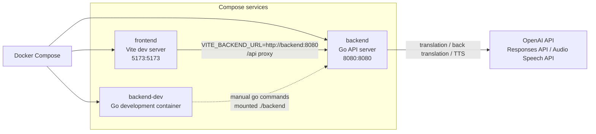
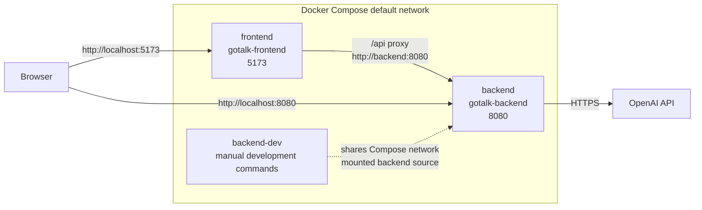

# Docker

## 1. 概要

GoTalk の Docker 構成は `docker-compose.yml` で定義されています。現在の service は次の 3 つです。

- `frontend`
- `backend`
- `backend-dev`

`frontend` は Vite dev server を起動する開発用 Frontend service です。`backend` は Go API server を起動する Backend service です。`backend-dev` は Backend ディレクトリを mount して Go tooling を実行するための開発用 service です。

通常のアプリケーション実行では `frontend` と `backend` が接続します。`backend-dev` は通常運用で常時起動する service ではなく、Backend の開発作業でコマンドを指定して使うための service です。

## 2. 全体構成



`frontend` は `depends_on` で `backend` に依存します。Frontend から Backend への `/api` request は Vite proxy により `VITE_BACKEND_URL` または `http://localhost:8080` へ転送されます。Compose では `frontend` に `VITE_BACKEND_URL=http://backend:8080` を渡しています。

## 3. docker-compose 構成

`docker-compose.yml` は `services` だけを定義しています。明示的な top-level `networks` は定義されていません。

| Service | image | build | ports | environment | volumes | network |
| --- | --- | --- | --- | --- | --- | --- |
| `frontend` | 定義なし | `context: ./frontend` | `5173:5173` | `VITE_BACKEND_URL=http://backend:8080` | `./frontend:/app`, `/app/node_modules` | Compose default network |
| `backend` | 定義なし | `context: ./backend` | `8080:8080` | `OPENAI_API_KEY=${OPENAI_API_KEY}`, `OPENAI_MODEL=${OPENAI_MODEL:-gpt-4o-mini}`, `DEBUG_TRANSLATION=true` | 定義なし | Compose default network |
| `backend-dev` | 定義なし | `context: ./backend`, `dockerfile: Dockerfile.dev` | 定義なし | `OPENAI_API_KEY=${OPENAI_API_KEY}`, `OPENAI_MODEL=${OPENAI_MODEL:-gpt-4o-mini}` | `./backend:/app` | Compose default network |

`frontend` には `depends_on: backend` が設定されています。`backend-dev` には `entrypoint: [""]` が設定されています。

## 4. frontend

`frontend` service は `frontend/Dockerfile` から build されます。

| 項目 | 内容 |
| --- | --- |
| Dockerfile | `frontend/Dockerfile` |
| ベースイメージ | `node:22-alpine` |
| Working directory | `/app` |
| package copy | `package*.json` |
| dependency install | `npm install` |
| source copy | `COPY . .` |
| exposed port | `5173` |
| command | `npm run dev -- --host` |

Compose では host の `5173` を container の `5173` に bind します。

```yaml
ports:
  - "5173:5173"
```

開発中の source は `./frontend:/app` で mount されます。`/app/node_modules` は anonymous volume として定義され、container 内の `node_modules` を使います。

```yaml
volumes:
  - ./frontend:/app
  - /app/node_modules
```

`frontend` には `VITE_BACKEND_URL=http://backend:8080` が渡されます。Architecture に記載されているとおり、Vite の開発サーバーでは `/api` request を `VITE_BACKEND_URL` または `http://localhost:8080` に proxy します。

## 5. backend

`backend` service は `backend/Dockerfile` から build されます。

`backend/Dockerfile` はマルチステージビルドです。

| Stage | ベースイメージ | 内容 |
| --- | --- | --- |
| builder | `golang:1.24-alpine` | `go.mod` を copy し、`go mod download` 後に source を copy して `go build -o server .` を実行する |
| runtime | `alpine:3.22` | builder stage の `/app/server` を copy して `./server` を実行する |

runtime stage の working directory は `/app` です。`EXPOSE 8080` が定義され、Compose では host の `8080` を container の `8080` に bind します。

```yaml
ports:
  - "8080:8080"
```

`backend` には OpenAI API 呼び出しに使う環境変数が渡されます。

```yaml
environment:
  - OPENAI_API_KEY=${OPENAI_API_KEY}
  - OPENAI_MODEL=${OPENAI_MODEL:-gpt-4o-mini}
  - DEBUG_TRANSLATION=true
```

Backend は OpenAI Responses API で翻訳とバックトランスレーションを行い、OpenAI Audio Speech API で TTS を行います。OpenAI API key は Backend 側の環境変数として扱われます。

## 6. backend-dev

`backend-dev` service は `backend/Dockerfile.dev` から build されます。

| 項目 | 内容 |
| --- | --- |
| Dockerfile | `backend/Dockerfile.dev` |
| ベースイメージ | `golang:1.24-alpine` |
| PATH 設定 | `/etc/profile.d/go.sh` に `/go/bin:/usr/local/go/bin:$PATH` を設定 |
| Working directory | `/app` |
| volume | `./backend:/app` |
| ports | 定義なし |
| entrypoint | `[""]` |

`backend-dev` は Backend の開発用途の service です。`./backend` を `/app` に mount するため、Backend の source に対して Go command を実行できます。Compose 上では `ports` が定義されておらず、通常運用で常時起動する API server service ではありません。

利用例:

```bash
docker compose run --rm backend-dev gofmt -w .
docker compose run --rm backend-dev go test ./...
```

`backend-dev` には `OPENAI_API_KEY` と `OPENAI_MODEL` が渡されます。`DEBUG_TRANSLATION` は `backend-dev` には定義されていません。

## 7. 環境変数

現在の Docker 構成と関連する実装で使われている環境変数は次のとおりです。

| 環境変数 | 設定箇所 | 用途 | 未設定時 |
| --- | --- | --- | --- |
| `OPENAI_API_KEY` | `backend`, `backend-dev` | Backend から OpenAI API を呼び出すための API key | Backend API で service unavailable 系の error |
| `OPENAI_MODEL` | `backend`, `backend-dev` | 翻訳とバックトランスレーションに使う model | Compose では `gpt-4o-mini` |
| `DEBUG_TRANSLATION` | `backend` | 翻訳 debug log の出力制御 | Compose では `true` |
| `VITE_BACKEND_URL` | `frontend` | Vite proxy の Backend 接続先 | Architecture では `http://localhost:8080` が fallback として記載されている |
| `OPENAI_TTS_MODEL` | Backend 実装 | TTS model | `gpt-4o-mini-tts` |
| `OPENAI_TTS_VOICE` | Backend 実装 | TTS voice | `marin` |

`OPENAI_TTS_MODEL` と `OPENAI_TTS_VOICE` は `docker-compose.yml` では定義されていません。Backend 実装では未設定時の default が使われます。

## 8. ネットワーク構成



`frontend` と `backend` は Compose default network 上で service 名により接続します。`frontend` から見た Backend の URL は `http://backend:8080` です。

host からは `frontend` が `localhost:5173`、`backend` が `localhost:8080` で到達できます。`backend` は OpenAI API へ outbound 接続します。

`backend-dev` は同じ Compose project の service ですが、port は公開していません。Backend source を mount した開発用 container として使います。

## 9. 開発手順

Docker 開発環境の基本的な流れは次のとおりです。

1. 必要な環境変数を shell または `.env` から Compose に渡す
2. `docker compose build` で image を build する
3. `docker compose up` で `frontend` と `backend` を起動する
4. `http://localhost:5173` で Frontend を確認する
5. `http://localhost:8080/health` で Backend の health check を確認する
6. Backend 開発用 command は `docker compose run --rm backend-dev ...` で実行する

詳細な開発手順は [development.md](development.md) を参照してください。

## 10. 関連ドキュメント

- [architecture.md](architecture.md)
- [api.md](api.md)
- [development.md](development.md)
