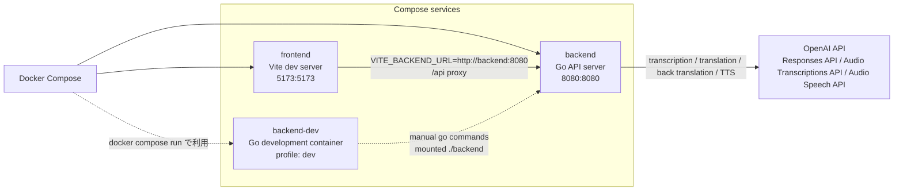
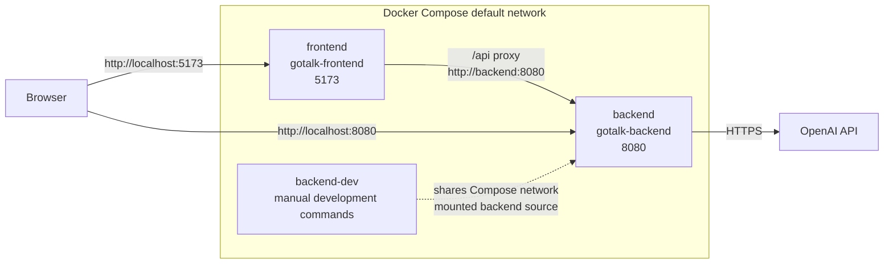

# Docker

## 1. 概要

GoTalk の Docker 構成は `docker-compose.yml` で定義されています。現在の service は次の 3 つです。

- `frontend`
- `backend`
- `backend-dev`

`frontend` は Vite dev server を起動する開発用 Frontend service です。`backend` は Go API server を起動する Backend service です。`backend-dev` は Backend ディレクトリを mount して Go tooling を実行するための開発用 service です。

通常のアプリケーション実行では `frontend` と `backend` が接続します。`backend-dev` は `profiles: ["dev"]` に属しており、サービス名を指定しない `docker compose up` の対象になりません。通常運用で常時起動する service ではなく、Backend の開発作業で `docker compose run` によりコマンドを指定して使うための service です。

## 2. 全体構成


```mermaid
flowchart LR
  Compose[Docker Compose]

  subgraph Services[Compose services]
    Frontend[frontend<br/>Vite dev server<br/>5173:5173]
    Backend[backend<br/>Go API server<br/>8080:8080]
    BackendDev[backend-dev<br/>Go development container<br/>profile: dev]
  end

  OpenAI[OpenAI API<br/>Responses API / Audio Transcriptions API / Audio Speech API]

  Compose --> Frontend
  Compose --> Backend
  Compose -.->|docker compose run で利用| BackendDev

  Frontend -->|VITE_BACKEND_URL=http://backend:8080<br/>/api proxy| Backend
  Backend -->|transcription / translation / back translation / TTS| OpenAI
  BackendDev -.->|manual go commands<br/>mounted ./backend| Backend
```

`frontend` は `depends_on` で `backend` に依存します。Frontend から Backend への `/api` request は Vite proxy により `VITE_BACKEND_URL` へ転送され、`VITE_BACKEND_URL` が未設定の場合は `http://localhost:8080` へ転送されます（`frontend/vite.config.ts`）。Compose では `frontend` に `VITE_BACKEND_URL=http://backend:8080` を渡しています。

## 3. docker-compose 構成

`docker-compose.yml` は `services` だけを定義しています。明示的な top-level `networks` は定義されていません。

| Service | profiles | image | build | ports | environment | volumes | network |
| --- | --- | --- | --- | --- | --- | --- | --- |
| `frontend` | 定義なし | 定義なし | `context: ./frontend` | `5173:5173` | `VITE_BACKEND_URL=http://backend:8080` | `./frontend:/app`, `/app/node_modules` | Compose default network |
| `backend` | 定義なし | 定義なし | `context: ./backend` | `8080:8080` | `OPENAI_API_KEY=${OPENAI_API_KEY}`, `OPENAI_MODEL=${OPENAI_MODEL:-gpt-4o-mini}`, `DEBUG_TRANSLATION=true` | 定義なし | Compose default network |
| `backend-dev` | `["dev"]` | 定義なし | `context: ./backend`, `dockerfile: Dockerfile.dev` | 定義なし | `OPENAI_API_KEY=${OPENAI_API_KEY}`, `OPENAI_MODEL=${OPENAI_MODEL:-gpt-4o-mini}` | `./backend:/app` | Compose default network |

`frontend` には `depends_on: backend` が設定されています。`backend-dev` には `profiles: ["dev"]` と `entrypoint: [""]` が設定されています。

`profiles` を持たない `frontend` と `backend` は常に有効です。`backend-dev` は `dev` profile が有効なときだけ Compose の対象になるため、サービス名を指定しない `docker compose build`、`docker compose up` では `frontend` と `backend` だけが build・起動されます。`docker compose config --services` には `frontend` と `backend` だけが表示され、`docker compose --profile dev config --services` では `backend-dev` も表示されます。

## 4. frontend

`frontend` service は `frontend/Dockerfile` から build されます。

| 項目 | 内容 |
| --- | --- |
| Dockerfile | `frontend/Dockerfile` |
| ベースイメージ | `node:22-alpine` |
| Working directory | `/app` |
| package copy | `package*.json` |
| dependency install | `npm install` |
| source copy | `COPY . .` |
| exposed port | `5173` |
| command | `npm run dev -- --host` |

Compose では host の `5173` を container の `5173` に bind します。

```yaml
ports:
  - "5173:5173"
```

開発中の source は `./frontend:/app` で mount されます。`/app/node_modules` は anonymous volume として定義され、container 内の `node_modules` を使います。

```yaml
volumes:
  - ./frontend:/app
  - /app/node_modules
```

`frontend` には `VITE_BACKEND_URL=http://backend:8080` が渡されます。`frontend/vite.config.ts` により、Vite の開発サーバーは `/api` request を `VITE_BACKEND_URL` に proxy し、未設定の場合は `http://localhost:8080` に proxy します。

## 5. backend

`backend` service は `backend/Dockerfile` から build されます。

`backend/Dockerfile` はマルチステージビルドです。

| Stage | ベースイメージ | 内容 |
| --- | --- | --- |
| builder | `golang:1.24-alpine` | `go.mod` を copy し、`go mod download` 後に source を copy して `go build -o server .` を実行する |
| runtime | `alpine:3.22` | builder stage の `/app/server` を copy して `./server` を実行する |

runtime stage の working directory は `/app` です。`EXPOSE 8080` が定義され、Compose では host の `8080` を container の `8080` に bind します。

```yaml
ports:
  - "8080:8080"
```

`backend` には OpenAI API 呼び出しに使う環境変数が渡されます。

```yaml
environment:
  - OPENAI_API_KEY=${OPENAI_API_KEY}
  - OPENAI_MODEL=${OPENAI_MODEL:-gpt-4o-mini}
  - DEBUG_TRANSLATION=true
```

Backend は OpenAI Audio Transcriptions API で言語判定と文字起こしを行い、OpenAI Responses API で翻訳とバックトランスレーションを行い、OpenAI Audio Speech API で TTS を行います。OpenAI API key は Backend 側の環境変数として扱われます。

## 6. backend-dev

`backend-dev` service は `backend/Dockerfile.dev` から build されます。

| 項目 | 内容 |
| --- | --- |
| Dockerfile | `backend/Dockerfile.dev` |
| ベースイメージ | `golang:1.24-alpine` |
| PATH 設定 | `/etc/profile.d/go.sh` に `/go/bin:/usr/local/go/bin:$PATH` を設定 |
| Working directory | `/app` |
| volume | `./backend:/app` |
| ports | 定義なし |
| profiles | `["dev"]` |
| entrypoint | `[""]` |

`backend-dev` は Backend の開発用途の service です。`./backend` を `/app` に mount するため、Backend の source に対して Go command を実行できます。Compose 上では `ports` が定義されておらず、通常運用で常時起動する API server service ではありません。

`backend-dev` は `profiles: ["dev"]` に属しているため、サービス名を指定しない `docker compose up` では起動しません。`docker compose run` でサービス名を指定すると、`--profile dev` を付けなくても実行できます。

利用例:

```bash
docker compose run --rm backend-dev gofmt -w .
docker compose run --rm backend-dev go test ./...
```

`backend-dev` には `OPENAI_API_KEY` と `OPENAI_MODEL` が渡されます。`DEBUG_TRANSLATION` は `backend-dev` には定義されていません。

## 7. 環境変数

現在の Docker 構成と関連する実装で使われている環境変数は次のとおりです。

| 環境変数 | 設定箇所 | 用途 | 未設定時 |
| --- | --- | --- | --- |
| `OPENAI_API_KEY` | Compose が `backend`、`backend-dev` に `${OPENAI_API_KEY}` を渡す | Backend から OpenAI API を呼び出すための API key | `/api/tts`、`/api/interpret` は HTTP 500 `service unavailable`、`/api/translate` は HTTP 500 `translation service unavailable` を返す |
| `OPENAI_MODEL` | Compose が `backend`、`backend-dev` に `${OPENAI_MODEL:-gpt-4o-mini}` を渡す（`.env` などで未設定なら `gpt-4o-mini`） | 翻訳とバックトランスレーションに使う model | `gpt-4o-mini` |
| `DEBUG_TRANSLATION` | Compose が `backend` に `true` を渡す（`backend-dev` には渡さない） | 翻訳 debug log の出力制御。`true` のときだけ出力する | debug log を出力しない |
| `VITE_BACKEND_URL` | Compose が `frontend` に `http://backend:8080` を渡す | Vite proxy の Backend 接続先 | `http://localhost:8080`（`frontend/vite.config.ts`） |
| `OPENAI_TTS_MODEL` | Compose では渡さない。ホスト上で Backend を直接実行するときのシェルの環境変数だけ | TTS model | `gpt-4o-mini-tts` |
| `OPENAI_TTS_VOICE` | Compose では渡さない。ホスト上で Backend を直接実行するときのシェルの環境変数だけ | TTS voice | `marin` |
| `WHISPER_MODEL` | Compose では渡さない。ホスト上で Backend を直接実行するときのシェルの環境変数だけ | `/api/interpret` で音声を文字起こしする model | `gpt-4o-transcribe` |

「未設定時」の列は、アプリケーションが環境変数を受け取らなかったときの動作です。

`.env` を読むのは Docker Compose の変数置換だけで、Backend 自身は `.env` を読み込みません（`backend/main.go` は `os.Getenv` で環境変数を読むだけです）。`OPENAI_TTS_MODEL`、`OPENAI_TTS_VOICE`、`WHISPER_MODEL` は `docker-compose.yml` が backend に渡していないため、`.env` に書いても、どの起動方法でも反映されず、Backend 実装の未設定時の default が使われます。これらはホスト上で Backend を直接実行する場合に、シェルの環境変数として渡したときだけ反映されます（[development.md](development.md) を参照）。言語判定に使う `whisper-1` は Backend 実装で固定されており、環境変数では変更できません。

## 8. ネットワーク構成


```mermaid
flowchart LR
  Browser[Browser]

  subgraph Compose[Docker Compose default network]
    Frontend[frontend<br/>gotalk-frontend<br/>5173]
    Backend[backend<br/>gotalk-backend<br/>8080]
    BackendDev[backend-dev<br/>manual development commands]
  end

  OpenAI[OpenAI API]

  Browser -->|http://localhost:5173| Frontend
  Frontend -->|/api proxy<br/>http://backend:8080| Backend
  Browser -->|http://localhost:8080| Backend
  Backend -->|HTTPS| OpenAI
  BackendDev -.->|shares Compose network<br/>mounted backend source| Backend
```

`frontend` と `backend` は Compose default network 上で service 名により接続します。`frontend` から見た Backend の URL は `http://backend:8080` です。

host からは `frontend` が `localhost:5173`、`backend` が `localhost:8080` で到達できます。`backend` は OpenAI API へ outbound 接続します。

`backend-dev` は同じ Compose project の service ですが、port は公開していません。`dev` profile に属しているため、サービス名を指定しない `docker compose up` では container が作られず、`docker compose run` で実行したときに作られます。Backend source を mount した開発用 container として使います。

## 9. 開発手順

Docker 開発環境の基本的な流れは次のとおりです。

1. 必要な環境変数を shell または `.env` から Compose に渡す
2. `docker compose build` で image を build する
3. `docker compose up frontend backend` で `frontend` と `backend` を起動する
4. `http://localhost:5173` で Frontend を確認する
5. `http://localhost:8080/health` で Backend の health check を確認する
6. Backend 開発用 command は `docker compose run --rm backend-dev ...` で実行する

`backend-dev` は `profiles: ["dev"]` に属しているため、手順2と手順3のどちらでも build・起動の対象になりません。サービス名を指定しない `docker compose up` でも、起動するのは `frontend` と `backend` だけです。手順6の `docker compose run --rm backend-dev ...` は `--profile` を付けずに実行できます。

詳細な開発手順は [development.md](development.md) を参照してください。

## 10. 関連ドキュメント

- [architecture.md](architecture.md)
- [api.md](api.md)
- [development.md](development.md)
