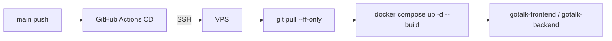

# Infrastructure

## 概要

GoTalk は VPS 上で Docker Compose により frontend/backend を起動します。GitHub Actions CD から SSH で VPS に接続し、main ブランチの最新状態を pull して再ビルド、再起動します。

公開環境は HTTPS で公開しています。Uptime Kuma による死活監視、Discord Webhook による障害通知、本番 VPS 設定のバックアップを運用に組み込んでいます。

## VPS 構成

本番配置:

```text
~/gotalk
├── backend/
├── frontend/
├── docker-compose.yml
└── .env
```

CD workflow は VPS 上で `cd ~/gotalk` を実行し、この配置で運用しています。

## Docker Compose

`docker-compose.yml` では frontend と backend の 2 サービスを定義しています。

| Service | Container | Port | 役割 |
| --- | --- | --- | --- |
| frontend | `gotalk-frontend` | `5173:5173` | Vite dev server |
| backend | `gotalk-backend` | `8080:8080` | Go API server |

frontend には `VITE_BACKEND_URL=http://backend:8080` を設定しています。Vite の `/api` proxy が backend コンテナへリクエストを転送します。

backend には以下の環境変数を渡します。

```yaml
OPENAI_API_KEY: ${OPENAI_API_KEY}
OPENAI_MODEL: ${OPENAI_MODEL:-gpt-4o-mini}
```

## 環境変数

VPS 側の `.env` に以下を設定します。

```env
OPENAI_API_KEY=sk-...
OPENAI_MODEL=gpt-4o-mini
```

| 変数 | 必須 | 内容 |
| --- | --- | --- |
| `OPENAI_API_KEY` | yes | OpenAI API キー |
| `OPENAI_MODEL` | no | 翻訳に使用するモデル。未設定時は `gpt-4o-mini` |

## デプロイ経路



## VPS 側の構成

- Docker / Docker Compose をインストール済み
- `~/gotalk` にリポジトリを clone 済み
- `.env` に `OPENAI_API_KEY` を設定済み
- GitHub Actions から SSH 接続できる鍵を配置済み
- GitHub Secrets に `VPS_HOST`, `VPS_USER`, `VPS_SSH_KEY` を登録済み

## 監視

Uptime Kuma で公開環境を監視し、異常発生時と復旧時に Discord の `gotalk-alerts` チャンネルへ通知します。

監視対象:

- HTTPS エンドポイント: `https://gotalk.chiemaru.com`
- SSH ポート: `49.212.204.161:22`
- SSL 証明書有効期限

## バックアップ

本番 VPS の復旧に必要な設定とデータを毎日バックアップします。バックアップは VPS ローカルに 14 世代保持し、Google Drive にも退避します。

詳細は [backup.md](backup.md) を参照してください。
