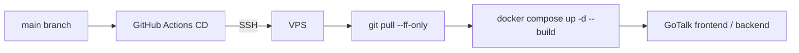

# Infrastructure

## 概要

GoTalk は VPS 上で Docker Compose により frontend/backend を起動します。GitHub Actions CD から SSH で VPS に接続し、main ブランチの最新状態を pull して再ビルド、再起動します。

## VPS 構成

想定配置:

```text
~/gotalk
├── backend/
├── frontend/
├── docker-compose.yml
└── .env
```

## Docker Compose

`docker-compose.yml` では frontend と backend の 2 サービスを定義しています。

| Service | Container | Port | 役割 |
| --- | --- | --- | --- |
| frontend | `gotalk-frontend` | `5173:5173` | React / Vite frontend |
| backend | `gotalk-backend` | `8080:8080` | Go API server |

## 環境変数

VPS 側の `.env` に以下を設定します。

```env
OPENAI_API_KEY=sk-...
OPENAI_MODEL=gpt-4o-mini
```

| 変数 | 必須 | 内容 |
| --- | --- | --- |
| `OPENAI_API_KEY` | yes | OpenAI API キー |
| `OPENAI_MODEL` | no | 翻訳に使用するモデル |

## デプロイ経路



## VPS 側の準備

- Docker / Docker Compose のインストール
- `~/gotalk` にリポジトリを clone
- `.env` に `OPENAI_API_KEY` を設定
- GitHub Actions から SSH 接続できる鍵を配置
- GitHub Secrets に `VPS_HOST`, `VPS_USER`, `VPS_SSH_KEY` を登録

## 本番運用で追加したい項目

- リバースプロキシの設定
- HTTPS / TLS 証明書の設定
- frontend の静的配信最適化
- デプロイ後ヘルスチェック
- ログ収集
- 監視とアラート
- バックアップ方針
