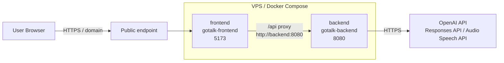

# Infrastructure

## 1. 概要

GoTalk は VPS 上で Docker Compose により `frontend` と `backend` を起動します。GitHub Actions の CD workflow は `main` への push を trigger に起動し、`production` Environment の承認後、SSH で VPS に接続して repository を更新します。

Backend は OpenAI API キーをサーバー側で扱い、OpenAI Responses API と OpenAI Audio Speech API へ outbound 接続します。Frontend は Backend の `/api` にリクエストし、Backend が翻訳、バックトランスレーション、TTS を実行します。

## 2. サーバー構成

本番 VPS では repository を `~/gotalk` に配置する前提です。CD workflow は VPS 上で `cd ~/gotalk` を実行します。

```text
~/gotalk
├── backend/
├── frontend/
├── docker-compose.yml
└── .env
```

Docker Compose の主な service は次のとおりです。

| Service | Container | Port | 役割 |
| --- | --- | --- | --- |
| `frontend` | `gotalk-frontend` | `5173:5173` | Vite dev server |
| `backend` | `gotalk-backend` | `8080:8080` | Go API server |

`docker-compose.yml` には `backend-dev` も定義されていますが、これは Backend 開発用 container です。通常運用で公開 port を持つ service ではありません。

## 3. ネットワーク構成

公開環境では HTTPS で GoTalk にアクセスできる状態です。ドメインと HTTPS の終端設定は repository の `docker-compose.yml` には含まれていません。運用上の関連設定はバックアップ対象として `/etc/nginx` と `/etc/letsencrypt` に含まれます。



Compose 内では `frontend` と `backend` が default network 上で service 名により接続します。`frontend` には `VITE_BACKEND_URL=http://backend:8080` が設定され、Vite proxy 経由で Backend に接続します。

Backend は OpenAI API へ HTTPS で outbound 接続します。

## 4. デプロイ構成

CD は `.github/workflows/cd.yml` で定義されています。

| 項目 | 内容 |
| --- | --- |
| Trigger | `push` to `main` |
| GitHub Environment | `production` |
| 接続方式 | SSH |
| GitHub Action | `appleboy/ssh-action@v1.2.2` |
| Deploy target | VPS |

CD workflow は次の GitHub Secrets を使います。

| Secret | 用途 |
| --- | --- |
| `VPS_HOST` | VPS host |
| `VPS_USER` | SSH user |
| `VPS_SSH_KEY` | SSH private key |

VPS 上で実行される deploy script:

```bash
set -e
cd ~/gotalk
git pull --ff-only
docker compose up -d --build
docker compose ps
```

`git pull --ff-only` で `main` の最新状態に更新し、`docker compose up -d --build` で image build と service 更新を行います。最後に `docker compose ps` で service 状態を表示します。

## 5. 環境変数

現在利用している環境変数は次のとおりです。

| 環境変数 | 設定箇所 | 用途 | 未設定時 |
| --- | --- | --- | --- |
| `OPENAI_API_KEY` | `backend`, `backend-dev` | OpenAI API 呼び出し用 API key | Backend API で service unavailable 系の error |
| `OPENAI_MODEL` | `backend`, `backend-dev` | 翻訳とバックトランスレーションに使う model | Compose では `gpt-4o-mini` |
| `DEBUG_TRANSLATION` | `backend` | 翻訳 debug log の出力制御 | Compose では `true` |
| `VITE_BACKEND_URL` | `frontend` | Vite proxy の Backend 接続先 | Compose では `http://backend:8080` |
| `OPENAI_TTS_MODEL` | Backend 実装 | TTS model | `gpt-4o-mini-tts` |
| `OPENAI_TTS_VOICE` | Backend 実装 | TTS voice | `marin` |

VPS 側の `.env` には少なくとも `OPENAI_API_KEY` を設定します。`OPENAI_MODEL` は `docker-compose.yml` で default が定義されています。

```env
OPENAI_API_KEY=sk-...
OPENAI_MODEL=gpt-4o-mini
```

`.env` はバックアップ対象です。詳細は [backup.md](backup.md) を参照してください。

## 6. ログ確認

アプリケーション service の状態確認とログ確認は Docker Compose を中心に行います。

Service 状態:

```bash
docker compose ps
```

全 service のログ:

```bash
docker compose logs -f
```

Backend のログ:

```bash
docker compose logs -f backend
```

Frontend のログ:

```bash
docker compose logs -f frontend
```

`DEBUG_TRANSLATION=true` の場合、Backend は翻訳処理の debug log を出力します。

## 7. 関連ドキュメント

- [architecture.md](architecture.md)
- [docker.md](docker.md)
- [ci-cd.md](ci-cd.md)
- [backup.md](backup.md)
