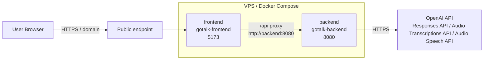

# Infrastructure

## 1. 概要

GoTalk は VPS 上で Docker Compose により `frontend` と `backend` を起動します。GitHub Actions の CD workflow は `main` への push を trigger に起動し、SSH で VPS に接続して repository を更新します。CD の deploy job は `production` Environment を指定しているため、GitHub 側で Required reviewers が設定されている場合は、承認されるまで deploy は実行されません。

Backend は OpenAI API キーをサーバー側で扱い、OpenAI Audio Transcriptions API、OpenAI Responses API、OpenAI Audio Speech API へ outbound 接続します。Frontend は Backend の `/api` にリクエストし、Backend が文字起こし、翻訳、バックトランスレーション、TTS を実行します。

## 2. サーバー構成

本番 VPS では repository を `~/gotalk` に配置する前提です。CD workflow は VPS 上で `cd ~/gotalk` を実行します。

```text
~/gotalk
├── backend/
├── frontend/
├── docker-compose.yml
└── .env
```

Docker Compose の主な service は次のとおりです。

| Service | Container | Port | 役割 |
| --- | --- | --- | --- |
| `frontend` | `gotalk-frontend` | `5173:5173` | Vite dev server |
| `backend` | `gotalk-backend` | `8080:8080` | Go API server |

`docker-compose.yml` には `backend-dev` も定義されていますが、これは Backend 開発用 container です。通常運用で公開 port を持つ service ではありません。`backend-dev` には `profiles: ["dev"]` が付いているため、サービス名を指定しない `docker compose up` では起動しません。

## 3. ネットワーク構成

公開環境では HTTPS で GoTalk にアクセスできる状態です。ドメインと HTTPS の終端設定は repository の `docker-compose.yml` には含まれていません。運用上の関連設定はバックアップ対象として `/etc/nginx` と `/etc/letsencrypt` に含まれます。


```mermaid
flowchart LR
  User[User Browser] -->|HTTPS / domain| Public[Public endpoint]
  Public --> Frontend[frontend<br/>gotalk-frontend<br/>5173]
  Frontend -->|/api proxy<br/>http://backend:8080| Backend[backend<br/>gotalk-backend<br/>8080]
  Backend -->|HTTPS| OpenAI[OpenAI API<br/>Responses API / Audio Transcriptions API / Audio Speech API]

  subgraph VPS[VPS / Docker Compose]
    Frontend
    Backend
  end
```

Compose 内では `frontend` と `backend` が default network 上で service 名により接続します。`frontend` には `VITE_BACKEND_URL=http://backend:8080` が設定され、Vite proxy 経由で Backend に接続します。

Backend は OpenAI API へ HTTPS で outbound 接続します。

## 4. デプロイ構成

CD は `.github/workflows/cd.yml` で定義されています。

| 項目 | 内容 |
| --- | --- |
| Trigger | `push` to `main` |
| GitHub Environment | `production` |
| 接続方式 | SSH |
| GitHub Action | `appleboy/ssh-action@v1.2.2` |
| Deploy target | VPS |

CD workflow は次の GitHub Secrets を使います。

| Secret | 用途 |
| --- | --- |
| `VPS_HOST` | VPS host |
| `VPS_USER` | SSH user |
| `VPS_SSH_KEY` | SSH private key |

VPS 上で実行される deploy script:

```bash
set -e
cd ~/gotalk
git pull --ff-only
docker compose up -d --build
docker compose ps
```

`git pull --ff-only` で `main` の最新状態に更新し、`docker compose up -d --build` で image build と service 更新を行います。最後に `docker compose ps` で service 状態を表示します。

deploy script の `docker compose up -d --build` はサービス名を指定していませんが、`backend-dev` には `profiles: ["dev"]` が付いているため対象にならず、`frontend` と `backend` だけを build・起動します。

## 5. 環境変数

現在利用している環境変数は次のとおりです。

| 環境変数 | 設定箇所 | 用途 | 未設定時 |
| --- | --- | --- | --- |
| `OPENAI_API_KEY` | Compose が `backend`、`backend-dev` に `${OPENAI_API_KEY}` を渡す | Backend から OpenAI API を呼び出すための API key | `/api/tts`、`/api/interpret` は HTTP 500 `service unavailable`、`/api/translate` は HTTP 500 `translation service unavailable` を返す |
| `OPENAI_MODEL` | Compose が `backend`、`backend-dev` に `${OPENAI_MODEL:-gpt-4o-mini}` を渡す（`.env` などで未設定なら `gpt-4o-mini`） | 翻訳とバックトランスレーションに使う model | `gpt-4o-mini` |
| `DEBUG_TRANSLATION` | Compose が `backend` に `true` を渡す（`backend-dev` には渡さない） | 翻訳 debug log の出力制御。`true` のときだけ出力する | debug log を出力しない |
| `VITE_BACKEND_URL` | Compose が `frontend` に `http://backend:8080` を渡す | Vite proxy の Backend 接続先 | `http://localhost:8080`（`frontend/vite.config.ts`） |
| `OPENAI_TTS_MODEL` | Compose では渡さない。ホスト上で Backend を直接実行するときのシェルの環境変数だけ | TTS model | `gpt-4o-mini-tts` |
| `OPENAI_TTS_VOICE` | Compose では渡さない。ホスト上で Backend を直接実行するときのシェルの環境変数だけ | TTS voice | `marin` |
| `WHISPER_MODEL` | Compose では渡さない。ホスト上で Backend を直接実行するときのシェルの環境変数だけ | `/api/interpret` で音声を文字起こしする model | `gpt-4o-transcribe` |

「未設定時」の列は、アプリケーションが環境変数を受け取らなかったときの動作です。

VPS 側の `.env` には少なくとも `OPENAI_API_KEY` を設定します。`OPENAI_MODEL` は `docker-compose.yml` で default が定義されています。

`.env` を読むのは Docker Compose の変数置換だけで、Backend 自身は `.env` を読み込みません（`backend/main.go` は `os.Getenv` で環境変数を読むだけです）。`OPENAI_TTS_MODEL`、`OPENAI_TTS_VOICE`、`WHISPER_MODEL` は `docker-compose.yml` が backend に渡していないため、`.env` に書いても、どの起動方法でも反映されず、Backend 実装の未設定時の default が使われます。これらはホスト上で Backend を直接実行する場合（開発時）に、シェルの環境変数として渡したときだけ反映されます（[development.md](development.md) を参照）。

```env
OPENAI_API_KEY=sk-...
OPENAI_MODEL=gpt-4o-mini
```

`.env` はバックアップ対象です。詳細は [backup.md](backup.md) を参照してください。

## 6. ログ確認

アプリケーション service の状態確認とログ確認は Docker Compose を中心に行います。

Service 状態:

```bash
docker compose ps
```

全 service のログ:

```bash
docker compose logs -f
```

Backend のログ:

```bash
docker compose logs -f backend
```

Frontend のログ:

```bash
docker compose logs -f frontend
```

`DEBUG_TRANSLATION=true` の場合、Backend は翻訳処理の debug log を出力します。

## 7. 関連ドキュメント

- [architecture.md](architecture.md)
- [docker.md](docker.md)
- [ci-cd.md](ci-cd.md)
- [backup.md](backup.md)
