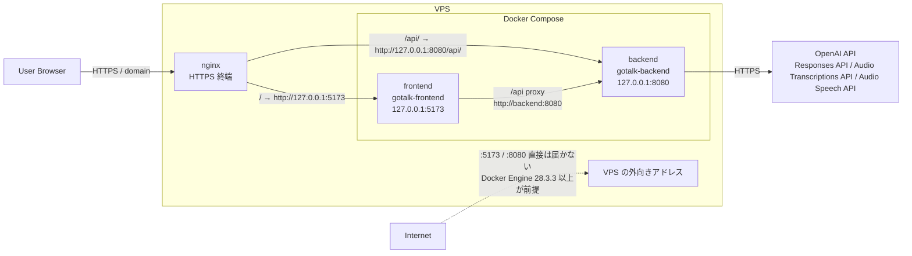

# Infrastructure

## 1. 概要

GoTalk は VPS 上で Docker Compose により `frontend` と `backend` を起動します。GitHub Actions の CD workflow は、`main` への push で起動した CI が成功した場合に起動し、SSH で VPS に接続して repository を CI が検証したコミットに更新します。CD の deploy job は `production` Environment を指定しているため、GitHub 側で Required reviewers が設定されている場合は、承認されるまで deploy は実行されません。

Backend は OpenAI API キーをサーバー側で扱い、OpenAI Audio Transcriptions API、OpenAI Responses API、OpenAI Audio Speech API へ outbound 接続します。Frontend は Backend の `/api` にリクエストし、Backend が文字起こし、翻訳、バックトランスレーション、TTS を実行します。

## 2. サーバー構成

本番 VPS では repository を `~/gotalk` に配置する前提です。CD workflow は VPS 上で `cd ~/gotalk` を実行します。

```text
~/gotalk
├── backend/
├── frontend/
├── docker-compose.yml
└── .env
```

Docker Compose の主な service は次のとおりです。

| Service | Container | Port | 役割 |
| --- | --- | --- | --- |
| `frontend` | `gotalk-frontend` | `127.0.0.1:5173:5173` | Vite dev server |
| `backend` | `gotalk-backend` | `127.0.0.1:8080:8080` | Go API server |

`frontend` と `backend` の `ports` は、VPS の IPv4 の loopback アドレス（`127.0.0.1`）だけに公開しています。すべての IPv4 のアドレス（`0.0.0.0`）にも、IPv6 のアドレス（`[::]` を含む）にも公開しません。そのため、VPS の外から `5173` と `8080` には直接接続できない構成です。ただし、これには Docker Engine のバージョンの前提があります（3 章の「ポートの公開範囲の前提」を参照）。

`docker-compose.yml` には `backend-dev` も定義されていますが、これは Backend 開発用 container です。通常運用で公開 port を持つ service ではありません。`backend-dev` には `profiles: ["dev"]` が付いているため、サービス名を指定しない `docker compose up` では起動しません。

## 3. ネットワーク構成

公開環境では HTTPS で GoTalk にアクセスできる状態です。ドメインと HTTPS の終端設定は repository の `docker-compose.yml` には含まれていません。HTTPS は VPS 上の nginx が終端します。nginx の設定はリポジトリの外（VPS の `/etc/nginx`）にあり、運用上の関連設定はバックアップ対象として `/etc/nginx` と `/etc/letsencrypt` に含まれます。

VPS の nginx の設定で確認している転送先は次のとおりです。

| nginx の location | 転送先 |
| --- | --- |
| `/` | `http://127.0.0.1:5173`（`frontend`） |
| `/api/` | `http://127.0.0.1:8080/api/`（`backend`） |

nginx の転送先は `127.0.0.1` で、Docker Compose の `ports` も `127.0.0.1` だけに公開しています。そのため、外からは HTTPS の nginx 経由でだけ GoTalk に届き、`5173` と `8080` に直接は届かない構成です（下の「ポートの公開範囲の前提」の条件を満たす場合）。


```mermaid
flowchart LR
  User[User Browser] -->|HTTPS / domain| Nginx[nginx<br/>HTTPS 終端]
  Internet[Internet] -.->|:5173 / :8080 直接は届かない<br/>Docker Engine 28.3.3 以上が前提| VPSHost[VPS の外向きアドレス]
  Nginx -->|/ → http://127.0.0.1:5173| Frontend[frontend<br/>gotalk-frontend<br/>127.0.0.1:5173]
  Nginx -->|/api/ → http://127.0.0.1:8080/api/| Backend[backend<br/>gotalk-backend<br/>127.0.0.1:8080]
  Frontend -->|/api proxy<br/>http://backend:8080| Backend
  Backend -->|HTTPS| OpenAI[OpenAI API<br/>Responses API / Audio Transcriptions API / Audio Speech API]

  subgraph VPS[VPS]
    Nginx
    VPSHost
    subgraph Compose[Docker Compose]
      Frontend
      Backend
    end
  end
```

Compose 内では `frontend` と `backend` が default network 上で service 名により接続します。`frontend` には `VITE_BACKEND_URL=http://backend:8080` が設定され、Vite proxy 経由で Backend に接続します。

Backend は OpenAI API へ HTTPS で outbound 接続します。

### ポートの公開範囲の前提

`5173` と `8080` に外から直接届かないことは、次の 2 点を前提にしています。

| 前提 | 内容 |
| --- | --- |
| Docker Engine が 28.3.3 以上であること | Docker のドキュメント（Port publishing and mapping）には、28.0.0 より前のリリースでは、同じ L2 のセグメントにあるホスト（同じネットワークスイッチにつながったホストなど）から、localhost に公開したポートに届く、という警告があります（[moby/moby#45610](https://github.com/moby/moby/issues/45610)）。VPS では、VPS の事業者のネットワーク上の他のホストがこれに当たる可能性があります。この問題は 28.0.0 で修正されました（Docker Engine 28 のリリースノートの 28.0.0「Fix a security issue that was allowing neighbor hosts to connect to ports mapped on a loopback address.」、[moby/moby#49325](https://github.com/moby/moby/pull/49325)）。これとは別に、firewalld を使っているホストでは、28.2.0 から 28.3.2 のバージョンで firewalld を reload した後に、Docker が作る「host のインターフェースに届いたパケットがコンテナのアドレスに届かないようにする規則」が作り直されません。その結果、Docker のブリッジネットワークへの経路を設定した他のホストから、コンテナのアドレス経由で、loopback だけに公開したポートにも届くようになります（[GHSA-x4rx-4gw3-53p4](https://github.com/moby/moby/security/advisories/GHSA-x4rx-4gw3-53p4)、[CVE-2025-54388](https://cve.mitre.org/cgi-bin/cvename.cgi?name=CVE-2025-54388)、[moby/moby#50506](https://github.com/moby/moby/pull/50506)）。advisory によると、28.2.0 より前のリリースは影響を受けず、28.3.3 で修正されています。Rootless mode や Docker Desktop のように、Docker Engine が host の network namespace で動いていない場合も影響を受けません。advisory には、28.3.3 に更新できない場合の回避策として、「firewalld を reload した後に、次のいずれかを行う」という形で、docker daemon を再起動する、ブリッジネットワークを作り直す、Rootless mode を使う、の 3 つが書かれています（3 つとも「firewalld を reload した後に」の下に並んでいます）。VPS で firewalld を使っているかどうかはリポジトリからは確認できないため、28.3.3 以上を前提にしています。28.3.3 より前のバージョンの場合は、Docker Engine を更新するか、ホストの firewall で `5173` と `8080` への外からのアクセスを塞ぐ必要があります。firewall の backend が iptables（既定）の場合は、Docker の `DOCKER-USER` チェーンに規則を加えます。nftables の場合は、Docker の nftables の実装には `DOCKER-USER` チェーンがないため、独自の table と chain で対策します（Docker のドキュメント「[Docker with nftables](https://docs.docker.com/engine/network/firewall-nftables/)」の「Migrating `DOCKER-USER`」を参照） |
| `docker-compose.yml` の `ports` に `127.0.0.1` を指定していること | 外からのアクセスを塞いでいるのは、この `127.0.0.1` の指定です。ufw ではありません（次の段落） |

VPS の Docker Engine の現在のバージョン、firewall の backend（iptables か nftables か）、firewalld を使っているかどうかは、リポジトリからは確認できません。この前提の確認は、VPS で `docker version` を実行し、Server（Engine）のバージョンが 28.3.3 以上であることで行います。

補助的な確認として、28.0.0 で入った moby/moby#45610 への対策の規則（`127.0.0.1` 宛てで `lo` 以外から来た通信を落とす規則）が VPS にあることも、次のコマンドで確認できます。ただし、この規則は `127.0.0.1` 宛ての通信だけを対象にしており、CVE-2025-54388 で作り直されなかったコンテナのアドレス宛ての規則とは別のものです。そのため、この規則の有無では CVE-2025-54388 への対策は確認できず、バージョンの確認の代わりにはなりません。28.2.0 から 28.3.2 で firewalld を使っている場合は、確認したときに規則があっても、firewalld を reload した後の状態までは保証されません。なお、nftables の backend は Docker 29.0.0 から入った機能（Docker のドキュメント「Docker with nftables」では experimental）なので、CVE-2025-54388 の影響を受けるバージョン（28.2.0 から 28.3.2）は、いずれも iptables の backend です。下の表の nftables の行は、29.0.0 以上で nftables の backend を使っている場合の、moby/moby#45610 への対策の規則の確認です。

| firewall の backend | 確認のコマンド | 期待する結果 |
| --- | --- | --- |
| iptables | `sudo iptables -t raw -S PREROUTING \| grep 127.0.0.1` | `5173` と `8080` について、`-d 127.0.0.1/32 ! -i lo ... -j DROP` の規則がある |
| nftables | `sudo nft list table ip docker-bridges \| grep 'DROP REMOTE LOOPBACK'` | `5173` と `8080` について、`iifname != "lo" ip daddr 127.0.0.1 ... drop` の規則がある |

Docker のドキュメント（Packet filtering and firewalls の「Docker and ufw」）にあるとおり、Docker が公開したポートへの通信は `nat` テーブルで転送されます。そのため、ufw が使う `INPUT` と `OUTPUT` のチェーンに届く前に処理され、ufw の規則は効きません。以前、外から `5173` と `8080` に直接届いていたのも、`ports` が `0.0.0.0` と `[::]` に公開していたためで、ufw の設定にかかわらず届いていたと考えられます。VPS の ufw の現在の設定は、リポジトリからは確認できません。`ports` を変更するときは、ufw で塞いでいるつもりでも外に公開されることがあるため、`127.0.0.1` の指定を外さないよう注意してください。

## 4. デプロイ構成

CD は `.github/workflows/cd.yml` で定義されています。

| 項目 | 内容 |
| --- | --- |
| Trigger | `workflow_run`（`CI` の完了、`main`。CI が成功した場合だけ deploy）、`workflow_dispatch`（手動） |
| GitHub Environment | `production` |
| concurrency | `deploy` job に group `cd-production`（deploy を同時に実行しない） |
| 接続方式 | SSH |
| GitHub Action | `appleboy/ssh-action` v1.2.2（コミットの SHA `2ead5e36573f08b82fbfce1504f1a4b05a647c6f` で固定） |
| Deploy target | VPS |

CD workflow は次の GitHub Secrets を使います。

| Secret | 用途 |
| --- | --- |
| `VPS_HOST` | VPS host |
| `VPS_USER` | SSH user |
| `VPS_SSH_KEY` | SSH private key |

VPS 上で実行される deploy script です。`TARGET_SHA` には CI が検証したコミットが入り、`appleboy/ssh-action` の `envs` で環境変数として渡されます。

```bash
# TARGET_SHA は appleboy/ssh-action の envs で環境変数として渡される
set -e
cd ~/gotalk
if ! printf '%s' "$TARGET_SHA" | grep -Eq '^[0-9a-f]{40}$'; then
  echo "Invalid TARGET_SHA: $TARGET_SHA"
  exit 1
fi
git fetch origin main
if ! git merge-base --is-ancestor HEAD "$TARGET_SHA"; then
  echo "Current HEAD $(git rev-parse HEAD) is not an ancestor of $TARGET_SHA; refusing to deploy"
  exit 1
fi
git merge --ff-only "$TARGET_SHA"
if [ "$(git rev-parse HEAD)" != "$TARGET_SHA" ]; then
  echo "HEAD $(git rev-parse HEAD) does not match $TARGET_SHA"
  exit 1
fi
docker compose build --pull
docker compose up -d
docker compose ps
```

`git fetch origin main` の後、VPS の現在のコミットが `TARGET_SHA` の祖先であることを確認し、`git merge --ff-only` で `TARGET_SHA` まで fast-forward します。`origin/main` がさらに進んでいても、CI が検証していないコミットは反映しません。新しいコミットがすでに反映されている場合は、古いコミットへ戻さずに失敗します。その後、`docker compose build --pull` で base image を pull してから image を build し、`docker compose up -d` で service を更新します。最後に `docker compose ps` で service 状態を表示します。

`docker compose build --pull` と `docker compose up -d` はサービス名を指定していませんが、`backend-dev` には `profiles: ["dev"]` が付いているため対象にならず、`frontend` と `backend` だけを pull・build・起動します。

手動で再 deploy する場合は、CD の run の Re-run か、CD workflow の `workflow_dispatch`（`main` から実行）を使います。VPS では手作業で `git pull` をしないでください。CI が成功していないコミットまで作業ツリーが進むためです。手作業でコミットを合わせる必要がある場合は、CI が成功したコミットを指定して `git merge --ff-only <SHA>` を実行します。build や pull で失敗した場合は、失敗した CD の run を Re-run すれば build から再実行でき、それまでのコンテナは動き続けます。詳細は [ci-cd.md](ci-cd.md) を参照してください。

## 5. 環境変数

現在利用している環境変数は次のとおりです。

| 環境変数 | 設定箇所 | 用途 | 未設定時 |
| --- | --- | --- | --- |
| `OPENAI_API_KEY` | Compose が `backend`、`backend-dev` に `${OPENAI_API_KEY}` を渡す | Backend から OpenAI API を呼び出すための API key | `/api/tts`、`/api/interpret` は HTTP 500 `service unavailable`、`/api/translate` は HTTP 500 `translation service unavailable` を返す |
| `OPENAI_MODEL` | Compose が `backend`、`backend-dev` に `${OPENAI_MODEL:-gpt-4o-mini}` を渡す（`.env` などで未設定なら `gpt-4o-mini`） | 翻訳とバックトランスレーションに使う model | `gpt-4o-mini` |
| `DEBUG_TRANSLATION` | Compose では渡さない（`backend`、`backend-dev` とも） | 翻訳 debug log の出力制御。`true` のときだけ出力する。debug log は発話の内容を含むため、本番では有効にしない | debug log を出力しない |
| `VITE_BACKEND_URL` | Compose が `frontend` に `http://backend:8080` を渡す | Vite proxy の Backend 接続先 | `http://localhost:8080`（`frontend/vite.config.ts`） |
| `OPENAI_TTS_MODEL` | Compose では渡さない。ホスト上で Backend を直接実行するときのシェルの環境変数だけ | TTS model | `gpt-4o-mini-tts` |
| `OPENAI_TTS_VOICE` | Compose では渡さない。ホスト上で Backend を直接実行するときのシェルの環境変数だけ | TTS voice | `marin` |
| `WHISPER_MODEL` | Compose では渡さない。ホスト上で Backend を直接実行するときのシェルの環境変数だけ | `/api/interpret` で音声を文字起こしする model | `gpt-4o-transcribe` |

「未設定時」の列は、アプリケーションが環境変数を受け取らなかったときの動作です。

VPS 側の `.env` には少なくとも `OPENAI_API_KEY` を設定します。`OPENAI_MODEL` は `docker-compose.yml` で default が定義されています。

`.env` を読むのは Docker Compose の変数置換だけで、Backend 自身は `.env` を読み込みません（`backend/main.go` は `os.Getenv` で環境変数を読むだけです）。`OPENAI_TTS_MODEL`、`OPENAI_TTS_VOICE`、`WHISPER_MODEL` は `docker-compose.yml` が backend に渡していないため、`.env` に書いても、どの起動方法でも反映されず、Backend 実装の未設定時の default が使われます。これらはホスト上で Backend を直接実行する場合（開発時）に、シェルの環境変数として渡したときだけ反映されます（[development.md](development.md) を参照）。

```env
OPENAI_API_KEY=sk-...
OPENAI_MODEL=gpt-4o-mini
```

`.env` はバックアップ対象です。詳細は [backup.md](backup.md) を参照してください。

## 6. ログ確認

アプリケーション service の状態確認とログ確認は Docker Compose を中心に行います。

Service 状態:

```bash
docker compose ps
```

全 service のログ:

```bash
docker compose logs -f
```

Backend のログ:

```bash
docker compose logs -f backend
```

Frontend のログ:

```bash
docker compose logs -f frontend
```

### Backend のログに出力する情報

Backend のログには、利用者の発話の内容を出力しません。障害の調査に必要な、内容を含まない情報だけを出力します。

| 出力するもの | 例 |
| --- | --- |
| 処理の種類と結果 | `translate result: ja -> en`、`interpret result: en -> ja` |
| 言語 | 選択言語、翻訳元と翻訳先、文字起こしで判定した言語。`frontend/src/languages.ts` にある言語 ID（と `unknown`）以外は `other` と出力し、判定した言語は英小文字の名前やコード以外は `invalid` と出力する |
| テキストの長さ | 文字起こしや翻訳の対象のテキストの文字数（rune の数）。例：`translate: text runes=7 lang0=ja lang1=en` |
| リクエストの概要 | `speaker`（選択言語のどちらかに一致する場合だけその言語、それ以外は `invalid`）、音声のファイルの拡張子（`.webm`、`.mp4`、`.ogg` 以外は `other`）、音声のサイズ、`transcript` の有無 |
| エラーの種類 | OpenAI API の HTTP status、エラー応答の本文のバイト数、JSON のデコードエラーの種類と位置、固有名詞保護の検証エラーの種類 |

出力しないものは次のとおりです。

- 文字起こしのテキスト、翻訳の対象と結果、バックトランスレーション、固有名詞、プレースホルダの対応、翻訳 prompt
- OpenAI API の応答の本文（エラー応答の本文を含む）
- クライアントから送られる任意の文字列（`speaker` の任意の値、音声のファイル名、選択肢にない言語 ID）

`DEBUG_TRANSLATION=true` の場合だけ、Backend は翻訳処理の debug log（`[DEBUG_TRANSLATION]` で始まる行）を出力します。debug log には、受信したテキスト、翻訳 prompt、OpenAI の応答、固有名詞の保護マップなど、発話の内容がそのまま含まれます。`docker-compose.yml` では `DEBUG_TRANSLATION` を渡していないため、本番では debug log は出力されません。本番では有効にしないでください。ローカルで調査に使う方法は [development.md](development.md) の「Backend の debug log」を参照してください。

## 7. 関連ドキュメント

- [architecture.md](architecture.md)
- [docker.md](docker.md)
- [ci-cd.md](ci-cd.md)
- [backup.md](backup.md)
