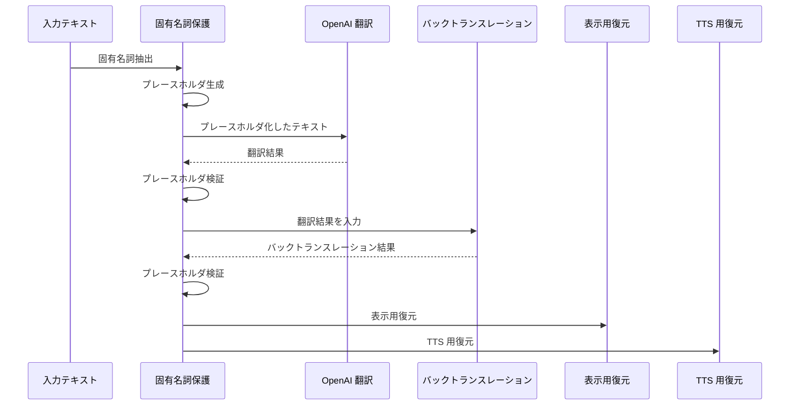

# Proper Noun Protection

## 1. 概要

固有名詞保護は、翻訳時に入力中の固有名詞が意味変換されたり、入力にない別の固有名詞へ補正されたりすることを抑えるための Backend 処理です。

保護の対象になり得る固有名詞は、人名、地名、組織名などです。実装では、検出した固有名詞を OpenAI に渡す前にプレースホルダへ置き換え、翻訳後とバックトランスレーション後にプレースホルダを検証してから表示用・TTS 用の文字列へ復元します。

固有名詞以外の通常文はプレースホルダ化せず、OpenAI Responses API の翻訳結果を使います。

## 2. 全体フロー



## 3. 保護対象

現在の実装で固有名詞保護経路に入る条件は `backend/main.go` の `useProtection` で決まります。

| 条件 | 保護経路 |
| --- | --- |
| 選択言語のどちらかが `ja` で、入力に日本語文字が含まれる | 使用する |
| 選択言語のどちらも `ja` ではなく、英語自己紹介パターンを含む | 使用する |
| 上記以外 | 使用しない |

日本語文字の判定は、ひらがな、カタカナ、CJK 統合漢字、CJK Extension A のいずれかを含むかで行います。

抽出対象は次のとおりです。

- 日本語文字を含む入力では、Kagome / IPA 辞書で `名詞・固有名詞` と判定された token
- 英語自己紹介パターンの直後にある名前表現

英語自己紹介パターンは次の 3 種類です。

| パターン | 名前として必要な単語数 |
| --- | --- |
| `my name is` | 1 語以上 |
| `I'm` | 2 語以上 |
| `I am` | 2 語以上 |

`I am` と `I'm` は、`I am happy` のような通常文を避けるため 2 語以上の場合だけ名前として扱います。

## 4. 固有名詞抽出

日本語の固有名詞抽出は `backend/propnoun.go` の `extractProperNouns` で行います。

- Kagome tokenizer は `tokenizer.New(ipa.Dict(), tokenizer.OmitBosEos())` で初期化する
- tokenizer は package 変数に保持し、2 回目以降は同じ tokenizer を使う
- token の feature が `名詞` かつ `固有名詞` の場合に固有名詞として扱う
- feature の第 3 要素で型を判定する

| Kagome feature | 内部型 |
| --- | --- |
| `人名` | `person` |
| `地域` | `place` |
| `組織` | `organization` |
| その他 | `unknown` |

補助ロジックとして、人名 token の直後に次の token がある場合は複合人名として結合することがあります。

- 次 token も `名詞・固有名詞・人名`
- または、次 token が 3 文字以下の純カタカナ

読みは Kagome feature の第 8 要素を使います。読みが取得でき、カタカナからローマ字へ変換できる場合は `RomanizedText` に保持します。複合人名では token ごとの読みをローマ字化し、スペースで連結します。

同じ surface が複数回出る場合、entry は 1 件だけ作成し、同じプレースホルダを再利用します。

英語自己紹介名の抽出は `extractEnglishIntroNames` で行います。

- パターン直後が文字で始まる場合だけ処理する
- ASCII の英字連続を名前の単語として集める
- `.`, `!`, `?`, `,`, `;`, `:`, `_` が単語間に出たら収集を止める
- stop word に当たったら収集を止める
- 最大 3 語まで収集する
- 大文字小文字を無視して重複を除外する
- 抽出した名前は `person` として扱う

英語名は `Translations["en"]` に元の名前を保持します。ローマ字からカタカナへ変換できる場合は、語順を逆にしたカタカナ表記を `TargetDisplay` に保持します。

## 5. プレースホルダ

プレースホルダ形式は次の固定形式です。

```text
__GT_PROPN_NNN__
```

`NNN` は 0 埋め 3 桁の連番です。日本語固有名詞は Kagome 抽出順に `__GT_PROPN_000__` から採番します。英語自己紹介名は、既存 entry 数を offset として後続番号を割り当てます。

OpenAI に渡す翻訳対象テキストは、抽出した surface をプレースホルダに置き換えた文字列です。置換時は長い surface から先に置換します。

翻訳 prompt では、プレースホルダを変更、削除、分割、翻訳せず、完全一致で保持するよう指示します。バックトランスレーション prompt でも同じ保持ルールを指示します。

プレースホルダ検証では、元のプレースホルダ化テキスト内の出現回数を期待値として使います。OpenAI の出力について、各プレースホルダの出現回数が期待値と一致すること、および未知の `__GT_PROPN_...__` 形式のプレースホルダが含まれないことを確認します。

## 6. 翻訳処理

保護ありの経路では、`runProtectedTranslation` が次を実行します。

1. 固有名詞を抽出する
2. 入力テキストをプレースホルダ化する
3. OpenAI Responses API で翻訳する
4. 翻訳結果のプレースホルダを検証する
5. 翻訳結果を入力としてバックトランスレーションする
6. バックトランスレーション結果のプレースホルダを検証する

保護なしの経路では、元の入力テキストをそのまま OpenAI Responses API に渡します。`sourceLanguage` が指定されている場合は翻訳元と翻訳先を固定し、未指定の場合は OpenAI の JSON 応答で翻訳元と翻訳先を判定します。

固有名詞保護経路に入っても、抽出 entry が 0 件の場合は通常翻訳へ進みます。Kagome tokenizer の初期化または抽出に失敗した場合も、通常翻訳へフォールバックします。

## 7. バックトランスレーション

バックトランスレーションは翻訳後に実行します。

保護ありの経路では、表示用に復元する前の `translatedRaw` をバックトランスレーション入力にします。つまり、バックトランスレーションにもプレースホルダを含んだ翻訳結果を渡します。

バックトランスレーション結果にも翻訳時と同じ期待出現回数でプレースホルダ検証を行います。検証に成功した後、`sourceLanguage` 側の言語 ID に合わせて復元し、`backTranslation` として返します。

保護なしの経路では、翻訳済みテキストをそのままバックトランスレーション入力にします。

## 8. 復元処理

表示用の復元は `restoreForLang` で行います。復元候補は次の優先順位で選ばれます。

1. `Translations[langID]`
2. `TargetDisplay`
3. `RomanizedText`
4. `Surface`

翻訳結果の表示用 `translatedText` は、翻訳先言語 ID で `restoreForLang` を実行して作ります。バックトランスレーション表示用 `backTranslation` は、翻訳元言語 ID で `restoreForLang` を実行して作ります。どちらも復元後に `stripOuterQuotes` を実行します。

TTS 用の復元は `restoreWithRomanized` で行います。プレースホルダごとに `RomanizedText` があればそれを使い、なければ `Surface` を使います。TTS 用の `ttsText` は翻訳結果の raw text から作ります。

ローマ字化はカタカナ読みを ASCII の Hepburn 風表記へ変換し、先頭を大文字化します。長音記号は落とし、`aa`, `ii`, `uu`, `ee`, `oo`, `ou` は短い母音へ畳み込みます。変換できない文字がある場合、その entry の `RomanizedText` は設定されません。

英語自己紹介名では、ローマ字からカタカナへ変換できる場合に `TargetDisplay` を設定します。この変換では単語順を逆にしてからカタカナ化します。

## 9. エラー処理

Kagome tokenizer の初期化や固有名詞抽出に失敗した場合、`runProtectedTranslation` は entry なしで error を返します。呼び出し側の `/api/translate` は警告ログを出し、固有名詞保護を使わない通常翻訳へフォールバックします。

保護ありの翻訳またはバックトランスレーションで OpenAI Responses API 呼び出しに失敗した場合、entry は存在するため通常翻訳へはフォールバックせず、`translation failed` を返します。

プレースホルダ検証に失敗した場合、欠落しているプレースホルダを含めるよう retry prompt を作り、同じ段階を 1 回だけ再実行します。

- 翻訳結果の検証失敗時は翻訳を 1 回再試行する
- バックトランスレーション結果の検証失敗時はバックトランスレーションを 1 回再試行する

再試行後もプレースホルダ検証に失敗した場合、`proper_noun_protection_failed` として扱います。`/api/translate` は HTTP 502 で JSON error `proper_noun_protection_failed` を返します。

固有名詞が 1 件も抽出されなかった場合はエラーではなく、通常翻訳へ進みます。

## 10. 設計上の特徴

- 固有名詞だけをプレースホルダ化し、通常文は OpenAI Responses API に翻訳させる
- OpenAI にはプレースホルダ保持ルールを prompt で明示する
- 翻訳結果とバックトランスレーション結果の両方でプレースホルダを検証する
- プレースホルダ欠落時は各段階で 1 回だけリトライする
- 表示用復元と TTS 用復元を分けている
- 表示用復元は言語 ID に応じた表記を優先し、TTS 用復元はローマ字表記を優先する
- Kagome が使えない場合は、固有名詞保護なしの通常翻訳へフォールバックする

## 11. 関連ドキュメント

- [architecture.md](architecture.md)
- [translation-flow.md](translation-flow.md)
- [api.md](api.md)
