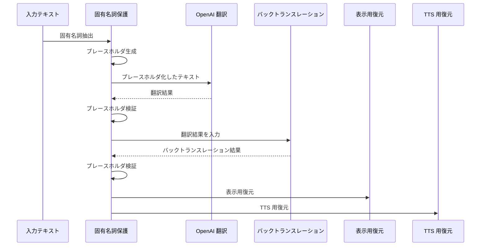

# Proper Noun Protection

## 1. 概要

固有名詞保護は、翻訳時に入力中の固有名詞が意味変換されたり、入力にない別の固有名詞へ補正されたりすることを抑えるための Backend 処理です。

保護の対象になり得る固有名詞は、人名、地名、組織名などです。実装では、検出した固有名詞を OpenAI に渡す前にプレースホルダへ置き換え、翻訳後とバックトランスレーション後にプレースホルダを検証してから表示用・TTS 用の文字列へ復元します。

固有名詞以外の通常文はプレースホルダ化せず、OpenAI Responses API の翻訳結果を使います。

## 2. 全体フロー


```mermaid
sequenceDiagram
  participant Input as 入力テキスト
  participant PN as 固有名詞保護
  participant OA as OpenAI 翻訳
  participant BT as バックトランスレーション
  participant Display as 表示用復元
  participant TTS as TTS 用復元

  Input->>PN: 固有名詞抽出
  PN->>PN: プレースホルダ生成
  PN->>OA: プレースホルダ化したテキスト
  OA-->>PN: 翻訳結果
  PN->>PN: プレースホルダ検証
  PN->>BT: 翻訳結果を入力
  BT-->>PN: バックトランスレーション結果
  PN->>PN: プレースホルダ検証
  PN->>Display: 表示用復元
  PN->>TTS: TTS 用復元
```

## 3. 保護対象

現在の実装で固有名詞保護経路に入る条件は `backend/main.go` の `useProtection` で決まります。条件は `/api/translate` と `/api/interpret` で異なります。

`/api/translate`:

| 条件 | 保護経路 |
| --- | --- |
| 選択言語のどちらかが `ja` で、入力に日本語文字が含まれる | 使用する |
| 選択言語のどちらも `ja` ではなく、英語自己紹介パターンを含む | 使用する |
| 上記以外 | 使用しない |

`/api/interpret`（翻訳元と翻訳先が決まった後に判定します）:

| 条件 | 保護経路 |
| --- | --- |
| 翻訳元言語が `ja` で、原文に日本語文字が含まれる | 使用する |
| 翻訳先言語が `ja` 以外で、原文に英語自己紹介パターンを含む | 使用する |
| 上記以外 | 使用しない |

日本語文字の判定は、ひらがな、カタカナ、CJK 統合漢字、CJK Extension A のいずれかを含むかで行います（`hasJapaneseChars`）。漢字だけの文も日本語文字を含むと判定されるため、たとえば `/api/translate` で `ja` と `zh-CN` を選択して中国語の文を送った場合も、`/api/translate` の 1 行目の条件に当てはまります。

上の表の条件に当てはまっても、保護経路で翻訳するのは固有名詞が 1 件以上抽出された場合だけです。0 件の場合は固有名詞保護を使わない経路（この文書では「保護なし経路」と呼びます）に進みます。また、入力テキストに `__GT_PROPN_` が含まれる場合は、固有名詞の抽出を行わずに保護なし経路に進みます（6 章を参照）。`/api/translate` の保護経路での翻訳方向の決め方は [api.md](api.md) を参照してください。

抽出対象は次のとおりです。

- 日本語文字を含む入力では、Kagome / IPA 辞書で `名詞・固有名詞` と判定された token
- 英語自己紹介パターンの直後にある名前表現

英語自己紹介パターンは次の 3 種類です。

| パターン | 名前として必要な単語数 |
| --- | --- |
| `my name is` | 1 語以上 |
| `I'm` | 2 語以上 |
| `I am` | 2 語以上 |

`I am` と `I'm` は、`I am happy` のような通常文を避けるため 2 語以上の場合だけ名前として扱います。

## 4. 固有名詞抽出

日本語の固有名詞抽出は `backend/propnoun.go` の `extractProperNouns` で行います。

- Kagome tokenizer は `tokenizer.New(ipa.Dict(), tokenizer.OmitBosEos())` で初期化する
- tokenizer は package 変数に保持し、2 回目以降は同じ tokenizer を使う
- token の feature が `名詞` かつ `固有名詞` の場合に固有名詞として扱う
- feature の第 3 要素で型を判定する

| Kagome feature | 内部型 |
| --- | --- |
| `人名` | `person` |
| `地域` | `place` |
| `組織` | `organization` |
| その他 | `unknown` |

補助ロジックとして、人名 token の直後に次の token がある場合は複合人名として結合することがあります。

- 次 token も `名詞・固有名詞・人名`
- または、次 token が 3 文字以下の純カタカナ

読みは Kagome feature の第 8 要素を使います。読みが取得でき、カタカナからローマ字へ変換できる場合は `RomanizedText` に保持します。複合人名では token ごとの読みをローマ字化し、スペースで連結します。

同じ surface が複数回出る場合、entry は 1 件だけ作成し、同じプレースホルダを再利用します。

英語自己紹介名の抽出は `extractEnglishIntroNames` で行います。

- パターン直後が文字で始まる場合だけ処理する
- ASCII の英字連続を名前の単語として集める
- `.`, `!`, `?`, `,`, `;`, `:`, `_` が単語間に出たら収集を止める
- stop word に当たったら収集を止める
- 最大 3 語まで収集する
- 大文字小文字を無視して重複を除外する
- 抽出した名前は `person` として扱う

英語名は `Translations["en"]` に元の名前を保持します。ローマ字からカタカナへ変換できる場合は、語順を逆にしたカタカナ表記を `TargetDisplay` に保持します。

## 5. プレースホルダ

プレースホルダ形式は次の固定形式です。

```text
__GT_PROPN_NNN__
```

`NNN` は 0 埋め 3 桁の連番です。日本語固有名詞は Kagome 抽出順に `__GT_PROPN_000__` から採番します。英語自己紹介名は、既存 entry 数を offset として後続番号を割り当てます。

OpenAI に渡す翻訳対象テキストは、抽出した surface をプレースホルダに置き換えた文字列です。置換時は長い surface から先に置換します。

翻訳 prompt では、プレースホルダを変更、削除、分割、翻訳せず、完全一致で保持するよう指示します。バックトランスレーション prompt でも同じ保持ルールを指示します。

プレースホルダ検証では、元のプレースホルダ化テキスト内の出現回数を期待値として使います。OpenAI の出力について、各プレースホルダの出現回数が期待値と一致することを確認します。出現回数が期待値より少ない場合も多い場合も検証は失敗します。

また、出力に含まれる `__GT_PROPN_` で始まる文字列を走査し、`__GT_PROPN_` の後ろにある終端の `__` までを 1 つのプレースホルダとして取り出します。取り出したプレースホルダが抽出した entry のどれとも一致しない場合（未知のプレースホルダ）は検証に失敗します。`__GT_PROPN_` の後ろに終端の `__` がない場合（形式が崩れたプレースホルダ）も検証に失敗します。

走査は、見つけた `__GT_PROPN_` の次の文字から次の `__GT_PROPN_` を探します。前のプレースホルダの範囲の中で次の `__GT_PROPN_` が始まる場合（`__GT_PROPN_000___GT_PROPN_001__` のように、2 つのプレースホルダがアンダースコアを共有して連結している場合）も検証に失敗します。この出力は出現回数の検証では成功しますが、そのまま復元すると 2 つ目のプレースホルダが壊れた文字列で残るためです。`__GT_PROPN_000____GT_PROPN_001__` のようにアンダースコアを共有せずに隣り合っている場合は、検証に成功します。

いずれの失敗も 9 章の再試行の対象になります。

## 6. 翻訳処理

保護ありの経路では、`runProtectedTranslation` が次を実行します。

1. 固有名詞を抽出する
2. 入力テキストをプレースホルダ化する
3. OpenAI Responses API で翻訳する
4. 翻訳結果のプレースホルダを検証する
5. 翻訳結果を入力としてバックトランスレーションする
6. バックトランスレーション結果のプレースホルダを検証する

保護なし経路では、元の入力テキストをそのまま OpenAI Responses API に渡します。

固有名詞保護経路に入っても、抽出 entry が 0 件の場合は保護なし経路へ進みます。Kagome tokenizer の初期化または抽出に失敗した場合も、保護なし経路へフォールバックします。

入力テキストに `__GT_PROPN_` が含まれる場合も、保護なし経路へ進みます。`runProtectedTranslation` は冒頭でこれを判定し、固有名詞を抽出せずに、0 件の場合と同じ戻り値を返し、理由をログに出力します。入力にもともと含まれる `__GT_PROPN_` で始まる文字列は、生成したプレースホルダと衝突し、検証で未知のプレースホルダとして必ず失敗するほか、復元でも誤った置き換えが起きうるためです。フォールバックするきっかけは `/api/translate` と `/api/interpret` で同じですが、フォールバック後の処理は異なります。

| API | 保護なし経路での処理 |
| --- | --- |
| `/api/translate` | OpenAI Responses API に候補 2 言語から翻訳元を判定させ、翻訳する。判定結果が `unknown` または候補外の場合は HTTP 422 `language_mismatch` を返す |
| `/api/interpret` | すでに決まっている翻訳元と翻訳先のまま、翻訳結果のテキストだけを返すよう指示して翻訳する。`language_mismatch` は返さない |

`/api/translate` では、保護経路で決めた翻訳方向は保護なし経路へ引き継がれず、OpenAI の判定で改めて決まります。

## 7. バックトランスレーション

バックトランスレーションは翻訳後に実行します。

保護ありの経路では、表示用に復元する前の `translatedRaw` をバックトランスレーション入力にします。つまり、バックトランスレーションにもプレースホルダを含んだ翻訳結果を渡します。

バックトランスレーション結果にも翻訳時と同じ期待出現回数でプレースホルダ検証を行います。検証に成功した後、翻訳元言語 ID に合わせて復元し、`backTranslation` として返します。

保護なし経路では、翻訳済みテキストをそのままバックトランスレーション入力にします。

## 8. 復元処理

表示用の復元は `restoreForLang` で行います。復元候補は次の優先順位で選ばれます。

1. `Translations[langID]`
2. `TargetDisplay`
3. `RomanizedText`
4. `Surface`

翻訳結果の表示用 `translatedText` は、翻訳先言語 ID で `restoreForLang` を実行して作ります。バックトランスレーション表示用 `backTranslation` は、翻訳元言語 ID で `restoreForLang` を実行して作ります。どちらも復元後に `stripOuterQuotes` を実行します。

TTS 用の復元は `restoreWithRomanized` で行います。プレースホルダごとに `RomanizedText` があればそれを使い、なければ `Surface` を使います。TTS 用の `ttsText` は翻訳結果の raw text から作ります。

ローマ字化はカタカナ読みを ASCII の Hepburn 風表記へ変換し、先頭を大文字化します。長音記号は落とし、`aa`, `ii`, `uu`, `ee`, `oo`, `ou` は短い母音へ畳み込みます。変換できない文字がある場合、その entry の `RomanizedText` は設定されません。

英語自己紹介名では、ローマ字からカタカナへ変換できる場合に `TargetDisplay` を設定します。この変換では単語順を逆にしてからカタカナ化します。

## 9. エラー処理

Kagome tokenizer の初期化や固有名詞抽出に失敗した場合、`runProtectedTranslation` は entry なしで error を返します。呼び出し側の `/api/translate` と `/api/interpret` は警告ログを出し、保護なし経路へフォールバックします（フォールバック後の処理の違いは 6 章を参照）。

保護ありの翻訳またはバックトランスレーションで OpenAI Responses API 呼び出しに失敗した場合、entry は存在するため保護なし経路へはフォールバックせず、`translation failed` を返します。

プレースホルダ検証に失敗した場合、retry prompt を作り、同じ段階を 1 回だけ再実行します。retry prompt は `buildRetryPrompt` で作ります。出現回数が期待値より少ないプレースホルダ（`collectMissingPlaceholders` の結果）がある場合は、それらを列挙して必ず含めるよう指示する文と、入力にないプレースホルダを作らず、各プレースホルダを入力と同じ回数だけそのまま含めるよう指示する文を追加します。欠落と、未知のプレースホルダや重複が同時に起きた場合も、この文面になります。少ないプレースホルダがない場合（出現回数が期待値より多い場合、未知のプレースホルダや形式が崩れたプレースホルダが含まれる場合）は、入力のプレースホルダを入力と同じ回数だけそのまま含め、重複や新しいプレースホルダの追加をしないよう指示する文を追加します。

- 翻訳結果の検証失敗時は翻訳を 1 回再試行する
- バックトランスレーション結果の検証失敗時はバックトランスレーションを 1 回再試行する

再試行後もプレースホルダ検証に失敗した場合、`proper_noun_protection_failed` として扱います。`/api/translate` と `/api/interpret` は HTTP 502 で JSON error `proper_noun_protection_failed` を返します。

固有名詞が 1 件も抽出されなかった場合と、入力テキストに `__GT_PROPN_` が含まれる場合は、エラーではなく保護なし経路へ進みます。

## 10. 設計上の特徴

- 固有名詞だけをプレースホルダ化し、通常文は OpenAI Responses API に翻訳させる
- OpenAI にはプレースホルダ保持ルールを prompt で明示する
- 翻訳結果とバックトランスレーション結果の両方でプレースホルダを検証する
- プレースホルダの出現回数が期待値と一致しない場合や、未知・形式が崩れた・連結したプレースホルダが含まれる場合は、各段階で 1 回だけリトライする
- 入力にもともと `__GT_PROPN_` が含まれる場合は、プレースホルダとの衝突を避けるため保護なし経路で翻訳する
- 表示用復元と TTS 用復元を分けている
- 表示用復元は言語 ID に応じた表記を優先し、TTS 用復元はローマ字表記を優先する
- Kagome が使えない場合は、保護なし経路へフォールバックする

## 11. 関連ドキュメント

- [architecture.md](architecture.md)
- [translation-flow.md](translation-flow.md)
- [api.md](api.md)
