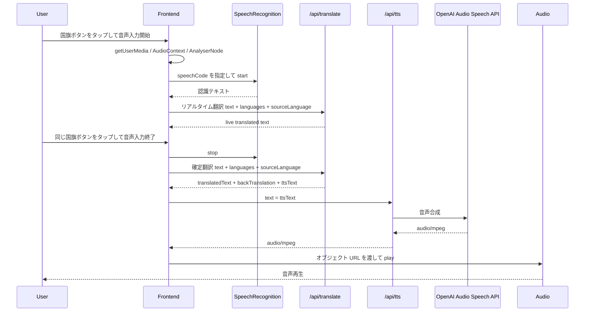
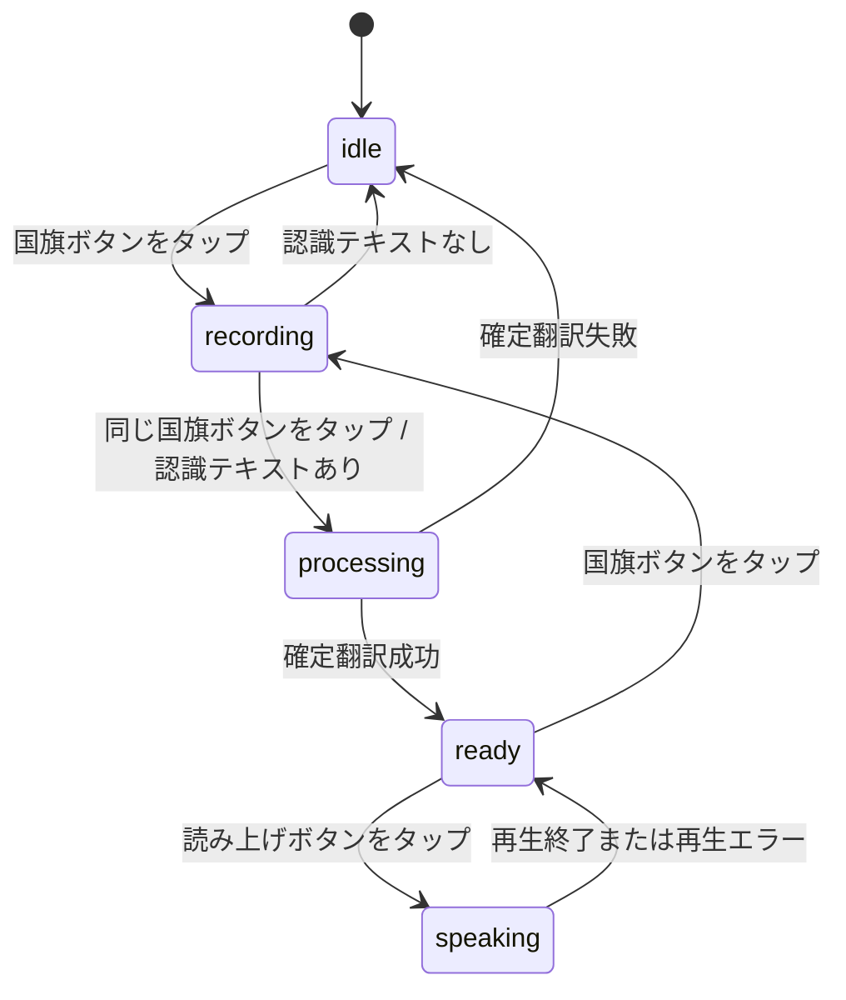

# Speech Flow

## 1. 概要

GoTalk の音声処理は、利用者が国旗ボタンから開始した音声入力をブラウザの `SpeechRecognition` でテキスト化し、その認識テキストを翻訳、読み上げ用テキストへ変換し、TTS で生成した音声をブラウザで再生するための処理です。

現在の構成は以下です。

- `SpeechRecognition` / `webkitSpeechRecognition`
- 音声入力中のリアルタイム翻訳
- 音声入力終了後の確定翻訳
- Backend の `/api/tts`
- OpenAI Audio Speech API
- Frontend の `Audio` 再生

音声のテキスト化は Frontend のブラウザ機能が担当します。Backend は音声データを受け取らず、Frontend から送られた認識テキストを `/api/translate` と `/api/tts` で処理します。

## 2. 全体フロー



## 3. Frontend の処理

Frontend の音声処理は `frontend/src/pages/InterpreterPage.tsx` に実装されています。

国旗ボタンは、2 つの選択言語それぞれに表示されます。`handleFlagTap` は、`idle` または `ready` のときにタップされた国旗の言語で `startRecording` を開始します。`recording` 中に同じ国旗がタップされた場合は `stopRecording` を実行します。`processing` または `speaking` の間は国旗ボタンを操作できません。

`startRecording` は、最初に `SpeechRecognition` / `webkitSpeechRecognition` の constructor を取得します。取得できない場合は、音声認識非対応のエラーメッセージを設定して `idle` に戻します。

次に `navigator.mediaDevices.getUserMedia({ audio: true })` でマイク入力へのアクセスを確認します。失敗した場合は、マイクアクセス不可のエラーメッセージを設定して `idle` に戻します。取得した `MediaStream` は `streamRef` に保持され、終了時に track を停止します。

マイク入力の視覚表現には `AudioContext` と `AnalyserNode` を使います。`AudioContext.createMediaStreamSource(stream)` で入力元を作り、`AnalyserNode` に接続します。`requestAnimationFrame` のループで `getByteTimeDomainData` を読み、振幅から国旗周辺の波紋要素の `transform` と `opacity` を更新します。`AudioContext` の作成に失敗した場合は、波紋表示なしで処理を継続します。

`SpeechRecognition` は、タップされた国旗に対応する `lang.speechCode` を `recognition.lang` に設定して開始します。`interimResults` と `continuous` はどちらも `true` です。`onresult` では `event.results` の transcript を先頭から連結し、`recognizedTextRef.current` と `recognizedText` state を更新します。

音声入力中は、`recognizedText` の変更に対して 800ms のデバウンスで `/api/translate` を呼び出します。このリアルタイム翻訳は、`text`、選択済み `languages`、現在の入力元言語がある場合は `sourceLanguage` を送信します。レスポンスの `translatedText` があり、`sourceLanguage` が `unknown` でない場合に `liveTranslatedText` を更新します。

音声入力終了時は終了処理が `SpeechRecognition`、波紋表示、`AudioContext`、`MediaStream` を停止・解放します。認識テキストが空の場合は、音声を認識できなかった旨のエラーメッセージを表示して `idle` に戻します。認識テキストがある場合は `callTranslateApi(transcript, recordingLangRef.current?.id)` を呼び、確定翻訳へ進みます。

音声再生は `handleSpeak` が担当します。`/api/tts` に `{ text: ttsText }` を送信し、返却された `audio/mpeg` からオブジェクト URL を作成して `new Audio(url)` に渡します。`audio.play()` の後、`onended` または `onerror` で URL を解放し、`status` を `ready` に戻します。

## 4. SpeechRecognition

`SpeechRecognition` は Frontend で生成され、音声入力のテキスト化だけを担当します。

| 項目 | 実装上の扱い |
| --- | --- |
| constructor | `window.SpeechRecognition` があれば使用し、なければ `window.webkitSpeechRecognition` を使用します。どちらもなければ音声認識非対応として扱います。 |
| `speechCode` | タップされた国旗の `Language.speechCode` を `recognition.lang` に設定します。 |
| `interimResults` | `true` に設定し、途中の認識結果も `onresult` で受け取ります。 |
| `continuous` | `true` に設定し、継続的に認識結果を受け取ります。 |
| `onresult` | `event.results` 全体を走査し、各 result の `transcript` を連結して `recognizedTextRef.current` と `recognizedText` を更新します。 |
| `onend` | `isRecordingRef.current` が `true` の場合、`recognition.start()` を再実行します。再開に失敗した場合は無視します。 |
| `onerror` | 現在の実装では空の handler です。 |
| `start` | `recognition.start()` を実行します。失敗した場合は入力中フラグ、国旗状態、マイク入力、波紋表示、`AudioContext` を片付け、`idle` に戻します。 |
| `stop` | `stopRecording` から `speechRecognitionRef.current?.stop()` を呼び、参照を `null` にします。 |

`onend` で再開するのは、ブラウザ側で認識が終了しても、利用者が明示的に終了していない間は音声入力を継続するためです。`stopRecording` では先に `isRecordingRef.current` を `false` にするため、明示的な終了後に `onend` が発火しても再開されません。

## 5. 音声入力状態

`InterpreterPage.tsx` の `status` は、音声入力から再生までの UI 状態を表します。

| 状態 | 役割 |
| --- | --- |
| `idle` | 初期状態、またはエラー後の待機状態です。国旗ボタンから音声入力を開始できます。 |
| `recording` | 音声入力中の状態です。`SpeechRecognition` が認識テキストを更新し、リアルタイム翻訳が動きます。同じ国旗ボタンで終了できます。 |
| `processing` | 音声入力終了後、`callTranslateApi` が確定翻訳を実行している状態です。翻訳中メッセージを表示し、国旗ボタンと読み上げ操作は無効になります。 |
| `ready` | 確定翻訳、バックトランスレーション、`ttsText` が取得済みの状態です。国旗ボタンから次の音声入力を開始でき、読み上げもできます。 |
| `speaking` | `/api/tts` の結果を `Audio` で再生している状態です。再生終了または再生エラーで `ready` に戻ります。 |

主な状態遷移は以下です。



## 6. リアルタイム翻訳

リアルタイム翻訳は `recording` 中だけ動作します。

`recognizedText` は `SpeechRecognition.onresult` から更新される表示用の認識テキストです。`recognizedTextRef` は、音声入力終了時に最新の認識テキストを同期的に参照するために使われます。

`useEffect` は、`status !== 'recording'` または `recognizedText` が空の場合は何もしません。条件を満たす場合、800ms の `setTimeout` で `/api/translate` を呼び出します。cleanup では `clearTimeout` と `AbortController.abort()` を実行するため、`recognizedText` が短時間で更新されると前のリクエスト準備は取り消されます。

送信する JSON は以下です。

```json
{
  "text": "recognizedText",
  "languages": [
    { "id": "first selected language id", "label": "first selected language label" },
    { "id": "second selected language id", "label": "second selected language label" }
  ],
  "sourceLanguage": "recording language id"
}
```

`sourceLanguage` は、`recordingLangRef.current` がある場合だけ含まれます。音声入力では国旗ボタンから入力元言語が決まるため、通常はタップされた国旗の言語 ID が送信されます。

レスポンスが成功し、`data.translatedText` が存在し、`data.sourceLanguage !== 'unknown'` の場合だけ `liveTranslatedText` を更新します。リアルタイム翻訳中の `AbortError` やネットワークエラーは UI エラーとして表示せず無視します。

## 7. 音声入力終了後

`stopRecording` は音声入力終了時の入口です。

処理内容は以下です。

- `isRecordingRef.current` を `false` にする
- `speechRecognitionRef.current?.stop()` を実行し、参照を `null` にする
- `requestAnimationFrame` を停止する
- 波紋要素の `transform` と `opacity` を初期化する
- `AudioContext` と `AnalyserNode` の参照を片付ける
- `MediaStream` の track を停止する
- `recordingFlagIndex` を `null` にする
- `recognizedTextRef.current` から確定翻訳に使うテキストを取得する

認識テキストが空でなければ、`callTranslateApi(transcript, recordingLangRef.current?.id)` を呼びます。`callTranslateApi` は `status` を `processing` にし、選択済み 2 言語と `sourceLanguage` を `/api/translate` に送信します。

確定翻訳の成功時、Frontend はレスポンスから以下を state に保存します。

- `translatedText`
- `ttsText`
- `backTranslation`

`ttsText` はレスポンスに存在する場合はその値を使い、存在しない場合は `translatedText` を使います。成功後は `status` を `ready` にし、履歴に原文、翻訳文、バックトランスレーション、翻訳元言語、翻訳先言語を追加します。

`/api/translate` が `422` で `language_mismatch` を返した場合は、言語不明メッセージを表示し、翻訳文とバックトランスレーションを空にして `idle` に戻します。それ以外の失敗ではタイムアウトまたはエラー内容に応じたメッセージを表示し、`idle` に戻します。

## 8. TTS

TTS は、確定翻訳後に翻訳カードの読み上げボタンから実行されます。

Frontend は `handleSpeak` で `status` を `speaking` にし、Backend の `/api/tts` に以下を送信します。

```json
{
  "text": "ttsText"
}
```

Backend の `/api/tts` は `POST` のみ受け付けます。`OPENAI_API_KEY` が未設定の場合は `service unavailable`、request body が不正な場合は `invalid request body`、`text` が空白のみの場合は `text is required` を返します。

TTS model は `OPENAI_TTS_MODEL` を使い、未設定時は `gpt-4o-mini-tts` です。voice は `OPENAI_TTS_VOICE` を使い、未設定時は `marin` です。Backend は OpenAI Audio Speech API に `model`、`input`、`voice` を送信し、成功時は `audio/mpeg` を Frontend に返します。

Frontend は返却された音声からオブジェクト URL を作成し、`Audio` で再生します。再生終了時または再生エラー時は URL を解放し、`audioRef` を `null` にして `status` を `ready` に戻します。`/api/tts` の呼び出しまたは `audio.play()` に失敗した場合も `ready` に戻します。

## 9. エラー処理

エラー処理の詳細は [api.md](api.md) を参照してください。この文書では音声処理に関係する概要のみ整理します。

- `SpeechRecognition` 非対応の場合、Frontend は「このブラウザは音声認識に対応していません」を表示し、`idle` に戻します。
- `getUserMedia` に失敗した場合、Frontend は「マイクへのアクセスが許可されていません」を表示し、`idle` に戻します。
- `recognition.start()` に失敗した場合、Frontend は音声入力用の状態とリソースを片付け、「音声認識を開始できませんでした。もう一度お試しください。」を表示して `idle` に戻します。
- 認識テキストが空のまま音声入力を終了した場合、Frontend は「音声を認識できませんでした。もう一度お試しください。」を表示して `idle` に戻します。
- 確定翻訳が失敗した場合、Frontend はエラーメッセージを表示して `idle` に戻します。
- TTS が失敗した場合、Frontend は `ready` に戻します。Backend では OpenAI Audio Speech API の呼び出し失敗時に `tts failed` を返します。

## 10. 関連ドキュメント

- [architecture.md](architecture.md)
- [translation-flow.md](translation-flow.md)
- [api.md](api.md)
