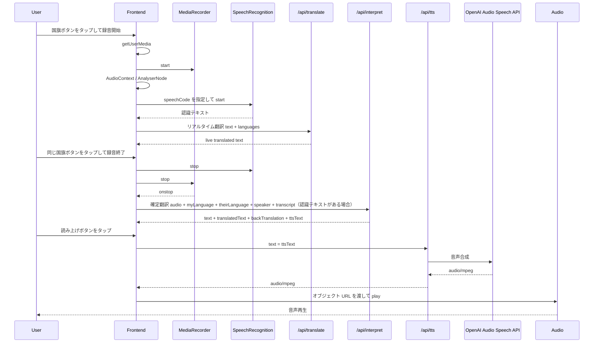
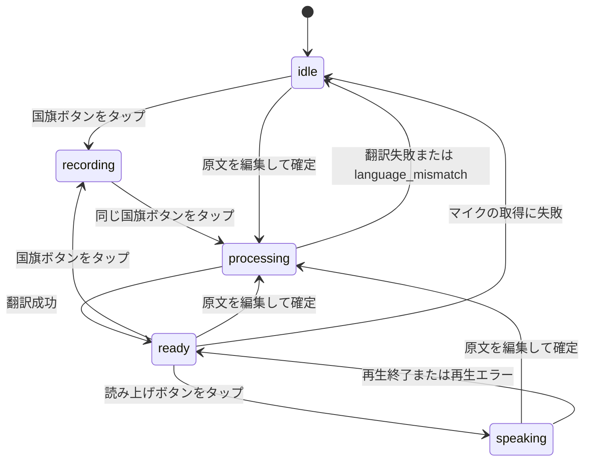

# Speech Flow

## 1. 概要

GoTalk の音声処理は、利用者が国旗ボタンから開始した発話を `MediaRecorder` で録音し、録音終了時に音声を Backend の `/api/interpret` へ送って確定翻訳を取得し、TTS で生成した音声をブラウザで再生するための処理です。

現在の構成は以下です。

- `getUserMedia` と `MediaRecorder` による録音
- `SpeechRecognition` / `webkitSpeechRecognition` による録音中の認識テキスト表示
- 録音中のリアルタイム翻訳（`/api/translate`）
- 録音終了後の確定翻訳（`/api/interpret`）
- Backend の `/api/tts`
- OpenAI Audio Speech API
- Frontend の `Audio` 再生

`SpeechRecognition` は録音と並行して動き、認識テキストを表示とリアルタイム翻訳に使います。録音終了時は、認識テキストの有無にかかわらず録音音声を `/api/interpret` に送ります。認識テキストが得られている場合は `transcript` として同じリクエストに添え、Backend はそのテキストを翻訳します。認識テキストがない場合は、Backend が OpenAI の音声文字起こし API で言語判定と文字起こしを行います。

## 2. 全体フロー


```mermaid
sequenceDiagram
  participant User as User
  participant FE as Frontend
  participant MR as MediaRecorder
  participant SR as SpeechRecognition
  participant TR as /api/translate
  participant IN as /api/interpret
  participant TTSAPI as /api/tts
  participant Speech as OpenAI Audio Speech API
  participant Audio as Audio

  User->>FE: 国旗ボタンをタップして録音開始
  FE->>FE: getUserMedia
  FE->>MR: start
  FE->>FE: AudioContext / AnalyserNode
  FE->>SR: speechCode を指定して start
  SR-->>FE: 認識テキスト
  FE->>TR: リアルタイム翻訳 text + languages
  TR-->>FE: live translated text
  User->>FE: 同じ国旗ボタンをタップして録音終了
  FE->>SR: stop
  FE->>MR: stop
  MR-->>FE: onstop
  FE->>IN: 確定翻訳 audio + myLanguage + theirLanguage + speaker + transcript（認識テキストがある場合）
  IN-->>FE: text + translatedText + backTranslation + ttsText
  User->>FE: 読み上げボタンをタップ
  FE->>TTSAPI: text = ttsText
  TTSAPI->>Speech: 音声合成
  Speech-->>TTSAPI: audio/mpeg
  TTSAPI-->>FE: audio/mpeg
  FE->>Audio: オブジェクト URL を渡して play
  Audio-->>User: 音声再生
```

## 3. Frontend の処理

Frontend の音声処理は `frontend/src/pages/InterpreterPage.tsx` に実装されています。

国旗ボタンは、2 つの選択言語それぞれに表示されます。`handleFlagTap` は、`idle` または `ready` のときに表示中の原文、リアルタイム翻訳、翻訳文、`ttsText`、バックトランスレーション、エラーメッセージを空にし、タップされた国旗の言語で `startRecording` を開始します。`recording` 中に同じ国旗がタップされた場合は `stopRecording` を実行します。`recording` 中は反対側の国旗を、`processing` または `speaking` の間は両方の国旗を操作できません。

`startRecording` は、最初に `getSupportedMimeType` で録音に使う MIME type を選びます。`MediaRecorder.isTypeSupported` で `audio/webm;codecs=opus`、`audio/webm`、`audio/mp4`、`audio/ogg;codecs=opus` の順に確認し、最初に対応しているものを使います。どれにも対応していない場合は MIME type を指定せずに `MediaRecorder` を作成します。

次に `navigator.mediaDevices.getUserMedia({ audio: true })` でマイク入力を取得し、`streamRef` に保持します。タップされた国旗の言語は `recordingLangRef` に保存します。取得した `MediaStream` から `MediaRecorder` を作成し、`ondataavailable` で録音データを `audioChunksRef` に蓄積します。`recorder.start()` の後、`status` を `recording` にします。`getUserMedia` や `MediaRecorder` の作成で例外が発生した場合は、マイクアクセス不可のエラーメッセージを設定して `idle` に戻します。

マイク入力の視覚表現には `AudioContext` と `AnalyserNode` を使います。`AudioContext.createMediaStreamSource(stream)` で入力元を作り、`AnalyserNode` に接続します。`requestAnimationFrame` のループで `getByteTimeDomainData` を読み、振幅から国旗周辺の波紋要素の `transform` と `opacity` を更新します。`AudioContext` の作成に失敗した場合は、波紋表示なしで処理を継続します。

`SpeechRecognition` の constructor が取得できる場合は、タップされた国旗に対応する `lang.speechCode` を `recognition.lang` に設定して開始します。constructor が取得できない場合や `recognition.start()` が失敗した場合も、録音はそのまま継続します。

音声入力中は、`recognizedText` の変更に対して 800ms のデバウンスで `/api/translate` を呼び出します。このリアルタイム翻訳は `text` と選択済み `languages` を送信します。レスポンスの `translatedText` があり、`sourceLanguage` が `unknown` でない場合に `liveTranslatedText` を更新します。

録音終了時は `stopRecording` が `SpeechRecognition`、波紋表示、`AudioContext` を停止・解放し、`status` を `processing` にしてから `MediaRecorder` を停止します。`MediaRecorder` の `onstop` で `MediaStream` の track を停止し、録音データから `Blob` を作成して `callInterpretApi(blob)` を呼び、確定翻訳へ進みます。

音声再生は `handleSpeak` が担当します。`/api/tts` に `{ text: ttsText }` を送信し、返却された `audio/mpeg` からオブジェクト URL を作成して `new Audio(url)` に渡します。`audio.play()` の後、`onended` または `onerror` で URL を解放し、`status` を `ready` に戻します。

`InterpreterPage` は `pendingAudio` prop を受け取れます。`pendingAudio` が渡された場合は、その `Blob` で `callInterpretApi` を呼びます。`App.tsx` からは `pendingAudio` を渡していません。

## 4. 録音と SpeechRecognition

録音は `MediaRecorder` が担当し、`SpeechRecognition` は録音と並行して認識テキストを取得します。

| 項目 | 実装上の扱い |
| --- | --- |
| `MediaRecorder` の MIME type | `audio/webm;codecs=opus`、`audio/webm`、`audio/mp4`、`audio/ogg;codecs=opus` の順に対応を確認し、最初に対応しているものを使います。 |
| `ondataavailable` | サイズが 0 より大きい録音データを `audioChunksRef` に追加します。 |
| `onstop` | `MediaStream` の track を停止します。利用者が国旗をタップして停止した場合だけ、録音データから `Blob` を作成して `callInterpretApi` を呼びます。 |
| `SpeechRecognition` constructor | `window.SpeechRecognition` があれば使用し、なければ `window.webkitSpeechRecognition` を使用します。どちらもなければ `SpeechRecognition` を使わずに録音だけを行います。 |
| `speechCode` | タップされた国旗の `Language.speechCode` を `recognition.lang` に設定します。 |
| `interimResults` | `true` に設定し、途中の認識結果も `onresult` で受け取ります。 |
| `continuous` | `true` に設定し、継続的に認識結果を受け取ります。 |
| `onresult` | `event.results` 全体を走査し、各 result の `transcript` を連結して `recognizedTextRef.current` と `recognizedText` を更新し、`hasLiveTranscriptRef.current` を `true` にします。 |
| `onend` | `mediaRecorderRef.current?.state` が `recording` の場合、`recognition.start()` を再実行します。再開に失敗した場合は無視します。 |
| `onerror` | 現在の実装では空の handler です。 |
| `start` | `recognition.start()` を実行します。失敗した場合は無視し、録音は継続します。 |
| `stop` | `stopRecording` から `speechRecognitionRef.current?.stop()` を呼び、参照を `null` にします。 |

`onend` で再開するのは、ブラウザ側で認識が終了しても、`MediaRecorder` が録音中の間は認識を継続するためです。

## 5. 音声入力状態

`InterpreterPage.tsx` の `status` は、録音から再生までの UI 状態を表します。

| 状態 | 役割 |
| --- | --- |
| `idle` | 初期状態、またはエラー後の待機状態です。国旗ボタンから録音を開始できます。 |
| `recording` | 録音中の状態です。`SpeechRecognition` が認識テキストを更新し、リアルタイム翻訳が動きます。同じ国旗ボタンで終了できます。 |
| `processing` | 録音終了後に `/api/interpret` で確定翻訳を実行している状態、または原文編集後に `/api/translate` で再翻訳している状態です。翻訳中メッセージを表示し、国旗ボタンと読み上げ操作は無効になります。 |
| `ready` | 翻訳文、バックトランスレーション、`ttsText` が取得済みの状態です。国旗ボタンから次の録音を開始でき、読み上げもできます。 |
| `speaking` | `/api/tts` の結果を `Audio` で再生している状態です。再生終了または再生エラーで `ready` に戻ります。国旗ボタンは操作できませんが、原文の編集はできます。 |

主な状態遷移は以下です。


```mermaid
stateDiagram-v2
  [*] --> idle
  idle --> recording: 国旗ボタンをタップ
  ready --> recording: 国旗ボタンをタップ
  recording --> processing: 同じ国旗ボタンをタップ
  processing --> ready: 翻訳成功
  processing --> idle: 翻訳失敗または language_mismatch
  ready --> processing: 原文を編集して確定
  idle --> processing: 原文を編集して確定
  speaking --> processing: 原文を編集して確定
  ready --> idle: マイクの取得に失敗
  ready --> speaking: 読み上げボタンをタップ
  speaking --> ready: 再生終了または再生エラー
```

録音を止めた後は、認識テキストの有無にかかわらず必ず `processing` へ進みます。原文の編集は、原文があり、`status` が `recording` と `processing` 以外（`idle`、`ready`、`speaking`）のときに開始でき、確定すると `/api/translate` で再翻訳して `processing` へ進みます。

`status` を `recording` にするのは `getUserMedia` と `MediaRecorder` の開始に成功した後です。そのため、`getUserMedia` や `MediaRecorder` の作成に失敗した場合は `recording` を経由せず、`ready` から開始した場合は `idle` に変わり、`idle` から開始した場合は `idle` のままです。どちらの場合もマイクアクセス不可のエラーメッセージを表示します。

## 6. リアルタイム翻訳

リアルタイム翻訳は `recording` 中だけ動作します。

`recognizedText` は `SpeechRecognition.onresult` から更新される表示用の認識テキストです。`recognizedTextRef` は、録音終了時に最新の認識テキストを同期的に参照するために使われます。

`useEffect` は、`status !== 'recording'` または `recognizedText` が空の場合は何もしません。条件を満たす場合、800ms の `setTimeout` で `/api/translate` を呼び出します。cleanup では `clearTimeout` と `AbortController.abort()` を実行するため、`recognizedText` が短時間で更新されると前のリクエスト準備は取り消されます。

送信する JSON は以下です。

```json
{
  "text": "recognizedText",
  "languages": [
    { "id": "first selected language id", "label": "first selected language label" },
    { "id": "second selected language id", "label": "second selected language label" }
  ]
}
```

レスポンスが成功し、`data.translatedText` が存在し、`data.sourceLanguage !== 'unknown'` の場合だけ `liveTranslatedText` を更新します。リアルタイム翻訳の結果は `recording` 中だけ表示されます。リアルタイム翻訳中の `AbortError`、ネットワークエラー、HTTP エラーは UI エラーとして表示せず無視します。

## 7. 録音終了後

`stopRecording` は録音終了時の入口です。`MediaRecorder` の state が `recording` でない場合は何もしません。

処理内容は以下です。

- `userStoppedRef.current` を `true` にする
- `speechRecognitionRef.current?.stop()` を実行し、参照を `null` にする
- `requestAnimationFrame` を停止する
- 波紋要素の `transform` と `opacity` を初期化する
- `AudioContext` と `AnalyserNode` の参照を片付ける
- `recordingFlagIndex` を `null` にする
- `status` を `processing` にする
- `MediaRecorder` を停止する

`MediaRecorder` の `onstop` では `MediaStream` の track を停止し、`userStoppedRef.current` が `true` の場合に録音データから `Blob` を作成して `callInterpretApi(blob)` を呼びます。画面の unmount 時にも `MediaRecorder` は停止されますが、この場合 `userStoppedRef.current` は `false` のため `/api/interpret` は呼ばれません。

`callInterpretApi` は `/api/interpret` に次を `multipart/form-data` で送信します。

- `audio`：録音データ。ファイル名は `recording.webm`、`recording.mp4`、`recording.ogg` のいずれか
- `myLanguage`：タップされた国旗の言語の `{ id, label }`
- `theirLanguage`：もう一方の言語の `{ id, label }`
- `speaker`：タップされた国旗の言語 ID
- `transcript`：`SpeechRecognition` の認識テキスト。認識テキストが得られた場合だけ送信

タイムアウトは 60 秒です。`processing` 中の翻訳カードには、話者側と相手側の両言語の「翻訳中」と「お待ちください」のメッセージを 1.2 秒ごとに切り替えて表示します。

確定翻訳の成功時、Frontend はレスポンスから以下を state に保存します。

- `translatedText`
- `ttsText`
- `backTranslation`

録音中に `onresult` が一度も呼ばれなかった場合（`hasLiveTranscriptRef.current` が `false`）は、レスポンスの `text` を原文として表示します。`onresult` は呼ばれたが認識テキストが空だった場合は、`transcript` を送らず、`text` も原文として表示しません。`ttsText` はレスポンスに存在する場合はその値を使い、存在しない場合は `translatedText` を使います。成功後は `status` を `ready` にし、履歴に原文、翻訳文、バックトランスレーション、翻訳元言語、翻訳先言語を追加します。履歴に表示するのは原文と翻訳文です。

`/api/interpret` が `422` で `language_mismatch` を返した場合は、言語不明メッセージを表示し、翻訳文とバックトランスレーションを空にして `idle` に戻します。それ以外の失敗ではタイムアウトまたはエラー内容に応じたメッセージを表示し、`idle` に戻します。

## 8. TTS

TTS は、確定翻訳（`/api/interpret`）または原文編集後の再翻訳（`/api/translate`）が成功した後に、翻訳カードの読み上げボタンから実行されます。

Frontend は `handleSpeak` で `status` を `speaking` にし、Backend の `/api/tts` に以下を送信します。

```json
{
  "text": "ttsText"
}
```

Backend の `/api/tts` は `POST` のみ受け付けます。`OPENAI_API_KEY` が未設定の場合は `service unavailable`、request body が不正な場合は `invalid request body`、`text` が空白のみの場合は `text is required` を返します。

TTS model は `OPENAI_TTS_MODEL` を使い、未設定時は `gpt-4o-mini-tts` です。voice は `OPENAI_TTS_VOICE` を使い、未設定時は `marin` です。Backend は OpenAI Audio Speech API に `model`、`input`、`voice` を送信し、成功時は `audio/mpeg` を Frontend に返します。

Frontend は返却された音声からオブジェクト URL を作成し、`Audio` で再生します。再生終了時または再生エラー時は URL を解放し、`audioRef` を `null` にして `status` を `ready` に戻します。`/api/tts` の呼び出しまたは `audio.play()` に失敗した場合も `ready` に戻します。

## 9. エラー処理

エラー処理の詳細は [api.md](api.md) を参照してください。この文書では音声処理に関係する概要のみ整理します。

- `getUserMedia` や `MediaRecorder` の作成に失敗した場合、Frontend は「マイクへのアクセスが許可されていません」を表示し、`idle` に戻します。
- `SpeechRecognition` に対応していない場合や `recognition.start()` に失敗した場合、エラーは表示せずに録音を継続します。この場合 `transcript` は送られず、Backend が録音音声から文字起こしします。
- `/api/interpret` または `/api/translate`（再翻訳）が `422` で `language_mismatch` を返した場合、Frontend は選択言語ごとの言語不明メッセージを表示し、`idle` に戻します。
- `/api/interpret` または `/api/translate`（再翻訳）がタイムアウトした場合、Frontend は「通信がタイムアウトしました。もう一度お試しください。」を表示し、`idle` に戻します。
- それ以外で確定翻訳または再翻訳が失敗した場合、Frontend は `HTTP 500` のような status 表示などのエラー内容を表示して `idle` に戻します。
- TTS が失敗した場合、Frontend は `ready` に戻します。Backend では OpenAI Audio Speech API の呼び出し失敗時に `tts failed` を返します。

## 10. 関連ドキュメント

- [architecture.md](architecture.md)
- [translation-flow.md](translation-flow.md)
- [api.md](api.md)
