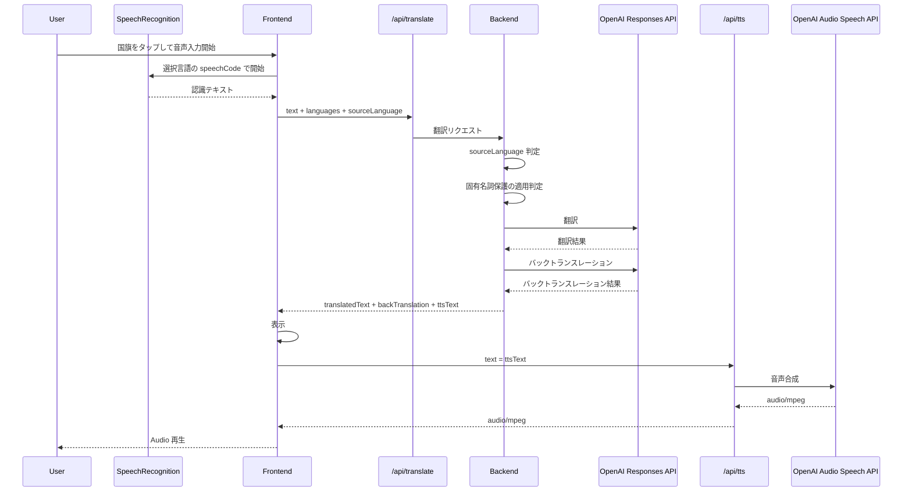

# Translation Flow

## 1. 概要

GoTalk の翻訳処理は、2 つの選択言語の間で会話を成立させるために、ブラウザで認識した発話テキストを翻訳し、翻訳結果とバックトランスレーションを表示し、必要に応じて翻訳文を音声として再生する処理です。

現在の実装では、音声認識は Frontend の `SpeechRecognition` / `webkitSpeechRecognition` が担当します。Frontend は認識テキスト、選択済み 2 言語、必要に応じて `sourceLanguage` を `/api/translate` に送信します。Backend は翻訳方向を決定し、必要な場合は固有名詞保護を適用してから OpenAI Responses API で翻訳とバックトランスレーションを実行します。

翻訳結果は Frontend に表示されます。読み上げ時は Backend の `/api/tts` に `ttsText` を送信し、Backend が OpenAI Audio Speech API で生成した `audio/mpeg` を Frontend が `Audio` で再生します。

## 2. 全体フロー

## 3. Frontend の処理

Frontend の翻訳処理は `frontend/src/pages/InterpreterPage.tsx` に実装されています。

`startRecording` は、タップされた国旗の言語を `recordingLangRef` に保存し、その言語の `speechCode` を `recognition.lang` に設定して `SpeechRecognition` を開始します。`interimResults` と `continuous` は有効化されています。`onresult` では認識結果を連結し、`recognizedText` と `recognizedTextRef` を更新します。

音声入力中は `recognizedText` の変更に対して 800ms のデバウンスで `/api/translate` を呼び出します。このリアルタイム翻訳では、`text`、選択済み `languages`、音声入力中の言語がある場合は `sourceLanguage` を送信します。成功時は `translatedText` が存在し、かつ `sourceLanguage` が `unknown` でない場合に `liveTranslatedText` を更新します。

音声入力終了時は `stopRecording` が `SpeechRecognition` を停止し、認識済みテキストがあれば `callTranslateApi(transcript, recordingLangRef.current?.id)` を実行します。この確定翻訳では、音声入力開始時に選ばれた国旗の言語 ID が `sourceLanguage` として送信されます。

`callTranslateApi` は `/api/translate` に `text` と `languages` を送信し、引数で `sourceLanguage` を受け取った場合だけ request body に含めます。レスポンスから `translatedText`、`backTranslation`、`ttsText` を state に保存し、履歴には `sourceLanguage` と `targetLanguage` も保存します。レスポンスの `ttsText` がない場合は `translatedText` を読み上げ用テキストとして使います。

認識テキストを手入力で編集して確定した場合、`handleEditConfirm` は `callTranslateApi(trimmed)` を呼び出します。この経路では `sourceLanguage` は送信されません。

読み上げは `handleSpeak` が担当します。Frontend は `/api/tts` に `{ text: ttsText }` を送信し、返却された `audio/mpeg` から作成した URL を `new Audio(url)` に渡して再生します。

## 4. Backend の処理

Backend の翻訳処理は `backend/main.go` の `translateHandler` に実装されています。

`/api/translate` は `POST` のみ受け付けます。`OPENAI_API_KEY` が未設定の場合は `translation service unavailable` を返します。request body の JSON decode に失敗した場合は `invalid request body`、`text` が空白のみの場合は `text is required`、`languages` が 2 件未満の場合は `two languages are required` を返します。

`sourceLanguage` が指定されている場合、Backend はそれが選択済み 2 言語のどちらかに一致するかを確認します。一致した場合は指定言語を翻訳元、もう一方を翻訳先として固定します。一致しない場合は `sourceLanguage not in selected languages` を返します。

`sourceLanguage` が未指定の場合、Backend は実行経路によって翻訳方向を決めます。固有名詞保護を使う経路では、日本語文字を含む場合は日本語を翻訳元にし、日本語文字を含まない自己紹介パターンの場合は非日本語側を翻訳元にします。通常経路では OpenAI Responses API に候補 2 言語から `sourceLanguage` と `targetLanguage` を判定させます。判定結果が `unknown` または候補外の場合は `language_mismatch` を返します。

固有名詞保護を使う場合、Backend は入力テキスト内の保護対象をプレースホルダ化し、OpenAI Responses API に翻訳を依頼します。その後、翻訳結果に対してバックトランスレーションを実行し、表示用の `translatedText` / `backTranslation` と読み上げ用の `ttsText` を作成します。保護処理を適用できない場合は通常翻訳へ進むことがあります。

通常翻訳では、翻訳 prompt で翻訳結果のみを返すように指示します。`sourceLanguage` 未指定時の通常経路では、OpenAI Responses API の JSON 応答から `sourceLanguage`、`targetLanguage`、`translatedText` を取り出します。翻訳後は別 prompt でバックトランスレーションを行います。通常経路の `ttsText` は `translatedText` です。

レスポンスは `sourceLanguage`、`targetLanguage`、`translatedText`、`backTranslation`、`ttsText` を JSON で返します。

## 5. sourceLanguage の役割

`sourceLanguage` は、Frontend が発話元言語を明示できる場合に、Backend の翻訳方向を固定するための値です。

| 経路 | `sourceLanguage` の送信 | 実装上の扱い |
| --- | --- | --- |
| 音声入力中リアルタイム翻訳 | 送信される | 音声入力開始時にタップされた国旗の言語 ID を送る。Backend は翻訳元をその言語に固定する。 |
| 音声入力終了後翻訳 | 送信される | `stopRecording` から `callTranslateApi` に音声入力中の言語 ID を渡す。Backend は翻訳方向を固定する。 |
| 手入力再翻訳 | 送信されない | `handleEditConfirm` は `callTranslateApi(trimmed)` を呼ぶため未指定。Backend は固有名詞保護経路または通常経路の判定で翻訳方向を決める。 |

`sourceLanguage` が指定される音声入力系の処理では、ユーザーがどちらの国旗から話し始めたかを正として扱います。未指定の手入力再翻訳では、Backend が入力テキストと選択言語に基づいて翻訳方向を決めます。

## 6. 固有名詞保護

固有名詞保護は、翻訳時に人名、地名、組織名などが別の意味に翻訳されたり、入力にない固有名詞へ補正されたりすることを抑えるための処理です。

Backend は条件に合う場合、固有名詞をプレースホルダに置き換えて OpenAI Responses API に渡します。翻訳とバックトランスレーションの結果に対してプレースホルダを検証し、必要に応じて再試行したうえで、表示用および TTS 用のテキストへ復元します。

この文書では概要のみ扱います。固有名詞の検出条件、プレースホルダ形式、検証、再試行、復元ルールの詳細は [proper-noun-protection.md](proper-noun-protection.md) にまとめています。

## 7. バックトランスレーション

バックトランスレーションは、翻訳結果を元の言語へ戻す処理です。Backend は翻訳が完了した後、OpenAI Responses API に別 prompt を送ってバックトランスレーションを実行します。

利用目的は、利用者が翻訳結果の意味を元の言語側から確認できるようにすることです。Frontend は `/api/translate` の `backTranslation` を `backTranslation` state に保存し、翻訳カード内のバックトランスレーション欄に表示します。履歴にも `backTranslation` は保存されます。

固有名詞保護が有効な場合、Backend はバックトランスレーション結果についてもプレースホルダを検証し、復元した文字列を Frontend に返します。

## 8. TTS

`ttsText` は読み上げに使うテキストです。通常経路では `translatedText` と同じ文字列です。固有名詞保護が有効な場合は、翻訳結果のプレースホルダを読み上げ向けに復元した文字列になります。

Frontend は読み上げボタンが押されたときに `/api/tts` へ `{ text: ttsText }` を送信します。Backend の `/api/tts` は `POST` のみ受け付け、`OPENAI_API_KEY`、TTS model、voice を使って OpenAI Audio Speech API を呼び出します。TTS model は `OPENAI_TTS_MODEL`、未設定時は `gpt-4o-mini-tts` です。voice は `OPENAI_TTS_VOICE`、未設定時は `marin` です。

OpenAI Audio Speech API から返った音声は Backend から `audio/mpeg` として Frontend に返されます。Frontend はその音声を `Audio` で再生し、再生終了または再生エラー時に状態を `ready` に戻します。

## 9. エラー処理

エラー処理の詳細は [api.md](api.md) を参照してください。この文書では翻訳処理に関係する概要のみ整理します。

`/api/translate` では、入力検証エラー、API キー未設定、OpenAI Responses API の失敗、翻訳元言語の不一致、固有名詞保護の失敗が JSON エラーとして返されます。代表的なエラーは `language_mismatch`、`translation failed`、`proper_noun_protection_failed` です。

Frontend は `/api/translate` が 422 を返し、エラーが `language_mismatch` の場合に言語不明メッセージを表示します。それ以外の翻訳失敗では HTTP status やタイムアウトに応じたメッセージを表示し、状態を `idle` に戻します。

`/api/tts` では、入力検証エラー、API キー未設定、OpenAI Audio Speech API の失敗が扱われます。OpenAI Audio Speech API の呼び出しに失敗した場合、Backend は `tts failed` を返します。Frontend の読み上げ処理は TTS 失敗時に状態を `ready` に戻します。

## 10. 関連ドキュメント

- [architecture.md](architecture.md)
- [proper-noun-protection.md](proper-noun-protection.md)
- [api.md](api.md)
