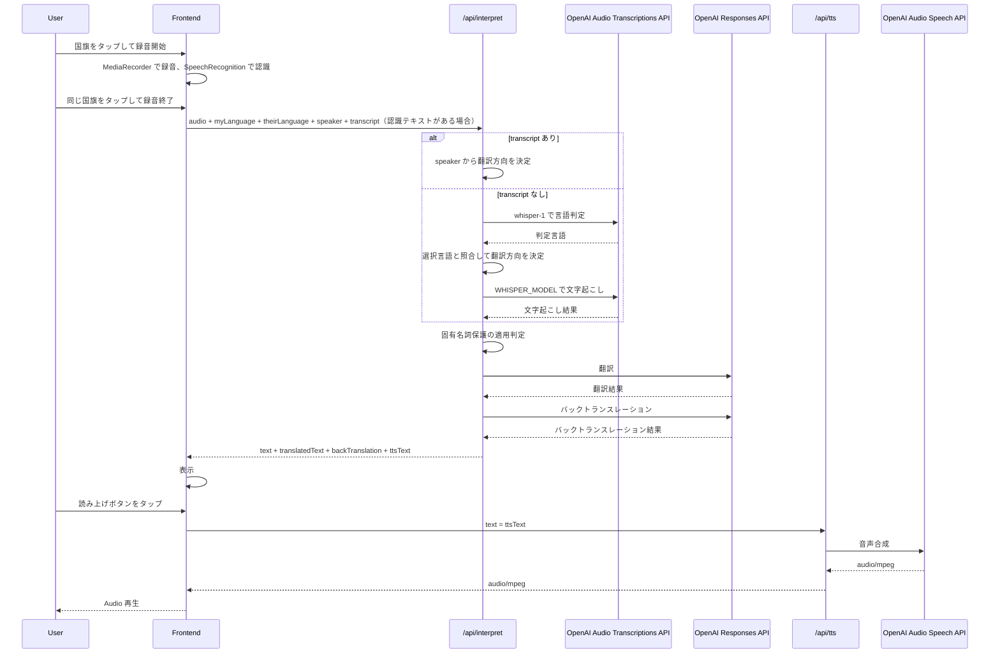

# Translation Flow

## 1. 概要

GoTalk の翻訳処理は、2 つの選択言語の間で会話を成立させるために、利用者の発話を翻訳し、翻訳結果とバックトランスレーションを表示し、必要に応じて翻訳文を音声として再生する処理です。

現在の実装では、翻訳は次の 3 つの経路で実行されます。

| 経路 | API | 翻訳対象 |
| --- | --- | --- |
| 録音終了後の確定翻訳 | `/api/interpret` | `SpeechRecognition` の認識テキスト。認識テキストがない場合は録音音声の文字起こし結果 |
| 録音中のリアルタイム翻訳 | `/api/translate` | `SpeechRecognition` の認識テキスト |
| 原文編集後の再翻訳 | `/api/translate` | 編集後のテキスト |

確定翻訳では、Frontend は録音音声、タップされた国旗の言語（`myLanguage`、`speaker`）、もう一方の言語（`theirLanguage`）、認識テキストがあれば `transcript` を `/api/interpret` に送信します。Backend は翻訳方向を決定し、必要な場合は固有名詞保護を適用してから OpenAI Responses API で翻訳とバックトランスレーションを実行します。

翻訳結果は Frontend に表示されます。読み上げ時は Backend の `/api/tts` に `ttsText` を送信し、Backend が OpenAI Audio Speech API で生成した `audio/mpeg` を Frontend が `Audio` で再生します。

## 2. 全体フロー

```mermaid
sequenceDiagram
  participant User
  participant FE as Frontend
  participant IN as /api/interpret
  participant WH as OpenAI Audio Transcriptions API
  participant OA as OpenAI Responses API
  participant TTSAPI as /api/tts
  participant Speech as OpenAI Audio Speech API

  User->>FE: 国旗をタップして録音開始
  FE->>FE: MediaRecorder で録音、SpeechRecognition で認識
  User->>FE: 同じ国旗をタップして録音終了
  FE->>IN: audio + myLanguage + theirLanguage + speaker + transcript（認識テキストがある場合）
  alt transcript あり
    IN->>IN: speaker から翻訳方向を決定
  else transcript なし
    IN->>WH: whisper-1 で言語判定
    WH-->>IN: 判定言語
    IN->>IN: 選択言語と照合して翻訳方向を決定
    IN->>WH: WHISPER_MODEL で文字起こし
    WH-->>IN: 文字起こし結果
  end
  IN->>IN: 固有名詞保護の適用判定
  IN->>OA: 翻訳
  OA-->>IN: 翻訳結果
  IN->>OA: バックトランスレーション
  OA-->>IN: バックトランスレーション結果
  IN-->>FE: text + translatedText + backTranslation + ttsText
  FE->>FE: 表示
  User->>FE: 読み上げボタンをタップ
  FE->>TTSAPI: text = ttsText
  TTSAPI->>Speech: 音声合成
  Speech-->>TTSAPI: audio/mpeg
  TTSAPI-->>FE: audio/mpeg
  FE-->>User: Audio 再生
```

## 3. Frontend の処理

Frontend の翻訳処理は `frontend/src/pages/InterpreterPage.tsx` に実装されています。

`startRecording` は、タップされた国旗の言語を `recordingLangRef` に保存し、`MediaRecorder` で録音を開始します。あわせて、その言語の `speechCode` を `recognition.lang` に設定して `SpeechRecognition` を開始します。`interimResults` と `continuous` は有効化されています。`onresult` では認識結果を連結し、`recognizedText` と `recognizedTextRef` を更新し、`hasLiveTranscriptRef` を `true` にします。

録音中は `recognizedText` の変更に対して 800ms のデバウンスで `/api/translate` を呼び出します。このリアルタイム翻訳では、`text` と選択済み `languages` を送信します。成功時は `translatedText` が存在し、かつ `sourceLanguage` が `unknown` でない場合に `liveTranslatedText` を更新します。

録音終了時は `stopRecording` が `SpeechRecognition` と `MediaRecorder` を停止します。`MediaRecorder` の `onstop` で録音データを `Blob` にまとめ、`callInterpretApi(blob)` を実行します。

`callInterpretApi` は `/api/interpret` に次を `multipart/form-data` で送信します。

| Field | 内容 |
| --- | --- |
| `audio` | 録音データ。ファイル名は MIME type に応じて `recording.webm`、`recording.mp4`、`recording.ogg` のいずれか |
| `myLanguage` | タップされた国旗の言語の `{ id, label }` |
| `theirLanguage` | もう一方の言語の `{ id, label }` |
| `speaker` | タップされた国旗の言語 ID |
| `transcript` | `SpeechRecognition` の認識テキスト。認識テキストが得られた場合だけ送信 |

レスポンスから `translatedText`、`backTranslation`、`ttsText` を state に保存し、履歴には原文、翻訳文、バックトランスレーション、`sourceLanguage`、`targetLanguage` を保存します。録音中に `SpeechRecognition` の `onresult` が一度も呼ばれなかった場合（`hasLiveTranscriptRef.current` が `false`）は、レスポンスの `text` を原文として表示します。`onresult` は呼ばれたが認識テキストが空だった場合は、`transcript` を送らず、`text` も原文として表示しません。レスポンスの `ttsText` がない場合は `translatedText` を読み上げ用テキストとして使います。タイムアウトは 60 秒です。

原文を編集して確定した場合、`handleEditConfirm` は `callTranslateApi(trimmed)` を呼び出します。`callTranslateApi` は `/api/translate` に `text` と `languages` を送信し、成功時は `/api/interpret` と同様に state と履歴を更新します。タイムアウトは 30 秒です。

`processing` 中の翻訳カードには、話者側と相手側の両言語の「翻訳中」と「お待ちください」のメッセージを 1.2 秒ごとに切り替えて表示します。

読み上げは `handleSpeak` が担当します。Frontend は `/api/tts` に `{ text: ttsText }` を送信し、返却された `audio/mpeg` から作成した URL を `new Audio(url)` に渡して再生します。

## 4. Backend の処理

### /api/interpret

確定翻訳は `backend/main.go` の `interpretHandler` に実装されています。

`/api/interpret` は `POST` のみ受け付けます。`OPENAI_API_KEY` が未設定の場合は `service unavailable` を返します。multipart form の parse に失敗した場合は `invalid multipart form`、`audio` がない場合は `audio is required`、`myLanguage` または `theirLanguage` が不正な場合は `invalid myLanguage` または `invalid theirLanguage` を返します。

`transcript` がある場合、Backend は `speaker` が `myLanguage.id` と `theirLanguage.id` のどちらに一致するかで翻訳元と翻訳先を決め、`transcript` を原文として翻訳します。どちらにも一致しない場合は `invalid speaker` を返します。

`transcript` がない場合、Backend は録音音声を `whisper-1` に送って言語を判定し、判定言語を `myLanguage`、`theirLanguage` の順に照合して翻訳元と翻訳先を決めます。どちらにも一致しない場合は `language_mismatch` を返します。その後、`WHISPER_MODEL`（未設定時は `gpt-4o-transcribe`）に翻訳元の言語コードと言語別のプロンプトを付けて音声を送り、文字起こし結果を原文として翻訳します。この経路では `speaker` は使いません。

翻訳方向が決まった後、固有名詞保護の適用条件に合う場合は保護経路で翻訳します。固有名詞保護を使わない場合（この文書では「保護なし経路」と呼びます）は、決めた翻訳方向のまま、翻訳 prompt で翻訳結果のテキストだけを返すよう指示して翻訳し、続けて別 prompt でバックトランスレーションを実行します。保護経路で固有名詞が 1 件も抽出されなかった場合や Kagome tokenizer の初期化・抽出に失敗した場合も、保護なし経路に進みます。`/api/interpret` の保護なし経路は OpenAI に言語を判定させないため、`language_mismatch` は返しません。保護なし経路の `ttsText` は `translatedText` です。

レスポンスは `text`、`sourceLanguage`、`targetLanguage`、`translatedText`、`backTranslation`、`ttsText` を JSON で返します。

### /api/translate

リアルタイム翻訳と再翻訳は `backend/main.go` の `translateHandler` に実装されています。

`/api/translate` は `POST` のみ受け付けます。`OPENAI_API_KEY` が未設定の場合は `translation service unavailable` を返します。request body の JSON decode に失敗した場合は `invalid request body`、`text` が空白のみの場合は `text is required`、`languages` が 2 件未満の場合は `two languages are required` を返します。

`/api/translate` は request で翻訳元を受け取らず、実行経路によって翻訳方向を決めます。保護経路（固有名詞が 1 件以上抽出された場合）では、次のように決めます。

- 選択言語に `ja` がある場合：保護経路に入るには入力に日本語文字が必要なため、常に `ja` が翻訳元、もう一方が翻訳先になる
- 選択言語に `ja` がなく、英語自己紹介パターンで保護経路に入った場合：入力に日本語文字を含めば `languages[1]`、含まなければ `languages[0]` が翻訳元になり、もう一方が翻訳先になる

「日本語文字」は、ひらがな、カタカナ、CJK 統合漢字、CJK Extension A のいずれかです（`hasJapaneseChars`）。漢字だけの文も日本語文字を含むと判定されるため、たとえば `ja` と `zh-CN` を選択して中国語の文を送り、固有名詞が 1 件以上抽出された場合は、`ja` が翻訳元、`zh-CN` が翻訳先になります。この場合は OpenAI による言語判定を行わないため、`language_mismatch` は返りません。

保護なし経路では、OpenAI Responses API に候補 2 言語から翻訳元を判定させ、JSON 応答から `sourceLanguage` と `translatedText` を取り出します。翻訳先は、`languages` の先頭 2 件のうち翻訳元でない方です。JSON 応答の `targetLanguage` はログに出力するだけで使いません。判定結果が `unknown` または候補外の場合は `language_mismatch` を返します。

固有名詞保護を使う場合、Backend は入力テキスト内の保護対象をプレースホルダ化し、OpenAI Responses API に翻訳を依頼します。その後、翻訳結果に対してバックトランスレーションを実行し、表示用の `translatedText` / `backTranslation` と読み上げ用の `ttsText` を作成します。固有名詞が 1 件も抽出されなかった場合や Kagome tokenizer の初期化・抽出に失敗した場合は、保護なし経路に進みます。

保護なし経路では翻訳後に別 prompt でバックトランスレーションを行います。保護なし経路の `ttsText` は `translatedText` です。

レスポンスは `sourceLanguage`、`targetLanguage`、`translatedText`、`backTranslation`、`ttsText` を JSON で返します。

## 5. 翻訳方向の決定

翻訳方向の決め方は経路ごとに次のとおりです。

| 経路 | API | 翻訳方向の決め方 |
| --- | --- | --- |
| 録音終了後の確定翻訳（`transcript` あり） | `/api/interpret` | `speaker`（タップされた国旗の言語）を翻訳元にする |
| 録音終了後の確定翻訳（`transcript` なし） | `/api/interpret` | `whisper-1` の判定言語が一致した選択言語を翻訳元にする |
| 録音中のリアルタイム翻訳 | `/api/translate` | 保護経路では入力文字種と選択言語から、保護なし経路では OpenAI Responses API が判定した翻訳元から決める |
| 原文編集後の再翻訳 | `/api/translate` | リアルタイム翻訳と同じ |

## 6. 固有名詞保護

固有名詞保護は、翻訳時に人名、地名、組織名などが別の意味に翻訳されたり、入力にない固有名詞へ補正されたりすることを抑えるための処理です。

Backend は条件に合う場合、固有名詞をプレースホルダに置き換えて OpenAI Responses API に渡します。翻訳とバックトランスレーションの結果に対してプレースホルダを検証し、必要に応じて再試行したうえで、表示用および TTS 用のテキストへ復元します。保護を適用する条件は `/api/interpret` と `/api/translate` で異なります。

この文書では概要のみ扱います。固有名詞の検出条件、適用条件、プレースホルダ形式、検証、再試行、復元ルールの詳細は [proper-noun-protection.md](proper-noun-protection.md) にまとめています。

## 7. バックトランスレーション

バックトランスレーションは、翻訳結果を元の言語へ戻す処理です。Backend は翻訳が完了した後、OpenAI Responses API に別 prompt を送ってバックトランスレーションを実行します。

利用目的は、利用者が翻訳結果の意味を元の言語側から確認できるようにすることです。Frontend は `/api/interpret` または `/api/translate` の `backTranslation` を `backTranslation` state に保存し、翻訳カード内のバックトランスレーション欄に表示します。履歴にも `backTranslation` は保存されますが、履歴の表示は原文と翻訳文だけです。

固有名詞保護が有効な場合、Backend はバックトランスレーション結果についてもプレースホルダを検証し、復元した文字列を Frontend に返します。

## 8. TTS

`ttsText` は読み上げに使うテキストです。保護なし経路では `translatedText` と同じ文字列です。固有名詞保護が有効な場合は、翻訳結果のプレースホルダを読み上げ向けに復元した文字列になります。

Frontend は読み上げボタンが押されたときに `/api/tts` へ `{ text: ttsText }` を送信します。Backend の `/api/tts` は `POST` のみ受け付け、`OPENAI_API_KEY`、TTS model、voice を使って OpenAI Audio Speech API を呼び出します。TTS model は `OPENAI_TTS_MODEL`、未設定時は `gpt-4o-mini-tts` です。voice は `OPENAI_TTS_VOICE`、未設定時は `marin` です。

OpenAI Audio Speech API から返った音声は Backend から `audio/mpeg` として Frontend に返されます。Frontend はその音声を `Audio` で再生し、再生終了または再生エラー時に状態を `ready` に戻します。

## 9. エラー処理

エラー処理の詳細は [api.md](api.md) を参照してください。この文書では翻訳処理に関係する概要のみ整理します。

`/api/interpret` では、入力検証エラー、API キー未設定、言語判定と文字起こしの失敗、判定言語の不一致、OpenAI Responses API の失敗、固有名詞保護の失敗が JSON エラーとして返されます。代表的なエラーは `invalid speaker`、`language detection failed`、`language_mismatch`、`transcription failed`、`translation failed`、`proper_noun_protection_failed` です。

`/api/translate` では、入力検証エラー、API キー未設定、OpenAI Responses API の失敗、翻訳元言語の不一致、固有名詞保護の失敗が JSON エラーとして返されます。代表的なエラーは `language_mismatch`、`translation failed`、`proper_noun_protection_failed` です。

Frontend は `/api/interpret` と `/api/translate`（再翻訳）のどちらでも、HTTP 422 でエラーが `language_mismatch` の場合は同じ扱いをします。選択言語ごとの言語不明メッセージを表示し、翻訳文とバックトランスレーションを空にして `idle` に戻します。それ以外の失敗では、タイムアウトの場合は「通信がタイムアウトしました。もう一度お試しください。」、それ以外は `HTTP 500` のような status 表示などのエラー内容を表示し、状態を `idle` に戻します。リアルタイム翻訳の失敗は表示しません。

`/api/tts` では、入力検証エラー、API キー未設定、OpenAI Audio Speech API の失敗が扱われます。OpenAI Audio Speech API の呼び出しに失敗した場合、Backend は `tts failed` を返します。Frontend の読み上げ処理は TTS 失敗時に状態を `ready` に戻します。

## 10. 関連ドキュメント

- [architecture.md](architecture.md)
- [speech-flow.md](speech-flow.md)
- [proper-noun-protection.md](proper-noun-protection.md)
- [api.md](api.md)
